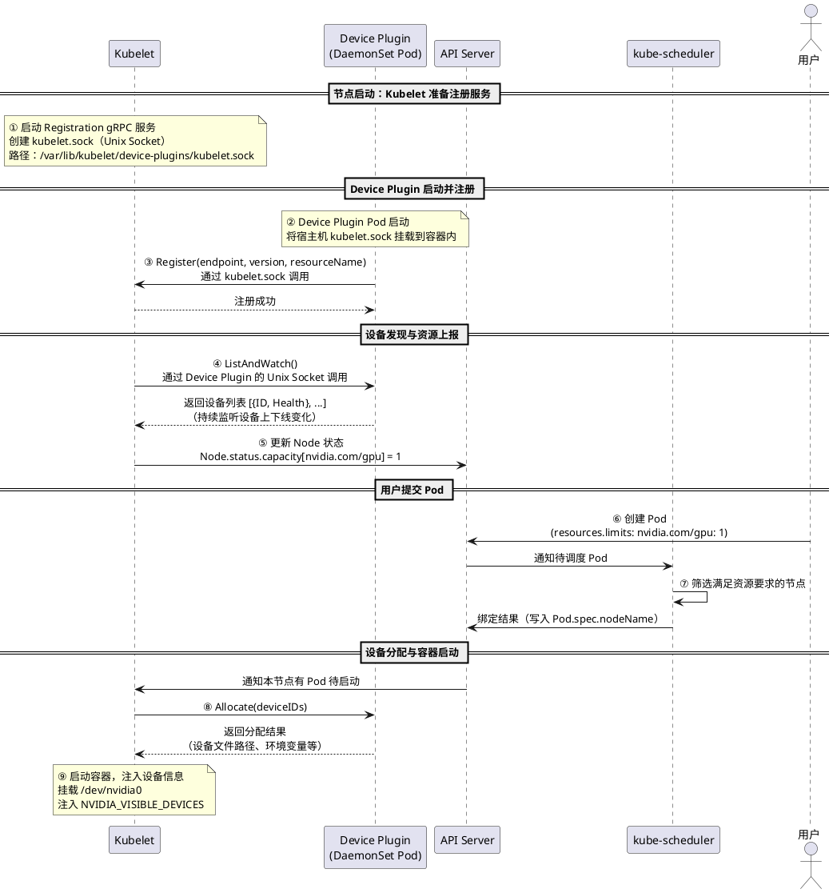
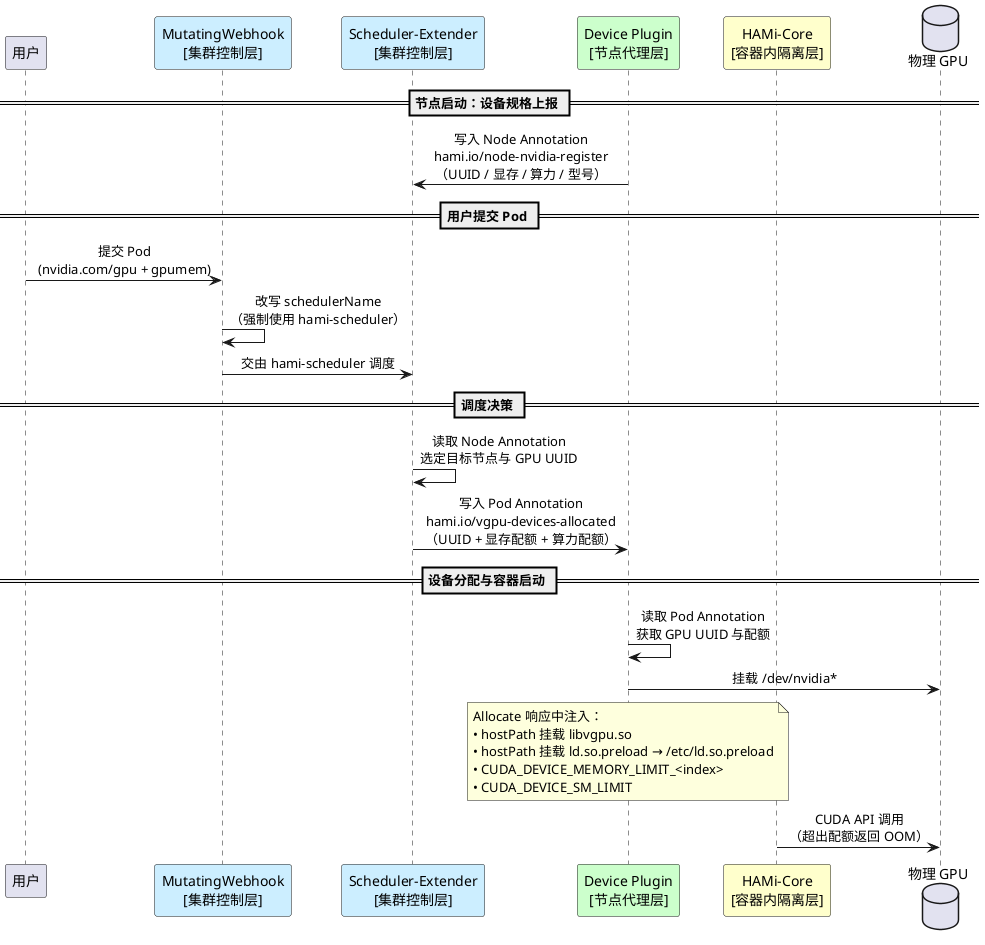

在 AI 推理场景中，一个常见的困境是：GPU 很贵，但大多数时候都是闲的。

一个典型的推理服务往往只占用 GPU 20%~40% 的算力和少量显存，剩余资源就这样空转着。Kubernetes 的默认 GPU 调度模型偏偏是独占的——`nvidia.com/gpu: 1` 意味着整张卡归你，其他 Pod 一律等待。想让多个推理服务共享一张 GPU？标准 Device Plugin 做不到，因为它只能向调度器上报设备数量（整数），根本没有"显存配额"这个概念。

于是出现了各种 GPU 共享方案。NVIDIA 官方的时间切片（Time-Slicing）可以让多个 Pod 同时被调度，但没有显存隔离，一个 Pod OOM 会拖垮整张卡上的所有任务。MIG 硬件分区有真正的隔离，但只有 A100、H100 这类数据中心级卡才支持。

[HAMI](https://github.com/Project-HAMi/HAMi)（Heterogeneous AI Computing Virtualization Middleware）走了另一条路：**不改驱动、不改应用**，通过 CUDA API 劫持在软件层实现 GPU 虚拟化——多个 Pod 共享同一张物理 GPU，每个 Pod 只能"看到"自己申请的那部分显存，超额分配直接返回 OOM。这是一个 CNCF Sandbox 项目，前身为 `k8s-vGPU-scheduler`。

本文先从 Kubernetes GPU 调度的原理讲起，理解默认模型的局限性，再深入 HAMI 的架构和实现，看它是如何绕过这些限制的。

## Kubernetes GPU 调度原理

### Device Plugin

Kubernetes 原生不直接管理 GPU 等异构硬件资源。为此，Kubernetes 提供了 **Device Plugin** 扩展机制，允许硬件厂商将自定义设备资源注册到
Kubelet，供调度器使用。

Device Plugin 本身以 **DaemonSet** 方式部署，运行在每个 GPU 节点上，负责向 Kubelet 注册设备、上报资源、响应分配请求。下图展示了从
Device Plugin 启动到 GPU Pod 运行的完整时序：




**各步骤说明：**

| 步骤 | 参与方                     | 说明                                                                                        |
|----|-------------------------|-------------------------------------------------------------------------------------------|
| ①  | Kubelet                 | 启动时创建 Registration gRPC 服务，监听 `kubelet.sock`，等待 Device Plugin 注册                          |
| ②  | Device Plugin           | DaemonSet Pod 启动，将宿主机 `kubelet.sock` 挂载到容器内，作为与 Kubelet 通信的入口                             |
| ③  | Device Plugin → Kubelet | 通过 `kubelet.sock` 调用 `Register` 接口，上报自身的 Unix Socket 路径、API 版本、资源名称（如 `nvidia.com/gpu`）   |
| ④  | Kubelet → Device Plugin | 注册成功后，Kubelet 反向通过 Device Plugin 的 Unix Socket 调用 `ListAndWatch`，获取当前节点的设备列表，并持续监听设备上下线事件 |
| ⑤  | Kubelet → API Server    | 将发现的设备数量同步到 API Server，体现在 `Node.status.capacity` 中（如 `nvidia.com/gpu: 1`）                |
| ⑥  | 用户 → API Server         | 用户提交 Pod，声明 `nvidia.com/gpu: 1` 资源需求                                                      |
| ⑦  | kube-scheduler          | 从 API Server 读取 Node 资源信息，筛选满足条件的节点，将 Pod 绑定到目标节点（写入 `Pod.spec.nodeName`）                 |
| ⑧  | Kubelet → Device Plugin | 目标节点的 Kubelet 感知到有 Pod 待启动，调用 Device Plugin 的 `Allocate` 接口，传入需要分配的设备 ID                  |
| ⑨  | Device Plugin → Kubelet | 返回具体的设备文件路径（如 `/dev/nvidia0`）、环境变量（`NVIDIA_VISIBLE_DEVICES` 等），Kubelet 将其注入容器并启动          |

Device Plugin 有一个根本局限：`ListAndWatch` 接口只能上报设备数量（整数），调度器完全无法感知设备的具体属性——显存多大、什么型号、NUMA 拓扑如何。这也是 HAMI 不得不借道 Node Annotation 传递 GPU 规格的原因。

### DRA（Dynamic Resource Allocation）

DRA 是 Kubernetes 为此设计的下一代方案，v1.34 升级为 GA。它引入了一套新的 API：

- `ResourceClaim`：Pod 申领设备资源的声明，类似 PVC 之于 PV
- `DeviceClass`：描述一类设备的规格和筛选条件，支持 CEL 表达式细粒度匹配（如"显存 ≥ 16GB 且型号为 A100"）
- `ResourceSlice`：设备驱动向 API Server 上报的可用设备列表，携带完整属性

调度器可以直接读取 `ResourceSlice` 中的设备属性做调度决策，不再需要 HAMI 那套 Annotation 通信协议。DRA 还原生支持多个 Pod 共享同一设备，以及跨容器的设备拓扑对齐。

HAMI 目前仍基于 Device Plugin，但官方已启动 [HAMi-DRA](https://github.com/Project-HAMi/HAMi-DRA) 子项目（v0.1.0，需要 Kubernetes 1.34+），通过 MutatingWebhook 将 HAMI 的 GPU 资源请求转换为 DRA 的 `ResourceClaim`，作为向 DRA 迁移的过渡方案。目前尚处于早期阶段，不建议生产使用。

## HAMI 虚拟 GPU 调度

> 官方文档：https://project-hami.io/zh/docs/
>
> GitHub：https://github.com/Project-HAMi/HAMi

### 方案简介

标准 Device Plugin 只能上报整数数量（`nvidia.com/gpu: 1`），调度器无从感知显存、算力等属性，也没有任何隔离机制。HAMI 在 Device Plugin 之上叠加了三个能力：

- **细粒度资源声明**：用户可以声明 `nvidia.com/gpumem`（显存 MiB）和 `nvidia.com/gpucores`（算力 %）
- **感知调度**：Scheduler-Extender 读取节点 Annotation 中的 GPU 规格，按显存/算力剩余量做 Filter 和 Bind
- **容器内隔离**：通过 `libvgpu.so` 在 CUDA API 层拦截，硬性限制容器实际使用的显存和算力

### 架构与核心组件

HAMI 由四个核心组件构成：

| 组件                            | 类型                                 | 职责                                                                                                                                                     |
|-------------------------------|------------------------------------|--------------------------------------------------------------------------------------------------------------------------------------------------------|
| `HAMi MutatingWebhook Server` | Deployment（内嵌于 hami-scheduler Pod） | 准入入口：扫描 Pod 资源字段，将需要 HAMI 调度的 Pod 的 `schedulerName` 改写为 `hami-scheduler`（可配置）；已显式指定其他 schedulerName 的 Pod 会被跳过                                          |
| `HAMi Scheduler-Extender`     | Deployment（内嵌于 hami-scheduler Pod） | 调度核心：感知全局 GPU 视图，在 Filter/Bind 阶段实现细粒度显存/算力感知调度，支持 binpack/spread 策略                                                                                   |
| `HAMi Device Plugin`          | DaemonSet                          | 节点资源层：向 Kubelet 注册虚拟 GPU 资源；在 `Allocate` 中以 hostPath 方式将 `libvgpu.so` 和 `ld.so.preload` 挂载到容器，并注入 `CUDA_DEVICE_MEMORY_LIMIT_<index>`、`CUDA_DEVICE_SM_LIMIT` 等环境变量 |
| `HAMi-Core`（`libvgpu.so`）     | 动态库（Device Plugin Allocate 时注入）    | 容器内软隔离：重写 `dlsym` 劫持以 `cu` / `nvml` 开头的 NVIDIA 库函数，实现显存上限拦截与算力限速                                                                                         |

实际部署后的 Pod 状态如下：

```
$ kubectl -n hami-system get pod
NAME                              READY   STATUS    RESTARTS   AGE
hami-device-plugin-5gn6j          2/2     Running   0          25h   ← GPU 节点 1（节点代理层）
hami-device-plugin-qzc78          2/2     Running   0          29h   ← GPU 节点 2（节点代理层）
hami-scheduler-8647f67d84-zr42b   2/2     Running   0          29h   ← 调度控制层（全局唯一）
```

下图展示三层架构的组件构成及其通信关系：




### 工作流程详解

#### 第一步：设备注册与资源上报

`hami-device-plugin` 启动后做两件事：

**① 向 Kubelet 虚报 GPU 数量**

将 1 块物理 GPU 虚报为 N 个逻辑 GPU 资源（默认 10 个），使 kube-scheduler 认为节点有 10 个 GPU 可分配：

```
# kubectl get node <gpu-node> -o yaml 中的可分配资源
nvidia.com/gpu: "10"   # 原本 1 块卡，虚报为 10
```

**② 将设备详细规格写入 Node Annotation**

标准 Device Plugin 的 `ListAndWatch` 接口只能上报设备数量（整数），无法携带显存大小、UUID、算力等详细规格。HAMI
的解决方案是额外将这些信息写入 Node Annotation，供 `hami-scheduler` 读取：

| Annotation                     | 用途                                      |
|--------------------------------|-----------------------------------------|
| `hami.io/node-handshake`       | 心跳时间戳，超过阈值则认为节点设备信息已失效                  |
| `hami.io/node-nvidia-register` | 设备规格列表（UUID、虚报数量、显存、算力、型号、NUMA 节点、健康状态） |

字段格式（JSON 数组，每块 GPU 一个对象）：

```
# 2 块 32G V100 节点的示例
hami.io/node-handshake: Requesting_2024.05.14 07:07:33
hami.io/node-nvidia-register: '[
  {"id":"GPU-00552014-...","count":10,"devmem":32768,"devcore":100,"type":"NVIDIA-Tesla V100-PCIE-32GB","numa":0,"health":true},
  {"id":"GPU-0fc3eda5-...","count":10,"devmem":32768,"devcore":100,"type":"NVIDIA-Tesla V100-PCIE-32GB","numa":0,"health":true}
]'
```

各字段说明：`id` 为 GPU UUID，`count` 为虚报逻辑数量，`devmem` 为显存（MiB），`devcore` 为算力（%），`numa` 为 NUMA 节点编号，`health` 为健康状态。

`hami-scheduler` 启动后持续 Watch 所有 GPU 节点的这两个 Annotation，维护全局 GPU 资源视图。

#### 第二步：调度决策

用户提交 Pod 时声明细粒度资源需求：

```yaml
resources:
  limits:
    nvidia.com/gpu: 1          # 申请 1 个逻辑 GPU 槽位
    nvidia.com/gpumem: 1024    # 申请 1024 MiB 显存
    nvidia.com/gpucores: 30    # 申请 30% 算力（可选）
```

`hami-scheduler` 作为 kube-scheduler 的扩展器，在标准调度流程的 **Filter** 和 **Bind** 阶段介入：

- **Filter**：读取 Node Annotation，检查目标节点是否有足够剩余显存（`已分配显存之和 + 本次请求 ≤ 物理显存总量`）
- **Bind**：选定具体物理 GPU UUID，将分配结果写入 Pod Annotation

**调度结果通过 Pod Annotation 传递给 Device Plugin：**

标准 Kubernetes 调度流程中，kube-scheduler 在 Bind 阶段仅向 device-plugin 传递设备 UUID，不携带显存量、算力等信息。因此 HAMI
约定了以下 Pod Annotation 作为调度器与 device-plugin 之间的通信协议：

| Annotation                         | 内容                                                                         |
|------------------------------------|----------------------------------------------------------------------------|
| `hami.io/bind-time`                | 调度时间戳（Unix 时间），device-plugin 用于超时检测                                        |
| `hami.io/vgpu-devices-allocated`   | 已分配的设备列表（UUID + 厂商 + 显存 MiB + 算力%），完成后保留作为记录                               |
| `hami.io/vgpu-devices-to-allocate` | 待分配设备列表，初始与 allocated 相同；device-plugin 每挂载成功一个设备就移除对应条目，**全部移除后置空，表示分配完成** |

以申请 3000 MiB 显存的 Pod 为例，运行成功后的 Annotation：

```
hami.io/bind-time: 1716199325
hami.io/vgpu-devices-allocated: GPU-0fc3eda5-e98b-a25b-5b0d-cf5c855d1448,NVIDIA,3000,0:;
hami.io/vgpu-devices-to-allocate: ;    ← 已为空，说明设备分配完成
```

#### 第三步：设备注入与库劫持

Pod 调度到目标节点后，Kubelet 调用 Device Plugin 的 `Allocate` 接口，Device Plugin 在响应中完成四件事：

1. **挂载设备文件**：将 `/dev/nvidia*` 等设备文件注入容器
2. **hostPath 挂载 libvgpu.so**：将宿主机上的 `libvgpu.so`（默认路径 `/usr/local/vgpu/libvgpu.so`）以 hostPath 方式挂载到容器内同路径
3. **hostPath 挂载 ld.so.preload**：将宿主机上的 `/usr/local/vgpu/ld.so.preload` 挂载到容器内的 `/etc/ld.so.preload`。该文件内容只有一行：`/usr/local/vgpu/libvgpu.so`。Linux 动态链接器在容器内任何进程启动时都会读取 `/etc/ld.so.preload`，并将其中列出的库**最先**加载——效果等同于 `LD_PRELOAD`，但无需修改任何环境变量，对容器内所有进程透明生效。若容器设置了 `CUDA_DISABLE_CONTROL=true`，则跳过此挂载，禁用隔离
4. **注入环境变量**：
    - `CUDA_DEVICE_MEMORY_LIMIT_<index>=<数字>m`：per-device 显存配额，`index` 为容器内设备索引（0、1、2...），值带单位后缀 `m`（如 `1024m`），来自 Pod 申请的 `nvidia.com/gpumem`
    - `CUDA_DEVICE_SM_LIMIT=<百分比>`：算力配额上限（来自 Pod 申请的 `nvidia.com/gpucores`）

容器启动后，libvgpu.so 通过**重写 `dlsym` 函数**劫持 NVIDIA 动态库的符号解析，对所有以 `cu` 和 `nvml` 开头的函数调用进行拦截：

**显存限制（Memory Limit）：**

- 拦截 `nvmlDeviceGetMemoryInfo` / `nvmlDeviceGetMemoryInfo_v2`：使 `nvidia-smi` 只显示 `CUDA_DEVICE_MEMORY_LIMIT_<index>` 设定的配额值，而非物理总显存
- 拦截 `cuMemAlloc_v2` / `cuMemAllocManaged` / `cuMemAllocHost_v2` 等内存分配函数：分配前执行 OOM 检查——若当前 Pod 已用显存 + 本次申请量 >
  `CUDA_DEVICE_MEMORY_LIMIT_<index>`，直接返回 `CUDA_ERROR_OUT_OF_MEMORY`，阻止超额分配

**算力限制（Core Limit）：**

- 拦截 `cuLaunchKernel` / `cuLaunchKernelEx` 等 Kernel 提交函数：每次提交前调用 `rate_limiter`，以本次 kernel 的 grid 数量为单位消耗全局计数器 `g_cur_cuda_cores`；当计数器耗尽（`< 0`）时，当前调用进入自旋等待（`nanosleep`）
- 计数器的补充由后台 utilization watcher 线程负责：该线程定期采样实际 GPU 利用率，通过 `delta()` 函数动态计算补充量——利用率低于配额时快速补充，高于配额时减少补充，从而将容器的整体算力占用收敛到 `CUDA_DEVICE_SM_LIMIT` 设定的百分比以内

#### 第四步：多容器共享物理 GPU

多个容器通过时分复用共享同一块物理 GPU，每个容器只能"看到"自己配额内的显存：

```
物理 GPU：RTX 3060，12288 MiB 显存
├── Pod A：nvidia.com/gpumem=1024 → 容器内看到的 Total Memory = 1024 MiB
├── Pod B：nvidia.com/gpumem=1024 → 容器内看到的 Total Memory = 1024 MiB
├── Pod C：nvidia.com/gpumem=2048 → 容器内看到的 Total Memory = 2048 MiB
├── ...（最多 10 个 Pod，总计 ≤ 12288 MiB）
└── 剩余显存：空闲（不可超额分配）
```

### 验证结果

**集群环境：**

```
GPU：NVIDIA GeForce RTX 3060（12288 MiB）
CUDA Driver：550.120
HAMI 版本：v2.8.0
```

**运行组件状态：**

```
NAME                              READY   STATUS    RESTARTS   AGE
hami-device-plugin-wtchf          2/2     Running   0          16h
hami-scheduler-78db5bffbc-hf2jf   2/2     Running   0          16h
```

**节点资源上报：**

```
# GPU 虚报为 10 个逻辑资源
nvidia.com/gpu: "10"

# 物理 GPU 详细信息（Annotation）
hami.io/node-nvidia-register: '[{
  "id": "GPU-32f85ff6-efb5-a95e-2d82-ce615ca43152",
  "count": 10,
  "devmem": 12288,
  "devcore": 100,
  "type": "NVIDIA GeForce RTX 3060",
  "numa": 0,
  "health": true
}]'
```

**多 Pod 并发测试（10 个 Pod 同时共享 1 块 GPU）：**

测试 YAML（Job，10 个并发实例，每个申请 1024 MiB 显存）：

```yaml
apiVersion: batch/v1
kind: Job
metadata:
  name: gpu-test-10
spec:
  completions: 10
  parallelism: 10
  template:
    spec:
      restartPolicy: Never
      containers:
        - name: gpu-test
          image: docker.io/nvidia/cuda:12.4.0-base-ubuntu22.04
          command:
            - bash
            - -c
            - |
              echo "=== Pod: $HOSTNAME ==="
              nvidia-smi
              sleep 3600
          resources:
            limits:
              nvidia.com/gpu: 1
              nvidia.com/gpumem: 1024   # 每个 Pod 申请 1024 MiB
```

**10 个 Pod 全部成功调度运行：**

```
NAME                READY   STATUS    RESTARTS   AGE
gpu-test-10-5rdvl   1/1     Running   0          10m
gpu-test-10-cpp7n   1/1     Running   0          10m
gpu-test-10-f48b5   1/1     Running   0          10m
gpu-test-10-kmnr6   1/1     Running   0          10m
gpu-test-10-lwkk6   1/1     Running   0          10m
gpu-test-10-qpjhn   1/1     Running   0          10m
gpu-test-10-qwqzc   1/1     Running   0          10m
gpu-test-10-s8bkd   1/1     Running   0          10m
gpu-test-10-t8thz   1/1     Running   0          10m
gpu-test-10-zghzv   1/1     Running   0          10m
```

**容器内 nvidia-smi 输出（显存隔离验证）：**

```
Tue Mar 10 02:36:50 2026
+-----------------------------------------------------------------------------------------+
| NVIDIA-SMI 550.120          Driver Version: 550.120        CUDA Version: 12.4           |
|-----------------------------------------+------------------------+----------------------+
| GPU  Name                 Persistence-M | Bus-Id          Disp.A | Volatile Uncorr. ECC |
| Fan  Temp   Perf          Pwr:Usage/Cap |           Memory-Usage | GPU-Util  Compute M. |
|=========================================+========================+======================|
|   0  NVIDIA GeForce RTX 3060        Off |   00000000:84:00.0 Off |                  N/A |
|  0%   33C    P8             13W /  170W |       0MiB /   1024MiB |      0%      Default |
+-----------------------------------------+------------------------+----------------------+
```

**关键观察**：容器内看到的 GPU 总显存为 **1024 MiB**（而非物理的 12288 MiB），显存隔离生效。10 个 Pod × 1024 MiB = 10240
MiB < 12288 MiB，满足总量约束。

### HAMI 调度策略详解

> 来源：https://project-hami.io/zh/docs/developers/scheduling（v2.8.0）

HAMI 提供了两个维度的调度策略配置，分别作用于**节点选择**和**单节点内 GPU 卡选择**，两者正交组合，可覆盖多种资源分配偏好。

#### 策略维度概览

| 配置维度      | 配置项                     | 可选策略                 | 作用域              |
|-----------|-------------------------|----------------------|------------------|
| 节点调度策略    | `node-scheduler-policy` | `binpack` / `spread` | 决定调度到哪个节点        |
| GPU 卡调度策略 | `gpu-scheduler-policy`  | `binpack` / `spread` | 决定调度到节点内哪张 GPU 卡 |

**设置方式**（两种方式，后者优先级更高）：

```yaml
# 方式一：Helm 全局默认配置（values.yaml），完整路径在 scheduler.defaultSchedulerPolicy 下
scheduler:
  defaultSchedulerPolicy:
    nodeSchedulerPolicy: binpack    # 节点维度默认策略，默认 binpack
    gpuSchedulerPolicy: spread      # GPU 维度默认策略，默认 spread

# 方式二：Pod 级别 Annotation 覆盖（仅对当次调度生效，优先级高于全局配置）
metadata:
  annotations:
    hami.io/node-scheduler-policy: "spread"   # 覆盖节点调度策略
    hami.io/gpu-scheduler-policy: "binpack"   # 覆盖 GPU 调度策略
```

#### 节点调度策略（Node-Scheduler-Policy）

**场景假设**：集群有 2 个节点，各有 4 块 GPU；节点1 已用 3 块，节点2 已用 2 块；现需调度 pod1、pod2 各申请 1 块 GPU。

**统一评分公式（基于节点当前已用资源，不含本次申请量）：**

```
节点得分 = (已用设备数/总设备数 + 已用算力/总算力 + 已用显存/总显存) × 10
```

三个维度均等权重，综合反映节点的整体负载。以下示例仅以设备数量维度说明策略效果：

---

**Binpack 策略（集中装箱）**

策略目标：优先填满已有负载的节点，尽量少用空节点，为大型作业保留完整节点。

```
节点1 得分 = (3/4) × 10 = 7.5   ← 得分高，优先选择
节点2 得分 = (2/4) × 10 = 5.0
```

调度结果：pod1 → 节点1，pod2 → 节点1（集中在负载更高的节点）

适用场景：

- 希望腾出空节点以供大型训练任务（如需要整节点独占 GPU 的任务）
- 减少空闲节点的冗余资源占用
- 单 GPU 跑多模型

---

**Spread 策略（分散打散）**

策略目标：将负载均匀分散到各节点，避免单节点过热，提高容错能力。

```
节点1 得分 = (3/4) × 10 = 7.5
节点2 得分 = (2/4) × 10 = 5.0  ← 得分低，Spread 选低分节点
```

调度结果：pod1 → 节点2，pod2 → 节点1（分散到不同节点）

适用场景：

- 推理服务横向扩展，避免单点故障影响过多实例
- 对延迟敏感的在线服务，避免资源竞争
- 多 GPU 多实例横向扩展

---

#### GPU 卡调度策略（GPU-Scheduler-Policy）

**场景假设**：节点1 有 GPU1、GPU2 两块卡；GPU1 已用 core 10%、mem 2000 MiB；GPU2 已用 core 70%、mem 6000 MiB；每块卡总算力
100%、总显存 8000 MiB；现申请 core 20%、mem 1000 MiB。

**统一评分公式（综合设备槽位 + 算力 + 显存三个维度，均含本次申请量）：**

```
GPU 得分 = ((申请数量 + 已用数量) / 总槽位 + (申请 core + 已用 core) / 总 core + (申请 mem + 已用 mem) / 总 mem) × 10
```

以下示例场景未提供设备槽位使用情况，仅以算力 + 显存两个维度说明策略效果：

---

**GPU Binpack 策略（集中装箱到同一张卡）**

策略目标：优先将多个 Pod 塞进同一张已有负载的 GPU，让其余 GPU 空闲。

```
GPU1 得分 = ((20+10)/100 + (1000+2000)/8000) × 10 = (0.3 + 0.375) × 10 = 6.75
GPU2 得分 = ((20+70)/100 + (1000+6000)/8000) × 10 = (0.9 + 0.875) × 10 = 17.75  ← 选高分
```

调度结果：优选 GPU2（负载更高的卡）

适用场景：

- 希望释放 GPU1 供独占型任务（如模型训练）使用
- 多个轻量推理服务集中在少数几张卡，节省整卡资源

---

**GPU Spread 策略（分散到不同的卡）**

策略目标：优先选择负载最轻的 GPU，降低单卡压力，提高并发性能。

```
GPU1 得分 = 6.75   ← 选低分（负载更轻）
GPU2 得分 = 17.75
```

调度结果：优选 GPU1（负载更低的卡）

适用场景：

- 多个服务对 GPU 计算延迟敏感，避免争抢同一张卡
- 同一模型的多个推理实例分散到不同 GPU，提升整体吞吐

---

#### 策略组合矩阵与推荐

| 节点策略        | GPU 策略      | 典型使用场景                             |
|-------------|-------------|------------------------------------|
| **Binpack** | **Binpack** | 资源整合：将轻量任务集中到少数节点/卡，腾出整机资源给大型任务    |
| **Binpack** | **Spread**  | 节点集中 + 卡级隔离：多推理服务集中在一个节点，但各用不同 GPU |
| **Spread**  | **Binpack** | 节点分散 + 卡内装箱：跨节点高可用，每个节点内尽量共用同一张卡   |
| **Spread**  | **Spread**  | 最大分散：全方位打散，最高容错和隔离性，适合在线高可用推理服务    |

### Pod 配置参考

除资源字段外，HAMI 还支持通过 Pod Annotation 和容器环境变量对调度行为与隔离策略进行细粒度控制。

**Pod 调度 Annotation：**

| Annotation                      | 说明                              | 示例                       |
|---------------------------------|---------------------------------|--------------------------|
| `nvidia.com/use-gpuuuid`        | 强制指定只能使用的 GPU UUID（白名单）         | `"GPU-AAA,GPU-BBB"`      |
| `nvidia.com/nouse-gpuuuid`      | 排除指定 GPU UUID（黑名单）              | `"GPU-AAA,GPU-BBB"`      |
| `nvidia.com/use-gputype`        | 强制指定只能使用的 GPU 型号                | `"Tesla V100-PCIE-32GB"` |
| `nvidia.com/nouse-gputype`      | 排除指定 GPU 型号                     | `"NVIDIA A10"`           |
| `hami.io/node-scheduler-policy` | 覆盖本次调度的节点策略（binpack/spread）     | `"spread"`               |
| `hami.io/gpu-scheduler-policy`  | 覆盖本次调度的 GPU 卡策略（binpack/spread） | `"binpack"`              |
| `nvidia.com/vgpu-mode`          | 指定 vGPU 实例类型                    | `"hami-core"` 或 `"mig"`  |

**容器环境变量：**

| 环境变量                          | 说明                                                                    | 默认值       |
|-------------------------------|-----------------------------------------------------------------------|-----------|
| `GPU_CORE_UTILIZATION_POLICY` | 算力限制策略：`default`（默认）、`force`（强制限制到 gpucores 以下）、`disable`（忽略算力限制，调试用） | `default` |
| `CUDA_DISABLE_CONTROL`        | 设为 `true` 时禁用容器内 HAMi-Core，无资源隔离（调试用）                                 | `false`   |
