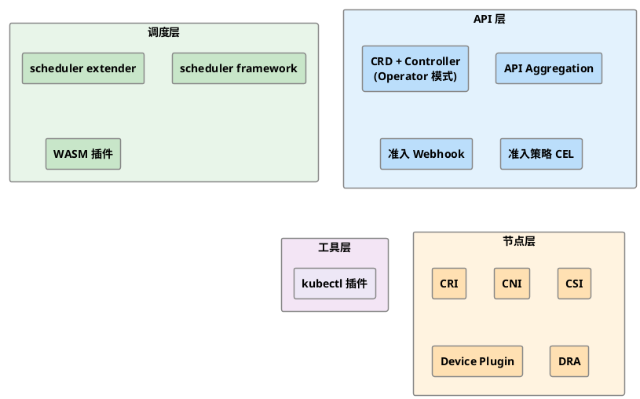

## 为什么需要扩展

Kubernetes 的设计哲学是：核心保持精简、通用，将复杂的业务场景通过扩展点来满足。这样做的好处是，扩展组件可以独立开发、部署和升级，不会与 Kubernetes 核心版本强绑定，社区也因此积累了大量可复用的扩展生态（如基于 CRD + Operator 管理 TLS 证书的 cert-manager、基于 scheduler framework 实现 AI 训练作业批量调度的 Volcano、基于 CNI 提供网络策略的 Cilium 等）。

Kubernetes 提供了两种定制方式，扩展并非第一选择：

- **配置（Configuration）**：通过命令行参数、配置文件、内置策略 API（ResourceQuota、NetworkPolicy、RBAC 等）来调整行为，这是优先推荐的方式，无需编写额外代码
- **扩展（Extensions）**：编写软件组件来增强或改变 Kubernetes 的行为，是本系列文章的主题

## 扩展机制全景

Kubernetes 的扩展点遍布请求处理链路和各个控制面组件，按层次大致可以分为以下几类。

展开/收起

### API 层扩展

API 层扩展用于向 Kubernetes 引入自定义资源，或在请求到达处理逻辑前进行拦截和变更。

**自定义资源（Custom Resources）**

- **CRD + Controller（Operator 模式）**：最主流的扩展方式。通过 CustomResourceDefinition 声明新的资源类型，kube-apiserver 的 APIExtensionsServer 会自动提供 CRUD 接口，数据持久化到 etcd 中；再配合自定义控制器持续监听资源状态、驱动实际状态向期望状态收敛，即 Operator 模式。Controller 的开发工具从低到高分三个层次：
  - **client-go**：直接使用 Informer 机制，是 kube-controller-manager 本身所采用的方式
  - **controller-runtime**：更高层次的抽象框架，封装了 Manager、Reconciler 等概念，是目前社区的主流选择
  - **Kubebuilder / Operator SDK**：基于 controller-runtime 的代码脚手架，快速生成项目骨架和 CRD 资源定义
- **API 聚合（API Aggregation，AA）**：当 CRD 无法满足需求时（如需要自定义存储、WebSocket 长连接子资源、或与外部系统深度集成），可以自行实现一个扩展 API 服务器（Extension API Server），通过 APIService 注册到 kube-apiserver 的聚合层（AggregatorServer），由 kube-apiserver 将匹配的请求转发过来。

**准入控制（Admission Control）**

- **准入 Webhook**：资源持久化前，kube-apiserver 将请求发送给外部 Webhook Server。分变更（MutatingWebhook，可修改请求对象，如注入 sidecar）和验证（ValidatingWebhook，只做校验）两类，两者均需自行部署 Webhook Server 并配置 HTTPS 证书。
- **准入策略 CEL**：Kubernetes 1.26+ 引入的声明式准入控制方案，无需部署 Webhook Server，直接用 CEL（Common Expression Language）表达式定义策略，包括 ValidatingAdmissionPolicy（v1.30 Stable）和 MutatingAdmissionPolicy（v1.34 Beta）。

### 调度层扩展

kube-scheduler 提供了多种扩展方式，灵活性依次递增：

- **scheduler extender**：以 HTTP Webhook 形式介入调度流程，只能作用于过滤（Filter）、优先级排序（Prioritize，对应 scheduler framework 的 Score 阶段）、抢占（Preempt）和绑定（Bind）阶段。无需重新编译 kube-scheduler，改动最小，但性能开销相对较大。
- **scheduler framework**：Kubernetes v1.19 Stable 的插件化架构，在调度的每个阶段（PreFilter、Filter、Score、Reserve、Bind 等）均提供扩展点，以插件形式编译进调度器（通常是自行部署一个定制 kube-scheduler），扩展能力最强。
- **WebAssembly（WASM）插件**：实验性方案，通过 WASM 模块实现调度插件，无需重新编译调度器。

### 节点层扩展

节点层扩展通过标准化接口将底层基础设施的差异屏蔽在 kubelet 之外，各接口均以二进制插件或 gRPC 服务的形式实现：

- **CRI（Container Runtime Interface）**：容器运行时接口，允许 kubelet 对接不同的容器运行时（containerd、CRI-O 等）
- **CNI（Container Network Interface）**：容器网络接口，定义 Pod 网络的标准实现方式（Calico、Flannel、Cilium 等均基于此实现）
- **CSI（Container Storage Interface）**：容器存储接口，允许第三方存储厂商以标准方式接入 Kubernetes 存储系统
- **设备插件（Device Plugin）**：允许节点发布自定义硬件资源（如 GPU、NPU、FPGA），供 Pod 申请和使用
- **动态资源分配（Dynamic Resource Allocation，DRA）**：v1.35 Stable，比设备插件更灵活的硬件资源分配机制，支持多个 Pod 共享同一设备、通过 CEL 表达式细粒度筛选设备属性，通过 ResourceClaim / DeviceClass 等 API 管理资源申领，使用体验类似 PersistentVolumeClaim

### 工具层扩展

- **kubectl 插件**：以 `kubectl-` 开头的可执行文件，放入 PATH 后即可作为 `kubectl` 的子命令使用，适合封装常用运维操作

## 如何选择扩展方式

| 需求 | 推荐方案 |
|------|---------|
| 引入自定义资源、自动化管理应用 | CRD + Controller（Operator 模式） |
| 需要自定义存储、长连接或与外部系统深度集成 | API Aggregation |
| 拦截/校验 Kubernetes 请求，逻辑简单 | ValidatingAdmissionPolicy（CEL） |
| 拦截/校验 Kubernetes 请求，逻辑复杂 | ValidatingAdmissionWebhook |
| 自动注入 sidecar、修改资源字段 | MutatingAdmissionWebhook 或 MutatingAdmissionPolicy |
| 干预 Pod 调度逻辑 | scheduler framework（复杂）/ scheduler extender（简单） |
| 对接特殊硬件资源，简单数量申请 | Device Plugin |
| 对接特殊硬件资源，需共享设备或细粒度筛选 | DRA（Dynamic Resource Allocation） |
| 自定义网络方案 | CNI |
| 对接第三方存储 | CSI |
| 自定义容器运行时 | CRI |

这些扩展机制并不互斥，实际项目中往往是多种组合使用。以 GPU 虚拟化项目 HAMi 为例，它同时用到了 MutatingAdmissionWebhook（修改 Pod 资源请求）、scheduler extender（自定义 GPU 调度策略）和 Device Plugin（向节点注册虚拟 GPU 资源），三者各司其职。

## 微信公众号

更多内容请关注微信公众号：gopher的Infra修行

