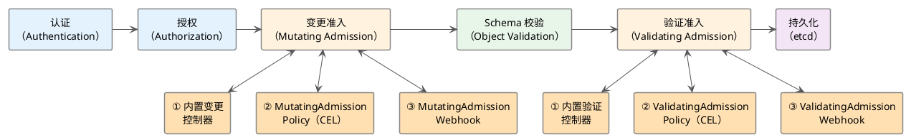
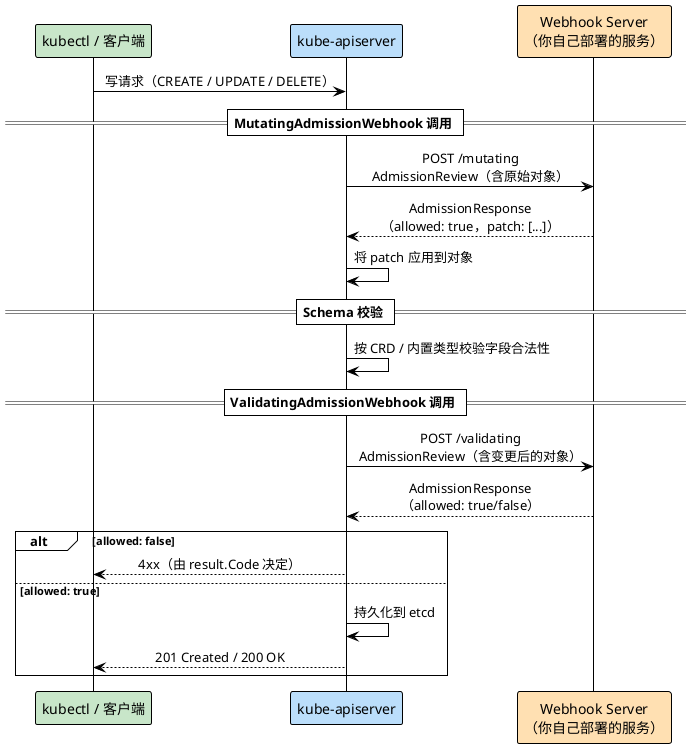

CRD + Controller 和 API Aggregation 解决的是"如何向 Kubernetes 引入新的资源类型"，而 **准入控制（Admission Control）** 解决的是另一个问题：如何在请求写入 etcd 之前对它进行拦截、修改或拒绝。

这个能力在实际工程中极为常见。注入 Istio sidecar、强制 Pod 必须带 label、限制 Deployment 副本数上限、阻止使用最新镜像 tag，这些需求背后都是准入控制在工作。相比 CRD 和 API Aggregation，准入控制是一种"横切"能力：它不关心资源类型，只关心所有写请求在落盘前是否满足约束。

参考：[extensible-admission-controllers](https://kubernetes.io/zh-cn/docs/reference/access-authn-authz/extensible-admission-controllers/)、[validating-admission-policy](https://kubernetes.io/zh-cn/docs/reference/access-authn-authz/validating-admission-policy/)、[mutating-admission-policy](https://kubernetes.io/zh-cn/docs/reference/access-authn-authz/mutating-admission-policy/)

## 准入控制在请求链路中的位置

一个写请求（创建、更新、删除）到达 kube-apiserver 后，并不会直接落盘，而是要经过一条完整的处理流水线：



准入控制位于授权之后、持久化之前，分为两个阶段：

- **变更（Mutating）阶段**：可以修改请求对象，例如注入 sidecar、添加 label、设置默认字段。依次执行：内置变更控制器（DefaultStorageClass、LimitRanger 等）→ MutatingAdmissionPolicy → MutatingAdmissionWebhook。
- **验证（Validating）阶段**：只能读取对象，决定允许或拒绝请求，不能修改。依次执行：内置验证控制器（PodSecurity、NodeRestriction 等）→ ValidatingAdmissionPolicy → ValidatingAdmissionWebhook → ResourceQuota。

ResourceQuota 被刻意排在所有 Webhook 之后，原因是它需要看到对象的最终形态才能正确统计资源用量。如果排在 Mutating Webhook 之前，Webhook 注入的 sidecar 所追加的资源请求就不会被算进配额，配额也就失去了意义。

两个阶段内任一插件拒绝请求，整个请求立即终止并返回错误，不会继续往后执行。

扩展准入控制有两套机制，分别对应 Webhook 和 CEL 策略：

| 机制 | 变更阶段 | 验证阶段 | 特点 |
|------|---------|---------|------|
| **准入 Webhook** | MutatingAdmissionWebhook | ValidatingAdmissionWebhook | 需要自行部署 HTTP(S) 服务，逻辑完全自定义 |
| **准入策略 CEL** | MutatingAdmissionPolicy（v1.34 Beta） | ValidatingAdmissionPolicy（v1.30 Stable） | 无需部署服务，用 CEL 表达式声明策略 |

## 准入 Webhook

准入 Webhook 的工作方式与 API Aggregation 类似：kube-apiserver 在准入阶段将请求以 HTTP 调用的形式发送给外部服务（Webhook Server），由外部服务决定是否允许、或如何修改请求对象，再将结果返回给 kube-apiserver。

### 整体流程



示例中同一个 Webhook Server 同时实现了 `/mutating` 和 `/validating` 两个端点，实际生产中两者完全可以是独立部署的服务，互不干扰。

kube-apiserver 发送给 Webhook Server 的请求体是一个 `AdmissionReview` 对象，其中 `Request` 字段包含了本次操作的所有信息：资源类型、操作类型（CREATE/UPDATE/DELETE）、操作前后的对象等。Webhook Server 需要解析这个对象，执行自己的逻辑，然后将结果封装回 `AdmissionReview.Response` 中返回。

Mutating Webhook 通过在 `Response` 中附带 JSON Patch 来修改对象；Validating Webhook 只需要设置 `Response.Allowed` 为 `true` 或 `false`。

### 实现 Webhook Server

下面实现一个最简单的示例：Mutating Webhook 为每个新建的 Pod 自动打上 `simple-app: mutating` 的 label；Validating Webhook 则拒绝所有没有 `app` label 的 Pod 创建请求。

**pkg/admit/http.go：统一处理 AdmissionReview 的收发**

Webhook Server 收到的是 HTTP 请求，第一件事是从 Body 中解析出 `AdmissionReview`，处理完成后再序列化回 JSON 写回响应。这部分逻辑对 Mutating 和 Validating 两个端点完全相同，可以提取成一个公共的 `Serve` 函数：

```go
func Serve(w http.ResponseWriter, r *http.Request, h handler) {
    // 读取请求体
    body, _ := io.ReadAll(r.Body)

    // 将请求体反序列化为 AdmissionReview 对象
    // 兼容 v1 和 v1beta1 两个版本
    reqAdmissionReview := AdmissionReview{}
    _, gvk, err := serializer.NewCodecFactory(runtime.NewScheme()).
        UniversalDeserializer().Decode(body, nil, &reqAdmissionReview)
    if err != nil { /* ... */ }

    // 调用业务逻辑，生成 AdmissionResponse
    respAdmissionReview := &v1.AdmissionReview{}
    respAdmissionReview.SetGroupVersionKind(*gvk)
    respAdmissionReview.Response = h(reqAdmissionReview)
    // UID 必须原样回传，kube-apiserver 用它对应请求和响应
    respAdmissionReview.Response.UID = reqAdmissionReview.Request.UID

    // 序列化后写回响应
    respBytes, _ := json.Marshal(respAdmissionReview)
    w.Header().Set("Content-Type", "application/json")
    w.Write(respBytes)
}
```

`handler` 是一个函数类型，接收 `AdmissionReview`，返回 `*v1.AdmissionResponse`，两个端点各自提供自己的实现。

**pkg/admit/mutating.go：JSON Patch 辅助函数**

Mutating Webhook 通过 JSON Patch（RFC 6902）描述对对象的修改，每条操作包含 `op`（操作类型：add/remove/replace）、`path`（JSON 路径）和 `value`（新值）三个字段：

```go
type PatchOperation struct {
    Op    string      `json:"op"`
    Path  string      `json:"path"`
    Value interface{} `json:"value,omitempty"`
}

// PatchTypeJSONPatch 将一组 PatchOperation 序列化为 kube-apiserver 识别的格式
func PatchTypeJSONPatch(patch ...PatchOperation) ([]byte, *admissionv1.PatchType, error) {
    patchBytes, err := json.Marshal(&patch)
    if err != nil {
        return nil, nil, err
    }
    pt := admissionv1.PatchTypeJSONPatch
    return patchBytes, &pt, nil
}
```

**main.go：注册两个端点**

```go
func main() {
    // /validating 端点：验证 Pod 必须带有 app label
    http.HandleFunc("/validating", func(w http.ResponseWriter, r *http.Request) {
        admit.Serve(w, r, func(review admit.AdmissionReview) *v1.AdmissionResponse {
            var pod corev1.Pod
            json.Unmarshal(review.Request.Object.Raw, &pod)

            if _, ok := pod.Labels["app"]; !ok {
                // 拒绝请求，Reason 会作为错误信息返回给用户
                return &v1.AdmissionResponse{
                    Allowed: false,
                    Result:  &metav1.Status{Reason: "Pod does not have an app label"},
                }
            }
            return &v1.AdmissionResponse{Allowed: true}
        })
    })

    // /mutating 端点：为每个新建的 Pod 打上 simple-app: mutating 的 label
    http.HandleFunc("/mutating", func(w http.ResponseWriter, r *http.Request) {
        admit.Serve(w, r, func(review admit.AdmissionReview) *v1.AdmissionResponse {
            // 构造 JSON Patch，在 /metadata/labels 下新增一个键值对
            patchBytes, patchType, _ := admit.PatchTypeJSONPatch(admit.PatchOperation{
                Op:    "add",
                Path:  "/metadata/labels/simple-app",
                Value: "mutating",
            })
            return &v1.AdmissionResponse{
                Allowed:   true,
                Patch:     patchBytes,
                PatchType: patchType,
            }
        })
    })

    // Webhook Server 必须以 HTTPS 启动
    http.ListenAndServeTLS(fmt.Sprintf(":%d", port), crt, key, nil)
}
```

kube-apiserver 要求 Webhook Server 必须提供有效的 HTTPS 证书，所以服务以 `ListenAndServeTLS` 启动，证书路径通过命令行参数传入。

### 注册 Webhook

Webhook Server 运行起来之后，需要创建 `MutatingWebhookConfiguration` 和 `ValidatingWebhookConfiguration` 资源，告知 kube-apiserver 何时调用、调用哪个地址：

```yaml
apiVersion: admissionregistration.k8s.io/v1
kind: MutatingWebhookConfiguration
metadata:
  name: simple-mutating-webhook-configuration
webhooks:
  - name: simple-webhook-server.mutating.webhook-system.io
    clientConfig:
      service:
        name: simple-webhook-server
        namespace: webhook-system
        path: "/mutating"
      caBundle: <base64-encoded-ca-cert>   # CA 证书，用于验证 Webhook Server 的 TLS 证书
    rules:
      - operations: [ "CREATE" ]           # 只拦截 Pod 的创建操作
        apiGroups: [ "" ]
        apiVersions: [ "v1" ]
        resources: [ "pods" ]
    admissionReviewVersions: [ "v1", "v1beta1" ]
    sideEffects: None
    failurePolicy: Fail    # Webhook 不可用时拒绝请求；Ignore 表示放行
    namespaceSelector:
      matchLabels:
        kubernetes.io/metadata.name: simple-webhook  # 只作用于带此 label 的命名空间
---
apiVersion: admissionregistration.k8s.io/v1
kind: ValidatingWebhookConfiguration
metadata:
  name: simple-validating-webhook-configuration
webhooks:
  - name: simple-webhook-server.validating.webhook-system.io
    clientConfig:
      service:
        name: simple-webhook-server
        namespace: webhook-system
        path: "/validating"
      caBundle: <base64-encoded-ca-cert>
    rules:
      - operations: [ "CREATE" ]
        apiGroups: [ "" ]
        apiVersions: [ "v1" ]
        resources: [ "pods" ]
    admissionReviewVersions: [ "v1", "v1beta1" ]
    sideEffects: None
    failurePolicy: Fail    # Webhook 不可用时拒绝请求；Ignore 表示放行
    namespaceSelector:
      matchLabels:
        kubernetes.io/metadata.name: simple-webhook
```

几个关键字段：

- **`rules`**：声明这个 Webhook 拦截哪些资源的哪些操作，kube-apiserver 只有在命中规则时才会发起调用，避免不必要的请求。
- **`namespaceSelector`**：进一步缩小生效范围，只有带指定 label 的命名空间下的请求才会被拦截。生产环境强烈建议配置这个字段，否则 kube-system 等系统命名空间也会被拦截，一旦 Webhook Server 不可用，整个集群的系统组件都会受影响。
- **`failurePolicy`**：当 Webhook Server 无响应或返回错误时的处理策略。`Fail`（默认）表示拒绝请求，`Ignore` 表示放行。前者安全但 Webhook 故障会阻塞请求，后者不阻塞但 Webhook 失效时策略形同虚设，需要根据业务重要性权衡。
- **`caBundle`**：CA 证书的 Base64 编码，kube-apiserver 用它验证 Webhook Server 出示的 TLS 证书。如果使用 cert-manager 管理证书，可以给 WebhookConfiguration 加上 `cert-manager.io/inject-ca-from: <namespace>/<cert-name>` 注解，cert-manager 会自动填充这个字段，无需手动维护。

完整代码见：[admission-webhook/simple](https://github.com/togettoyou/kubernetes-src-notes/tree/main/src/admission-webhook/simple)

## 准入策略 CEL

Kubernetes 从 1.26 开始逐步引入一种不需要部署 Webhook Server 的准入控制方案：直接在 API 对象中用 CEL（Common Expression Language）表达式写策略，由 kube-apiserver 内部执行。其中 ValidatingAdmissionPolicy 已在 v1.30 达到 Stable，MutatingAdmissionPolicy 目前是 v1.34 Beta，两者成熟度不同，生产使用时需注意。

CEL 是一种轻量级表达式语言，可以访问对象的任意字段（如 `object.spec.replicas`）、调用内置函数、进行条件判断，非常适合表达"某个字段不能超过某个值"、"某个 label 必须存在"这类结构化规则。

### ValidatingAdmissionPolicy

`ValidatingAdmissionPolicy` 是 v1.30 Stable 的验证准入策略，与 `ValidatingAdmissionPolicyBinding` 配合使用。Policy 定义规则本身，Binding 声明将规则绑定到哪些资源上，并可以传入参数，实现一套规则多处复用。

以"限制 Deployment 副本数不超过上限"为例：

```yaml
# 定义策略：通过 CEL 表达式校验副本数
apiVersion: admissionregistration.k8s.io/v1
kind: ValidatingAdmissionPolicy
metadata:
  name: "deploy-replica-policy.example.com"
spec:
  # paramKind 声明参数对象的类型，Binding 时传入具体参数实例
  paramKind:
    apiVersion: rules.example.com/v1
    kind: ReplicaLimit
  matchConstraints:
    resourceRules:
      - apiGroups: [ "apps" ]
        apiVersions: [ "v1" ]
        operations: [ "CREATE", "UPDATE" ]
        resources: [ "deployments" ]
  validations:
    # object 是请求对象，params 是 Binding 传入的参数对象
    - expression: "object.spec.replicas <= params.maxReplicas"
      # messageExpression 支持动态生成错误信息
      messageExpression: "'object.spec.replicas must be no greater than ' + string(params.maxReplicas)"
      reason: Invalid
```

Policy 中的 `paramKind` 只声明了参数的类型（`ReplicaLimit`），具体的上限值由 CR 实例提供。`ReplicaLimit` 是一个自定义资源类型，需要先创建对应的 CRD：

```yaml
apiVersion: apiextensions.k8s.io/v1
kind: CustomResourceDefinition
metadata:
  name: replicalimits.rules.example.com
spec:
  group: rules.example.com
  names:
    kind: ReplicaLimit
    plural: replicalimits
  scope: Namespaced
  versions:
    - name: v1
      served: true
      storage: true
      schema:
        openAPIV3Schema:
          type: object
          properties:
            maxReplicas:
              type: integer
```

有了 CRD 之后，再创建具体的参数实例。这里为生产环境创建一个上限为 10 的实例：

```yaml
apiVersion: rules.example.com/v1
kind: ReplicaLimit
metadata:
  name: "replica-limit-production"
  namespace: default
maxReplicas: 10
```

再通过 Binding 把 Policy 和这个参数对象关联起来，指定作用范围：

```yaml
# 绑定策略，同时传入参数
apiVersion: admissionregistration.k8s.io/v1
kind: ValidatingAdmissionPolicyBinding
metadata:
  name: "deploy-replica-policy-binding.example.com"
spec:
  policyName: "deploy-replica-policy.example.com"
  validationActions: [ Deny ]   # 校验失败时拒绝请求；也可配置为 Warn（只警告不拦截）
  paramRef:
    name: "replica-limit-production"   # 指向一个 ReplicaLimit 类型的 CR 实例
    parameterNotFoundAction: Deny
  matchResources:
    namespaceSelector:
      matchLabels:
        env: production
```

Policy 与 Binding 分离的设计使得同一套规则可以以不同参数绑定到不同命名空间，例如生产环境限制副本数不超过 10，测试环境限制不超过 3，不需要为每个环境单独维护一套策略。

### MutatingAdmissionPolicy

`MutatingAdmissionPolicy` 是 v1.34 Beta 的变更准入策略，支持通过 `ApplyConfiguration` 类型的 CEL 表达式声明对对象的修改，语义是"将我描述的结构合并到请求对象上"，与 Server-Side Apply 的 patch 语义一致。

以"自动注入 mesh-proxy initContainer"为例：

```yaml
apiVersion: admissionregistration.k8s.io/v1alpha1
kind: MutatingAdmissionPolicy
metadata:
  name: "sidecar-policy.example.com"
spec:
  paramKind:
    kind: Sidecar
    apiVersion: mutations.example.com/v1
  matchConstraints:
    resourceRules:
      - apiGroups: [ "" ]
        apiVersions: [ "v1" ]
        operations: [ "CREATE" ]
        resources: [ "pods" ]
  # matchConditions 是前置过滤条件，只有满足条件的请求才会执行 mutations
  matchConditions:
    - name: does-not-already-have-sidecar
      expression: "!object.spec.initContainers.exists(ic, ic.name == \"mesh-proxy\")"
  failurePolicy: Fail
  reinvocationPolicy: IfNeeded  # Policy 先于 Webhook 执行；若后续 Webhook 修改了对象，则重新触发本策略
  mutations:
    - patchType: "ApplyConfiguration"
      applyConfiguration:
        # 描述要"合并进去"的对象结构，CEL 的 Object{} 语法构造目标状态
        expression: >
          Object{
            spec: Object.spec{
              initContainers: [
                Object.spec.initContainers{
                  name: "mesh-proxy",
                  image: "mesh/proxy:v1.0.0",
                  args: ["proxy", "sidecar"],
                  restartPolicy: "Always"
                }
              ]
            }
          }
```

`matchConditions` 是一个很有用的字段：它在规则匹配之后、`mutations` 执行之前再做一次细粒度过滤。示例中的条件是"Pod 尚未包含名为 mesh-proxy 的 initContainer"，确保策略不会重复注入。

`reinvocationPolicy: IfNeeded` 处理的是执行顺序带来的覆盖问题。MutatingAdmissionPolicy 在 MutatingAdmissionWebhook 之前执行：策略先跑完注入逻辑，随后某个 Webhook 又修改了 initContainers，导致策略的注入结果被覆盖。`IfNeeded` 的含义是：如果后续的 Webhook 修改了对象，本策略会被重新触发一次，以确保最终状态仍然符合策略预期。

## 如何选择

| 场景 | 推荐方案 |
|------|---------|
| 校验字段范围、必填项、格式等结构化规则 | ValidatingAdmissionPolicy（CEL） |
| 需要调用外部系统、执行复杂业务逻辑 | ValidatingAdmissionWebhook |
| 注入 sidecar、设置默认值等简单字段修改 | MutatingAdmissionPolicy（CEL，v1.34 Beta） |
| 需要查询外部数据库再决定如何修改对象 | MutatingAdmissionWebhook |
| 集群版本低于 1.26，或策略逻辑难以用 CEL 表达 | Webhook |

选择的核心原则是：**能用 CEL 策略表达的，优先用 CEL**。CEL 方案不需要部署额外的服务，没有网络调用开销，也不存在 Webhook Server 故障导致集群请求被阻塞的风险。只有当逻辑复杂到 CEL 无法胜任，或需要与外部系统交互时，才考虑 Webhook。

## 总结

准入控制是 kube-apiserver 请求链路中最后一道"关卡"，在对象落盘之前完成变更和校验。两套机制各有侧重：Webhook 灵活、强大，适合复杂场景；CEL 策略轻量、声明式，适合结构化规则。

两者最大的区别在于**是否需要部署外部服务**。Webhook 引入了一个需要自己运维的 HTTP 服务，包括证书管理、高可用部署、故障处理，复杂度较高；CEL 策略把执行逻辑留在 kube-apiserver 内部，去掉了这些额外负担，代价是表达能力受限于 CEL 语法。

## 微信公众号

更多内容请关注微信公众号：gopher的Infra修行


