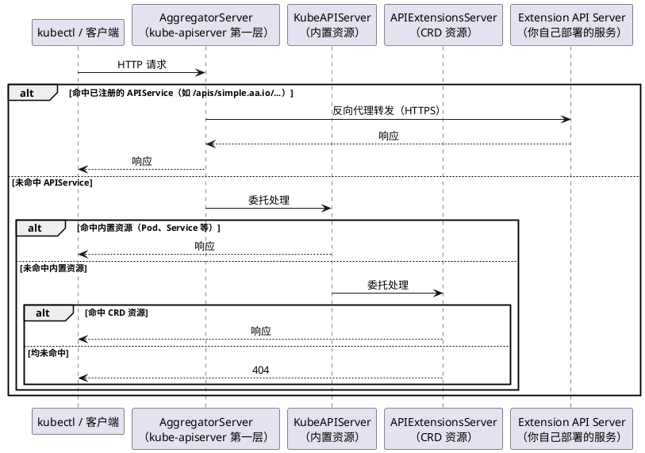

当 CRD 无法满足需求时，**API Aggregation（API 聚合，AA）** 是另一种扩展 Kubernetes API 的方式。它允许你自行编写并部署一个独立的 HTTP 服务——**Extension API Server（扩展 API 服务器）**，通过 APIService 资源将其注册到 kube-apiserver 的聚合层，之后 kube-apiserver 会将匹配的请求透明地转发过来。

参考：[api-extension/apiserver-aggregation](https://kubernetes.io/zh-cn/docs/concepts/extend-kubernetes/api-extension/apiserver-aggregation/)

## 为什么需要 API Aggregation

CRD 的能力覆盖了绝大多数场景，但它有几个先天限制：

- **存储固定为 etcd**：所有 CR 数据都持久化在 etcd 中，无法对接外部数据库或按需计算返回结果
- **不支持长连接子资源**：无法实现 WebSocket、exec、attach、portforward 等需要长时间保持连接的端点（类似 `kubectl exec` 背后的 `/exec` 子资源）
- **CRUD 语义固定**：CRD 只能走标准的 Create / Read / Update / Delete / List / Watch 接口，无法自定义复杂的请求处理逻辑

AA 把这些限制全部解开——你拿到的是原始 HTTP 请求，可以随意定义响应逻辑。代价是 CRD 帮你自动做好的事情（API Discovery、CRUD 接口、etcd 存储），现在都需要自己实现。

因此，选择的原则很简单：**优先用 CRD，只在 CRD 满足不了时才考虑 AA**。

## 整体架构

kube-apiserver 内部由三个服务组成，请求按照 AggregatorServer → KubeAPIServer → APIExtensionsServer 的顺序依次委托处理。AA 利用的是第一层 AggregatorServer：



AggregatorServer 内部有一个 `DiscoveryAggregationController`，它持续监听集群中的 APIService 资源变化。每当有新的 APIService 注册，控制器就会主动调用 Extension API Server 的 `/apis` 接口，把返回的 API 信息合并到 kube-apiserver 的全局 Discovery 响应中——这就是为什么创建完 APIService 之后，`kubectl api-resources` 马上就能看到新资源的原因。

## 需要自行实现的接口

和 CRD 对比，AA 需要自己承担更多工作：

| 功能 | CRD | AA |
|------|-----|----|
| API Discovery（`/apis/<group>` 等） | 自动注册 | **需要自行实现** |
| CR 的 CRUD 接口 | 自动提供，数据存 etcd | **需要自行实现** |
| 自定义存储后端 | 不支持 | 支持 |
| WebSocket / 长连接子资源 | 不支持 | 支持 |
| 自定义请求处理逻辑 | 不支持 | 支持 |

具体来说，AA 服务至少需要实现以下端点：

**API Discovery 端点**（让 kube-apiserver 知道你的服务提供了哪些资源）：

- `/apis`：返回 `APIGroupList` 或 `APIGroupDiscoveryList` 对象（兼容新旧版本客户端）
- `/apis/<group>`：返回 `APIGroup` 对象
- `/apis/<group>/<version>`：返回 `APIResourceList` 对象

**CR CRUD 端点**（实际的资源操作接口）：

- `/apis/<group>/<version>/namespaces/{ns}/<resource>`：list 和 create
- `/apis/<group>/<version>/namespaces/{ns}/<resource>/{name}`：get、update、patch、delete
- `/apis/<group>/<version>/<resource>`：跨命名空间 list

## 代码示例：API Discovery

API Discovery 是整个 AA 服务的核心前提——只有 kube-apiserver 知道你的服务提供了哪些资源，它才会把对应的请求转发过来。

先来看资源定义（`pkg/apis/discovery.go`）：

```go
// APIGroup：声明 AA 服务属于哪个 API 组
var _APIGroup = &metav1.APIGroup{
    TypeMeta: metav1.TypeMeta{
        Kind:       "APIGroup",
        APIVersion: "v1",
    },
    Name: "simple.aa.io",
    Versions: []metav1.GroupVersionForDiscovery{
        {
            GroupVersion: "simple.aa.io/v1beta1",
            Version:      "v1beta1",
        },
    },
}

// APIResourceList：声明该 Group/Version 下有哪些资源
var _APIResourceList = &metav1.APIResourceList{
    TypeMeta: metav1.TypeMeta{
        Kind:       "APIResourceList",
        APIVersion: "v1",
    },
    GroupVersion: "simple.aa.io/v1beta1",
    APIResources: []metav1.APIResource{
        {
            Name:         "hellos",       // 复数形式，用于 URL
            SingularName: "hello",        // 单数形式
            Namespaced:   true,
            Kind:         "Hello",
            Verbs:        []string{"create", "delete", "get", "list", "update", "patch"},
            ShortNames:   []string{"hi"}, // kubectl get hi 同样生效
            Categories:   []string{"all"},// kubectl get all 时会包含此资源
        },
    },
}

// APIGroupDiscoveryList：Kubernetes 1.27+ 新格式，一次请求返回所有 Discovery 信息
var _APIGroupDiscoveryList = &apidiscoveryv2beta1.APIGroupDiscoveryList{
    TypeMeta: metav1.TypeMeta{
        Kind:       "APIGroupDiscoveryList",
        APIVersion: "apidiscovery.k8s.io/v2beta1",
    },
    Items: []apidiscoveryv2beta1.APIGroupDiscovery{
        {
            ObjectMeta: metav1.ObjectMeta{Name: "simple.aa.io"},
            Versions: []apidiscoveryv2beta1.APIVersionDiscovery{
                {
                    Version: "v1beta1",
                    Resources: []apidiscoveryv2beta1.APIResourceDiscovery{
                        {
                            Resource:     "hellos",
                            ResponseKind: &metav1.GroupVersionKind{
                                Group: "simple.aa.io", Version: "v1beta1", Kind: "Hello",
                            },
                            Scope:            apidiscoveryv2beta1.ScopeNamespace,
                            SingularResource: "hello",
                            Verbs:      []string{"create", "delete", "get", "list", "update", "patch"},
                            ShortNames: []string{"hi"},
                            Categories: []string{"all"},
                        },
                    },
                },
            },
        },
    },
}
```

这里同时维护了两套格式：旧格式 `APIGroupList`（兼容 1.27 之前的 kube-apiserver）和新格式 `APIGroupDiscoveryList`（1.27+ 默认启用，一次 `/apis` 请求即可返回所有 Group/Version/Resource 信息，减少多次往返）。

在 `/apis` 端点的处理逻辑中，通过解析 `Accept` 请求头来决定返回哪种格式（`main.go`）：

```go
r.HandleFunc("/apis", func(w http.ResponseWriter, r *http.Request) {
    // 解析 Accept header，判断客户端支持哪种格式
    // 新版客户端会携带：Accept: application/json;as=APIGroupDiscoveryList;v=v2beta1;g=apidiscovery.k8s.io
    var as, g string
    accept := r.Header.Get("Accept")
    if accept != "" {
        for _, data := range strings.Split(accept, ";") {
            if values := strings.Split(data, "="); len(values) == 2 {
                switch values[0] {
                case "as":
                    as = values[1]
                case "g":
                    g = values[1]
                }
            }
        }
    }
    if as == "APIGroupDiscoveryList" && g == "apidiscovery.k8s.io" {
        // 新版客户端：返回聚合后的 APIGroupDiscoveryList，响应 Content-Type 需同步声明
        w.Header().Set("Content-Type", "application/json;as=APIGroupDiscoveryList;v=v2beta1;g=apidiscovery.k8s.io")
        w.Write(apis.APIGroupDiscoveryList())
        return
    }
    // 旧版客户端：返回 APIGroupList
    w.Header().Set("Content-Type", "application/json")
    w.Write(apis.APIGroupList())
})

// 兼容旧版客户端：需要分别实现 /apis/<group> 和 /apis/<group>/<version> 端点
r.HandleFunc("/apis/simple.aa.io", func(w http.ResponseWriter, r *http.Request) {
    w.Header().Set("Content-Type", "application/json")
    w.Write(apis.APIGroup())
})
r.HandleFunc("/apis/simple.aa.io/v1beta1", func(w http.ResponseWriter, r *http.Request) {
    w.Header().Set("Content-Type", "application/json")
    w.Write(apis.APIResourceList())
})
```

值得注意的是，响应 `APIGroupDiscoveryList` 时，`Content-Type` 里必须带上完整的格式声明（`as=APIGroupDiscoveryList;v=v2beta1;g=apidiscovery.k8s.io`）——kube-apiserver 通过这个字段识别响应体的类型，缺少它会导致解析失败。

## 代码示例：CR CRUD Handle

API Discovery 告诉 kube-apiserver "我有哪些资源"，CRUD Handle 才是实际处理资源请求的地方。

先定义 CR 类型（`pkg/apis/hello.go`）：

```go
// Hello 是 AA 服务自定义的资源类型
// 结构与 CRD 的 Go 类型定义完全一致，内嵌 TypeMeta 和 ObjectMeta
type Hello struct {
    metav1.TypeMeta   `json:",inline"`
    metav1.ObjectMeta `json:"metadata,omitempty"`

    Spec HelloSpec `json:"spec,omitempty"`
}

type HelloSpec struct {
    Msg string `json:"msg,omitempty"`
}
```

然后在路由中注册 CRUD 端点（`main.go`）：

```go
hellos := r.PathPrefix("/apis/simple.aa.io/v1beta1").Subrouter()

// kubectl get hello -A 时触发：跨命名空间 list
hellos.HandleFunc("/hellos", handle).Methods("GET")

// kubectl get hello -n <ns> 时触发：按命名空间 list
hellos.HandleFunc("/namespaces/{ns}/hellos", handle).Methods("GET")

// kubectl get hello <name> -n <ns> 时触发：按名称 get
hellos.HandleFunc("/namespaces/{ns}/hellos/{name}", handle).Methods("GET")
```

这里的 `handle` 函数处理了一个细节——`kubectl get` 默认以表格形式显示资源，但背后发送的是同一个 GET 请求，区别在于 `Accept` 请求头中是否携带 `as=Table`：

```go
handle := func(w http.ResponseWriter, r *http.Request) {
    w.Header().Set("Content-Type", "application/json")

    accept := r.Header.Get("Accept")
    if strings.Contains(accept, "application/json") && strings.Contains(accept, "as=Table") {
        // kubectl get 默认请求 Table 格式，用于终端表格展示
        // 需要返回 metav1.Table 对象，声明列名和行数据
        w.Write(apis.TODOHelloTable())
        return
    }
    // kubectl get -o json/yaml 等场景，返回原始对象
    w.Write(apis.TODOHello())
}
```

`Table` 对象的构造如下：

```go
var _TODOHelloTable = &metav1.Table{
    TypeMeta: metav1.TypeMeta{
        Kind:       "Table",
        APIVersion: "meta.k8s.io/v1",
    },
    // 声明表格的列名和类型
    ColumnDefinitions: []metav1.TableColumnDefinition{
        {Name: "Name", Type: "string", Format: "name"},
        {Name: "Msg", Type: "string", Format: "msg"},
    },
    // 每一行对应一个资源实例
    Rows: []metav1.TableRow{
        {
            Cells:  []interface{}{_TODOHello.Name, _TODOHello.Spec.Msg},
            Object: runtime.RawExtension{Object: _TODOHello},
        },
    },
}
```

支持 Table 格式是让 `kubectl get` 能正常显示列信息的前提。如果不处理这个分支，直接返回原始对象，kubectl 只会展示 `NAME` 和 `AGE` 两列，无法显示自定义字段。

最后，服务以 HTTPS 启动（kube-apiserver 要求 Extension API Server 必须使用 HTTPS）：

```go
panic(http.ListenAndServeTLS(fmt.Sprintf(":%d", port), crt, key, r))
```

完整代码见：[api-extension/AA/simple](https://github.com/togettoyou/kubernetes-src-notes/tree/main/src/api-extension/AA/simple)

## 部署：TLS 证书与 APIService

AA 服务必须以 HTTPS 对外服务——kube-apiserver 在转发请求前会验证 Extension API Server 的证书。证书的 CN 和 SAN 必须精确匹配服务的完全限定域名（FQDN），格式固定为 `<svc-name>.<namespace>.svc`。

**第一步：生成自签名证书**

项目提供了 `deploy/init.sh` 脚本一键完成证书生成和 YAML 填充：

```bash
#!/bin/bash
CN="simple-aa-server.aa-system.svc"

# 1. 生成私钥（tls.key）和证书签名请求（tls.csr）
openssl req -newkey rsa:2048 -nodes \
  -keyout certs/tls.key -out certs/tls.csr \
  -subj "/C=CN/ST=GD/L=SZ/O=Acme, Inc./CN=${CN}"

# 2. 生成自签名 CA 根证书
openssl req -new -x509 -days 3650 -nodes \
  -out certs/ca.crt -keyout certs/ca.key \
  -subj "/C=CN/ST=GD/L=SZ/O=Acme, Inc./CN=Acme Root CA"

# 3. 用 CA 签发 TLS 证书，SAN 必须与服务 FQDN 一致
openssl x509 -req -days 3650 \
  -in certs/tls.csr -CA certs/ca.crt -CAkey certs/ca.key -CAcreateserial \
  -out certs/tls.crt \
  -extfile <(printf "subjectAltName=DNS:${CN}")

# 4. Base64 编码后填充到 deploy.yaml 的占位符中
sed -i "s|<base64-encoded-ca-cert>|$(cat certs/ca.crt | base64 | tr -d '\n')|g" deploy.yaml
sed -i "s|<base64-encoded-tls-cert>|$(cat certs/tls.crt | base64 | tr -d '\n')|g" deploy.yaml
sed -i "s|<base64-encoded-tls-key>|$(cat certs/tls.key | base64 | tr -d '\n')|g" deploy.yaml
```

脚本执行完成后，`deploy.yaml` 中的三个占位符会被替换为实际的 Base64 编码证书。

**第二步：部署 AA 服务并注册 APIService**

`deploy.yaml` 包含四个资源，按职责依次说明：

```yaml
# 1. 将证书存入 Secret，挂载给 AA 服务使用
apiVersion: v1
kind: Secret
metadata:
  name: simple-aa-server-cert
  namespace: aa-system
type: kubernetes.io/tls
data:
  tls.crt: <base64-encoded-tls-cert>
  tls.key: <base64-encoded-tls-key>
---
# 2. 部署 AA 服务本体
apiVersion: apps/v1
kind: Deployment
metadata:
  name: simple-aa-server-deployment
  namespace: aa-system
spec:
  replicas: 1
  selector:
    matchLabels:
      app: simple-aa-server
  template:
    metadata:
      labels:
        app: simple-aa-server
    spec:
      containers:
        - name: simple-aa-server
          image: togettoyou/simple-aa-server:latest
          args:
            - --tls-crt-file=/etc/aa/certs/tls.crt
            - --tls-key-file=/etc/aa/certs/tls.key
            - --port=443
          volumeMounts:
            - name: cert
              mountPath: "/etc/aa/certs"
              readOnly: true
      volumes:
        - name: cert
          secret:
            secretName: simple-aa-server-cert
---
# 3. 暴露 AA 服务，kube-apiserver 通过此 Service 地址转发请求
apiVersion: v1
kind: Service
metadata:
  name: simple-aa-server
  namespace: aa-system
spec:
  ports:
    - port: 443
      targetPort: 443
  selector:
    app: simple-aa-server
---
# 4. 向 kube-apiserver 注册 APIService，完成 AA 接入
apiVersion: apiregistration.k8s.io/v1
kind: APIService
metadata:
  name: v1beta1.simple.aa.io   # 命名规则固定为 <version>.<group>
spec:
  group: simple.aa.io
  version: v1beta1
  groupPriorityMinimum: 100    # 同 group 多个 APIService 时的排序权重
  versionPriority: 100         # 同 group 内多个版本的排序权重
  service:
    namespace: aa-system
    name: simple-aa-server
    port: 443
  caBundle: <base64-encoded-ca-cert>  # CA 证书，kube-apiserver 用于验证 AA 服务的 TLS 证书
```

APIService 是整个接入流程的关键。一旦创建，AggregatorServer 就会开始监听它，调用 AA 服务的 `/apis` 接口拉取 Discovery 信息，随后将 `simple.aa.io/v1beta1` 下的所有请求转发到 `simple-aa-server` 这个 Service。

## 演示

按顺序执行：

```bash
# 1. 进入 deploy 目录，生成证书并填充 YAML
cd src/api-extension/AA/simple/deploy
bash init.sh

# 2. 创建命名空间并部署
kubectl create ns aa-system
kubectl apply -f deploy.yaml
```

确认 APIService 就绪：

```bash
$ kubectl get apiservice v1beta1.simple.aa.io
NAME                   SERVICE                        AVAILABLE   AGE
v1beta1.simple.aa.io   aa-system/simple-aa-server     True        10s
```

此时 `Hello` 资源已经可以正常访问：

```bash
# kubectl api-resources 可以看到新资源
$ kubectl api-resources | grep simple
hellos    hi    simple.aa.io/v1beta1    true    Hello

# kubectl get 以表格形式展示（触发 Table 格式逻辑）
$ kubectl get hello -A
NAMESPACE   NAME       MSG
default     my-hello   hello AA

# kubectl get -o json 返回原始对象
$ kubectl get hello my-hello -n default -o json
{
    "apiVersion": "simple.aa.io/v1beta1",
    "kind": "Hello",
    "metadata": {
        "name": "my-hello",
        "namespace": "default"
    },
    "spec": {
        "msg": "hello AA"
    }
}
```

AA 服务侧的日志同步打印出每次请求的路径：

```bash
I0410 21:30:02.123456   1 main.go:36] API Discovery/apis
I0410 21:30:02.234567   1 main.go:65] API Discovery/apis/simple.aa.io
I0410 21:30:02.345678   1 main.go:70] API Discovery/apis/simple.aa.io/v1beta1
I0410 21:30:03.456789   1 main.go:99] GET /namespaces/default/hellos
```

## 总结

API Aggregation 是 CRD 的补充而非替代——它把 Kubernetes API 的扩展边界彻底打开，代价是开发者需要自行承担 CRD 替你做好的那部分工作：API Discovery、CRUD 接口、TLS 配置。

核心流程可以归纳为三件事：**实现 HTTP 服务**（API Discovery 端点 + CR CRUD 端点）、**配置 TLS**（证书 CN/SAN 必须与 Service FQDN 一致）、**注册 APIService**（AggregatorServer 据此转发请求）。理解了 kube-apiserver 三层委托结构，以及 DiscoveryAggregationController 如何发现并聚合 AA 服务的 API 信息，整个机制就没有任何神秘之处。

## 微信公众号

更多内容请关注微信公众号：gopher的Infra修行


