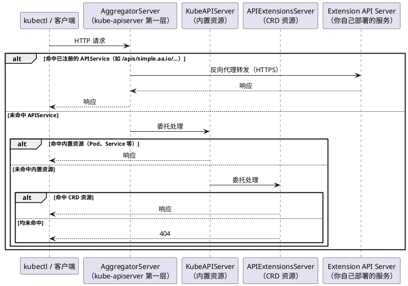

当 CRD 无法满足需求时，**API Aggregation（API 聚合，AA）** 是另一种扩展 Kubernetes API 的方式。它允许你自行编写并部署一个独立的 HTTP 服务（称为 **Extension API Server，扩展 API 服务器**），通过 APIService 资源将其注册到 kube-apiserver 的聚合层，之后 kube-apiserver 会将匹配的请求透明地转发过来。

参考：[api-extension/apiserver-aggregation](https://kubernetes.io/zh-cn/docs/concepts/extend-kubernetes/api-extension/apiserver-aggregation/)

## 为什么需要 API Aggregation

CRD 的能力覆盖了绝大多数场景，但它有几个先天限制：

- **存储固定为 etcd**：所有 CR 数据都持久化在 etcd 中，无法对接外部数据库或按需计算返回结果
- **不支持长连接子资源**：无法实现 WebSocket、exec、attach、portforward 等需要长时间保持连接的端点（类似 `kubectl exec` 背后的 `/exec` 子资源）
- **CRUD 语义固定**：CRD 只能走标准的 Create / Read / Update / Delete / List / Watch 接口，无法自定义复杂的请求处理逻辑

AA 把这些限制全部解开，你拿到的是原始 HTTP 请求，响应逻辑完全由自己定义。代价是 CRD 帮你自动做好的事情（API Discovery、CRUD 接口、etcd 存储），现在都需要自己实现。

因此，选择的原则很简单：**优先用 CRD，只在 CRD 满足不了时才考虑 AA**。

## 整体架构

kube-apiserver 内部由三个服务组成，每个服务各司其职，请求按照 AggregatorServer → KubeAPIServer → APIExtensionsServer 的顺序依次委托处理：

- **AggregatorServer**：第一层，负责 API 聚合。收到请求后先判断是否命中已注册的 APIService，命中则转发给对应的 Extension API Server，否则委托给下一层
- **KubeAPIServer**：第二层，处理所有 Kubernetes 内置资源（Pod、Service、Deployment 等），未命中则继续委托
- **APIExtensionsServer**：第三层，处理 CRD 声明的自定义资源，所有请求在这里都找不到处理时返回 404

AA 利用的是第一层 AggregatorServer，Extension API Server 部署在集群中，由 kube-apiserver 以反向代理的方式将请求转发过来：



转发时，kube-apiserver 与 Extension API Server 之间走 HTTPS，所以 Extension API Server 必须配置有效的 TLS 证书，并在 APIService 的 `caBundle` 字段中提供对应的 CA 证书供 kube-apiserver 校验。

### DiscoveryAggregationController：注册与发现

光有请求转发还不够，客户端（kubectl）在发出请求之前，需要先通过 API Discovery 知道某个资源挂在哪个 Group/Version 下、应该请求哪个路径。这部分由 AggregatorServer 内部的 `DiscoveryAggregationController` 负责。

它的工作分两个阶段：

**注册阶段**（创建 APIService 时触发）：`DiscoveryAggregationController` 持续 Watch 集群中的 APIService 资源。一旦发现新的 APIService，就主动调用对应 Extension API Server 的 `/apis` 接口，拉取其提供的 Group/Version/Resource 信息，将其合并到 kube-apiserver 的全局 Discovery 响应中。这就是为什么创建完 APIService 之后，`kubectl api-resources` 马上就能看到新资源。

**运行阶段**（请求到来时）：客户端请求 `/apis` 或 `/apis/<group>/<version>` 时，直接从 kube-apiserver 的全局 Discovery 缓存中读取，不再实时调用 Extension API Server。只有真正命中 APIService 路由的业务请求，才会被实时转发过去。

这个设计保证了 Discovery 信息的聚合对客户端完全透明，客户端始终只和 kube-apiserver 打交道，感知不到背后的 Extension API Server 的存在。

## 需要自行实现的接口

和 CRD 对比，AA 需要自己承担更多工作：

| 功能 | CRD | AA |
|------|-----|----|
| API Discovery（`/apis/<group>` 等） | 自动注册 | **需要自行实现** |
| CR 的 CRUD 接口 | 自动提供，数据存 etcd | **需要自行实现** |
| 自定义存储后端 | 不支持 | 支持 |
| WebSocket / 长连接子资源 | 不支持 | 支持 |
| 自定义请求处理逻辑 | 不支持 | 支持 |

具体来说，AA 服务至少需要实现以下端点：

**API Discovery 端点**（让 kube-apiserver 知道你的服务提供了哪些资源）：

- `/apis`：返回 `APIGroupList` 或 `APIGroupDiscoveryList` 对象（兼容新旧版本客户端）
- `/apis/<group>`：返回 `APIGroup` 对象
- `/apis/<group>/<version>`：返回 `APIResourceList` 对象

**CR CRUD 端点**（实际的资源操作接口）：

- `/apis/<group>/<version>/namespaces/{ns}/<resource>`：list 和 create
- `/apis/<group>/<version>/namespaces/{ns}/<resource>/{name}`：get、update、patch、delete
- `/apis/<group>/<version>/<resource>`：跨命名空间 list

下面我们来实现一个最简单的 AA 服务。它向集群注册一个新的资源类型 `Hello`（Group: `simple.aa.io`，Version: `v1beta1`），并让 `kubectl get hello` 能够正常工作。整个实现分两部分：API Discovery 和 CR CRUD Handle。

## API Discovery

API Discovery 是整个 AA 服务的核心前提，kube-apiserver 只有知道你的服务提供了哪些资源，才会把对应的请求转发过来。

### 旧格式：APIGroupList

1.27 之前的 kube-apiserver 通过三次请求完成 Discovery：先请求 `/apis` 获取 `APIGroupList`，再请求 `/apis/<group>` 获取 `APIGroup`，最后请求 `/apis/<group>/<version>` 获取 `APIResourceList`。三个对象需要分别实现（`pkg/apis/discovery.go`）：

```go
// /apis/<group>：描述 AA 服务的 Group 名称和支持的版本列表
var _APIGroup = &metav1.APIGroup{
    TypeMeta: metav1.TypeMeta{Kind: "APIGroup", APIVersion: "v1"},
    Name:     "simple.aa.io",
    Versions: []metav1.GroupVersionForDiscovery{
        {GroupVersion: "simple.aa.io/v1beta1", Version: "v1beta1"},
    },
}

// /apis：将 APIGroup 包装成列表返回
var _APIGroupList = &metav1.APIGroupList{
    TypeMeta: metav1.TypeMeta{Kind: "APIGroupList", APIVersion: "v1"},
    Groups:   []metav1.APIGroup{*_APIGroup},
}

// /apis/<group>/<version>：描述该版本下有哪些资源
var _APIResourceList = &metav1.APIResourceList{
    TypeMeta:     metav1.TypeMeta{Kind: "APIResourceList", APIVersion: "v1"},
    GroupVersion: "simple.aa.io/v1beta1",
    APIResources: []metav1.APIResource{
        {
            Name:         "hellos",        // 复数形式，用于 URL 路径
            SingularName: "hello",
            Namespaced:   true,
            Kind:         "Hello",
            Verbs:        []string{"create", "delete", "get", "list", "update", "patch"},
            ShortNames:   []string{"hi"},  // kubectl get hi 同样生效
            Categories:   []string{"all"}, // kubectl get all 时包含此资源
        },
    },
}
```

### 新格式：APIGroupDiscoveryList

1.27+ 引入了聚合格式 `APIGroupDiscoveryList`，把上面三个对象的信息合并在一起，客户端只需一次 `/apis` 请求就能拿到全部 Discovery 信息，减少多次往返：

```go
var _APIGroupDiscoveryList = &apidiscoveryv2beta1.APIGroupDiscoveryList{
    TypeMeta: metav1.TypeMeta{
        Kind:       "APIGroupDiscoveryList",
        APIVersion: "apidiscovery.k8s.io/v2beta1",
    },
    Items: []apidiscoveryv2beta1.APIGroupDiscovery{
        {
            ObjectMeta: metav1.ObjectMeta{Name: "simple.aa.io"},
            Versions: []apidiscoveryv2beta1.APIVersionDiscovery{
                {
                    Version: "v1beta1",
                    Resources: []apidiscoveryv2beta1.APIResourceDiscovery{
                        {
                            Resource:         "hellos",
                            ResponseKind:     &metav1.GroupVersionKind{Group: "simple.aa.io", Version: "v1beta1", Kind: "Hello"},
                            Scope:            apidiscoveryv2beta1.ScopeNamespace,
                            SingularResource: "hello",
                            Verbs:            []string{"create", "delete", "get", "list", "update", "patch"},
                            ShortNames:       []string{"hi"},
                            Categories:       []string{"all"},
                        },
                    },
                },
            },
        },
    },
}
```

### /apis 端点：兼容新旧两种格式

新旧客户端发出的请求路径相同，区别在于 `Accept` 请求头：新版客户端会携带 `as=APIGroupDiscoveryList`，旧版不携带。`/apis` 端点通过解析这个字段决定返回哪种格式（`main.go`）：

```go
r.HandleFunc("/apis", func(w http.ResponseWriter, r *http.Request) {
    var as, g string
    for _, data := range strings.Split(r.Header.Get("Accept"), ";") {
        if kv := strings.Split(data, "="); len(kv) == 2 {
            switch kv[0] {
            case "as":
                as = kv[1]
            case "g":
                g = kv[1]
            }
        }
    }
    if as == "APIGroupDiscoveryList" && g == "apidiscovery.k8s.io" {
        // 响应 Content-Type 必须与请求的 Accept 格式声明保持一致，
        // kube-apiserver 通过 Content-Type 识别响应体类型，缺少则解析失败
        w.Header().Set("Content-Type", "application/json;as=APIGroupDiscoveryList;v=v2beta1;g=apidiscovery.k8s.io")
        w.Write(apis.APIGroupDiscoveryList())
        return
    }
    w.Header().Set("Content-Type", "application/json")
    w.Write(apis.APIGroupList())
})

// 旧版客户端在获取 APIGroupList 后，还会继续请求这两个端点
r.HandleFunc("/apis/simple.aa.io", func(w http.ResponseWriter, r *http.Request) {
    w.Header().Set("Content-Type", "application/json")
    w.Write(apis.APIGroup())
})
r.HandleFunc("/apis/simple.aa.io/v1beta1", func(w http.ResponseWriter, r *http.Request) {
    w.Header().Set("Content-Type", "application/json")
    w.Write(apis.APIResourceList())
})
```

## CR CRUD Handle

API Discovery 告诉 kube-apiserver "我有哪些资源"，CRUD Handle 才是实际处理资源请求的地方。

### 类型定义

CR 类型的 Go 结构体写法与 CRD 完全一致，内嵌 `TypeMeta` 和 `ObjectMeta`（`pkg/apis/hello.go`）：

```go
type Hello struct {
    metav1.TypeMeta   `json:",inline"`
    metav1.ObjectMeta `json:"metadata,omitempty"`
    Spec HelloSpec    `json:"spec,omitempty"`
}

type HelloSpec struct {
    Msg string `json:"msg,omitempty"`
}
```

示例中预置了一个硬编码的 `Hello` 对象用于演示，在真实实现中，这里应该替换为从数据库或外部系统查询的实际数据：

```go
var _TODOHello = &Hello{
    TypeMeta: metav1.TypeMeta{
        Kind:       "Hello",
        APIVersion: "simple.aa.io/v1beta1",
    },
    ObjectMeta: metav1.ObjectMeta{
        Name:      "my-hello",
        Namespace: "default",
    },
    Spec: HelloSpec{Msg: "hello AA"},
}
```

### 路由注册

Kubernetes API 的 URL 结构是固定的，AA 服务需要按此规范注册路由（`main.go`）：

```go
hellos := r.PathPrefix("/apis/simple.aa.io/v1beta1").Subrouter()

hellos.HandleFunc("/hellos", handle).Methods("GET")                         // kubectl get hello -A
hellos.HandleFunc("/namespaces/{ns}/hellos", handle).Methods("GET")         // kubectl get hello -n <ns>
hellos.HandleFunc("/namespaces/{ns}/hellos/{name}", handle).Methods("GET")  // kubectl get hello <name> -n <ns>
```

路径中的 `{ns}` 和 `{name}` 是路由变量，可以在 handler 内通过 `mux.Vars(r)` 取出，用于按命名空间或按名称过滤返回结果。示例中为了简化直接返回了固定数据，实际实现时需要根据这两个参数查询对应的资源。

以 `kubectl get hello my-hello -n default` 为例，kube-apiserver 收到请求后经过 API Discovery 确定路径，最终将 `GET /apis/simple.aa.io/v1beta1/namespaces/default/hellos/my-hello` 转发到 AA 服务，匹配上第三条路由，进入 `handle` 处理。

### Table 格式支持

`kubectl get` 默认以表格形式显示资源，背后发的仍是 GET 请求，区别只在于 `Accept` 请求头中携带了 `as=Table`。如果直接返回原始对象，kubectl 只能展示通用的 `NAME` 和 `AGE` 两列，无法显示自定义字段。

`handle` 函数通过检测 `Accept` 请求头决定返回哪种格式：

```go
handle := func(w http.ResponseWriter, r *http.Request) {
    w.Header().Set("Content-Type", "application/json")
    accept := r.Header.Get("Accept")
    if strings.Contains(accept, "application/json") && strings.Contains(accept, "as=Table") {
        // kubectl get 默认携带 as=Table，期望返回 metav1.Table 对象
        w.Write(apis.TODOHelloTable())
        return
    }
    // kubectl get -o json / kubectl get -o yaml 等不携带 as=Table，返回原始对象
    w.Write(apis.TODOHello())
}
```

`metav1.Table` 通过 `ColumnDefinitions` 声明列名，通过 `Rows` 填充每一行的单元格数据：

```go
var _TODOHelloTable = &metav1.Table{
    TypeMeta: metav1.TypeMeta{Kind: "Table", APIVersion: "meta.k8s.io/v1"},
    // 声明终端表格的列名，kubectl 按此渲染表头
    ColumnDefinitions: []metav1.TableColumnDefinition{
        {Name: "Name", Type: "string", Format: "name"},
        {Name: "Msg", Type: "string", Format: "msg"},
    },
    // 每个 Row 对应一条资源记录
    // Cells 按列顺序填充单元格内容，Object 存原始对象（kubectl describe 等命令会用到）
    Rows: []metav1.TableRow{
        {
            Cells:  []interface{}{_TODOHello.Name, _TODOHello.Spec.Msg},
            Object: runtime.RawExtension{Object: _TODOHello},
        },
    },
}
```

两种请求格式对比，`kubectl get hello -A` 实际发出的请求头中带有：

```
Accept: application/json;as=Table;v=v1;g=meta.k8s.io,application/json;as=Table;v=v1beta1;g=meta.k8s.io,application/json
```

而 `kubectl get hello -A -o json` 发出的是：

```
Accept: application/json
```

AA 服务通过检测是否包含 `as=Table` 来区分这两种请求，分别返回 `metav1.Table` 和原始的 `Hello` 对象。

最后，服务以 HTTPS 启动：

```go
panic(http.ListenAndServeTLS(fmt.Sprintf(":%d", port), crt, key, r))
```

完整代码见：[api-extension/AA/simple](https://github.com/togettoyou/kubernetes-src-notes/tree/main/src/api-extension/AA/simple)

## 部署与演示

进入 `deploy` 目录，执行 `init.sh` 生成 TLS 证书并填充 `deploy.yaml`，然后部署：

```bash
cd src/api-extension/AA/simple/deploy
bash init.sh
kubectl create ns aa-system
kubectl apply -f deploy.yaml
```

`deploy.yaml` 包含四个资源，前三个是标准的 Secret + Deployment + Service 组合，将 AA 服务运行起来并暴露在集群内。最关键的是最后的 APIService：

```yaml
apiVersion: apiregistration.k8s.io/v1
kind: APIService
metadata:
  name: v1beta1.simple.aa.io  # 命名规则固定为 <version>.<group>
spec:
  group: simple.aa.io
  version: v1beta1
  groupPriorityMinimum: 100   # 同 group 多个 APIService 时的排序权重
  versionPriority: 100        # 同 group 内多个版本的排序权重
  service:
    namespace: aa-system
    name: simple-aa-server
    port: 443
  caBundle: <base64-encoded-ca-cert>  # CA 证书，kube-apiserver 用此验证 AA 服务的 TLS 证书
```

APIService 的 `name` 固定为 `<version>.<group>` 格式，`spec.group` 和 `spec.version` 声明这个 APIService 覆盖的 GV，`spec.service` 指向 AA 服务的 Service，`caBundle` 是 CA 证书的 Base64 编码，kube-apiserver 用它来验证转发请求时 AA 服务出示的 TLS 证书。

APIService 创建后，可以确认它已就绪：

```bash
$ kubectl get apiservice v1beta1.simple.aa.io
NAME                   SERVICE                        AVAILABLE   AGE
v1beta1.simple.aa.io   aa-system/simple-aa-server     True        10s
```

`AVAILABLE: True` 表示 AggregatorServer 已成功连通 AA 服务并完成 Discovery 同步。此后 `simple.aa.io/v1beta1` 下的所有请求都会被转发过来：

```bash
$ kubectl api-resources | grep simple
hellos    hi    simple.aa.io/v1beta1    true    Hello

$ kubectl get hello -A
NAMESPACE   NAME       MSG
default     my-hello   hello AA

$ kubectl get hello my-hello -n default -o json
{
    "apiVersion": "simple.aa.io/v1beta1",
    "kind": "Hello",
    "metadata": {
        "name": "my-hello",
        "namespace": "default"
    },
    "spec": {
        "msg": "hello AA"
    }
}
```

AA 服务侧的日志同步打印出每次请求的路径：

```bash
I0410 21:30:02.123456   1 main.go:36] API Discovery/apis
I0410 21:30:02.234567   1 main.go:65] API Discovery/apis/simple.aa.io
I0410 21:30:02.345678   1 main.go:70] API Discovery/apis/simple.aa.io/v1beta1
I0410 21:30:03.456789   1 main.go:99] GET /namespaces/default/hellos
```

## 总结

API Aggregation 是 CRD 的补充而非替代，它把 Kubernetes API 的扩展边界彻底打开，代价是开发者需要自行承担 CRD 替你做好的那部分工作：API Discovery、CRUD 接口、TLS 配置。

核心流程可以归纳为两件事：**实现 HTTP 服务**（API Discovery 端点 + CR CRUD 端点）、**注册 APIService**（AggregatorServer 据此转发请求）。理解了 kube-apiserver 三层委托结构，以及 DiscoveryAggregationController 如何发现并聚合 AA 服务的 API 信息，整个机制就没有任何神秘之处。

## 微信公众号

更多内容请关注微信公众号：gopher的Infra修行


