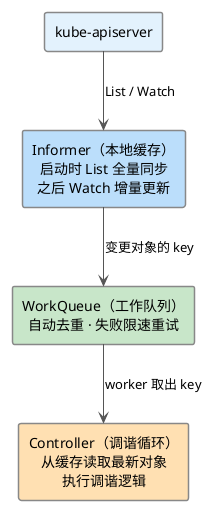
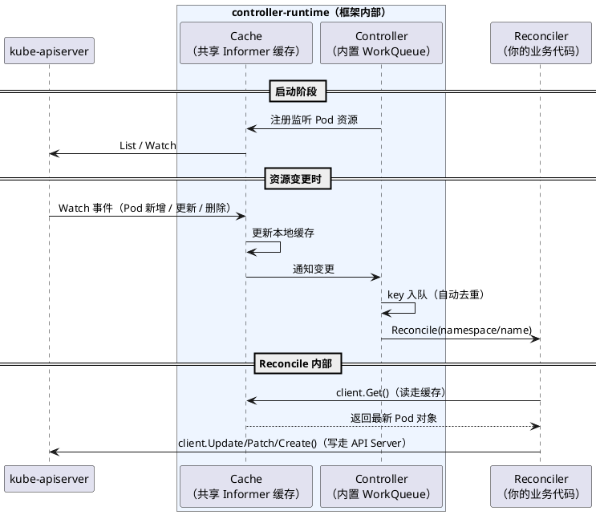

在 Kubernetes 的所有扩展机制中，**CRD + Controller（Operator 模式）** 是使用最广泛的一种。它的核心思想是：通过 CustomResourceDefinition 向集群声明一种新的资源类型，再配合一个自定义控制器，持续监听这个资源的状态，将实际状态驱动向期望状态收敛。

这种模式本质上是对 Kubernetes 自身设计哲学的一次复用——kube-controller-manager 里的 Deployment Controller、StatefulSet Controller，走的也是完全相同的路子。

参考：[extend-kubernetes/operator](https://kubernetes.io/zh-cn/docs/concepts/extend-kubernetes/operator/)

## 控制循环：Operator 模式的核心

理解 Operator 模式，先要理解 **控制循环（Control Loop）**。

传统的命令式系统告诉你"怎么做"——你执行一条命令，它立刻执行一次操作，执行完就结束了。Kubernetes 的设计是声明式的：你只需要告诉系统"期望状态是什么"，系统会自己想办法让实际状态与期望状态保持一致，并且在出现偏差时自动修复。

实现这个目标的机制就是控制循环：

```
永远循环：
  观察（Observe）— 获取资源的当前实际状态
  比对（Diff）    — 与期望状态比较，找出差异
  执行（Act）     — 执行操作，让实际状态向期望状态靠拢
```

这也是为什么控制器的核心逻辑被称为 **Reconcile（调谐）**——每一次调谐，都是在修复实际状态与期望状态之间的偏差。

值得注意的是，控制循环采用的是 **水平触发（Level-Triggered）** 而非边缘触发（Edge-Triggered）：控制器不关心"发生了什么事件"，只关心"当前状态是什么"。这意味着即使某次事件被遗漏，下一次触发时控制器依然能观察到正确的状态并做出正确的动作——这天然保证了容错性。

## CRD：向集群声明自定义资源

控制器要管理的资源，首先需要在 Kubernetes 中有一个对应的 API 类型。对于内置资源（Pod、Deployment 等），这些类型是 kube-apiserver 硬编码的。对于自定义资源，则需要通过 **CustomResourceDefinition（CRD）** 来声明。

一旦创建了 CRD，kube-apiserver 的 APIExtensionsServer 组件会自动为这个新资源类型提供标准的 CRUD 接口，数据同样持久化到 etcd 中，`kubectl get/apply/delete` 全部开箱即用。

CRD 对应的 Go 类型定义遵循固定的结构：

```go
// MyPodSpec 定义 MyPod 的期望状态（用户声明的目标）
type MyPodSpec struct {
    Foo string `json:"foo,omitempty"`
}

// MyPodStatus 定义 MyPod 的实际状态（控制器观察并写回的结果）
type MyPodStatus struct {
}

// MyPod 是 mypods API 的核心类型
type MyPod struct {
    metav1.TypeMeta   `json:",inline"`
    metav1.ObjectMeta `json:"metadata,omitempty"`

    Spec   MyPodSpec   `json:"spec,omitempty"`
    Status MyPodStatus `json:"status,omitempty"`
}
```

这个结构有几个固定约定：

- **Spec**：期望状态，由用户填写，控制器只读
- **Status**：实际状态，由控制器写回，记录观察到的真实情况
- **TypeMeta + ObjectMeta**：每个 Kubernetes 资源都必须内嵌这两个字段，分别存储 `apiVersion/kind` 和 `name/namespace/labels` 等元信息

有了 CRD，kube-apiserver 侧的工作就完成了。接下来需要一个控制器持续监听这个资源，驱动调谐逻辑。根据对底层细节的掌控程度和开发效率的取舍，社区形成了三个层次的选择：直接使用 **client-go**、基于 **controller-runtime**、以及借助 **Kubebuilder / Operator SDK** 脚手架。

## 直接使用 client-go

client-go 是 Kubernetes 官方的 Go 客户端库，kube-controller-manager 自身就是用它来实现所有内置控制器的。直接使用 client-go 灵活度最高，也最接近 Kubernetes 控制器的底层实现。

### 整体思路

用 client-go 构建一个控制器，需要三个核心组件配合：



Informer 负责感知变化，WorkQueue 负责可靠传递，Controller 负责处理。三者各司其职，这套模式在 Kubernetes 的所有内置控制器中几乎一模一样。

### main.go：串联三个组件

`main.go` 的职责是初始化这三个组件，并把它们拼装在一起：

```go
package main

import (
	"context"
	"flag"

	"k8s.io/client-go/informers"
	"k8s.io/client-go/kubernetes"
	"k8s.io/client-go/rest"
	"k8s.io/client-go/tools/cache"
	"k8s.io/client-go/util/workqueue"
)

var (
	host  string
	token string
)

func init() {
	flag.StringVar(&host, "host", "", "连接自定义集群")
	flag.StringVar(&token, "token", "", "连接自定义集群的token")
}

func main() {
	flag.Parse()

	// 第一步：初始化集群连接配置
	// 支持两种方式：
	//   · 指定 host + token（用于集群外本地开发调试）
	//   · 不指定参数，自动读取 Pod 内的 ServiceAccount 凭证（用于部署在集群内）
	var (
		cfg *rest.Config
		err error
	)
	if host != "" && token != "" {
		cfg = &rest.Config{
			Host:        host,
			BearerToken: token,
			TLSClientConfig: rest.TLSClientConfig{
				Insecure: true,
			},
		}
	} else {
		cfg, err = rest.InClusterConfig()
		if err != nil {
			panic(err)
		}
	}

	// 第二步：创建 ClientSet，用于与 kube-apiserver 通信
	clientSet, err := kubernetes.NewForConfig(cfg)
	if err != nil {
		panic(err)
	}

	// 第三步：创建 SharedInformerFactory
	// 它是 Informer 的工厂，负责管理所有 Informer 实例。
	// 第二个参数 resyncPeriod 为 0，表示不强制定期全量 re-list，
	// 只依赖 Watch 的增量事件驱动更新。
	sharedInformerFactory := informers.NewSharedInformerFactory(clientSet, 0)

	// 第四步：从工厂中获取 Pod Informer
	// Informer 会在本地内存中维护一份 Pod 的完整缓存，
	// 控制器后续所有的读操作都走这份缓存，不直接请求 kube-apiserver。
	podInformer := sharedInformerFactory.Core().V1().Pods()

	// 第五步：创建工作队列
	// NewRateLimitingQueue 内置了限速器，失败重试时会自动退避，
	// 避免某个 key 处理失败后被无限制地高频重试。
	queue := workqueue.NewRateLimitingQueue(workqueue.DefaultControllerRateLimiter())

	// 第六步：给 Informer 注册事件回调
	// 当 Pod 发生新增、更新、删除时，回调函数会被触发。
	// 这里不直接处理业务逻辑，只把变更对象的 key（"namespace/name" 格式）
	// 推入工作队列，交给 worker goroutine 异步处理。
	podInformer.Informer().AddEventHandler(cache.ResourceEventHandlerFuncs{
		AddFunc: func(obj interface{}) {
			key, err := cache.MetaNamespaceKeyFunc(obj)
			if err == nil {
				queue.Add(key)
			}
		},
		UpdateFunc: func(oldObj, newObj interface{}) {
			key, err := cache.MetaNamespaceKeyFunc(newObj)
			if err == nil {
				queue.Add(key)
			}
		},
		DeleteFunc: func(obj interface{}) {
			key, err := cache.MetaNamespaceKeyFunc(obj)
			if err == nil {
				queue.Add(key)
			}
		},
	})

	// 第七步：初始化控制器，传入队列和 Informer
	controller := NewController(queue, podInformer.Lister(), podInformer.Informer())

	ctx := context.Background()

	// 第八步：启动 Informer
	// Start 会在后台启动所有已创建的 Informer，开始 List/Watch。
	sharedInformerFactory.Start(ctx.Done())

	// 第九步：启动控制器（1 个 worker goroutine）
	go controller.Run(ctx, 1)

	// 阻塞主 goroutine，保持进程运行
	select {}
}
```

这里有一个设计值得留意：事件回调里只做了一件事——把对象的 key 推入队列，并没有直接处理业务逻辑。原因是，如果在回调里直接处理，一旦失败就没有重试机会，并发也难以控制。把 key 推入队列后，WorkQueue 会负责去重和失败重试，实际处理由 worker 串行或并发消费。

### controller.go：实现调谐循环

控制器的核心是一个持续运行的消费循环，不断从队列取 key，然后执行调谐逻辑：

```go
package main

import (
	"context"
	"fmt"
	"time"

	"k8s.io/apimachinery/pkg/api/errors"
	utilruntime "k8s.io/apimachinery/pkg/util/runtime"
	"k8s.io/apimachinery/pkg/util/wait"
	v1 "k8s.io/client-go/listers/core/v1"
	"k8s.io/client-go/tools/cache"
	"k8s.io/client-go/util/workqueue"
	"k8s.io/klog/v2"
)

type Controller struct {
	workqueue workqueue.RateLimitingInterface // 工作队列
	lister    v1.PodLister                   // 从 Informer 本地缓存读取 Pod（不发起网络请求）
	informer  cache.Controller               // 用于等待缓存首次同步完成
}

func NewController(
	workqueue workqueue.RateLimitingInterface,
	lister v1.PodLister,
	informer cache.Controller) *Controller {
	return &Controller{
		workqueue: workqueue,
		lister:    lister,
		informer:  informer,
	}
}

// Run 启动控制器，workers 指定并发处理的 goroutine 数量
func (c *Controller) Run(ctx context.Context, workers int) {
	defer utilruntime.HandleCrash() // 捕获 panic，避免整个进程崩溃
	defer c.workqueue.ShutDown()    // 退出时关闭队列，通知 worker 停止

	logger := klog.FromContext(ctx)
	logger.Info("Starting controller")

	// 关键：等待 Informer 完成首次全量同步
	// 控制器启动时，Informer 需要先从 kube-apiserver List 一次全量数据，
	// 建立好本地缓存后，才能开始处理事件。
	// 如果不等待这一步，worker 可能从缓存里读不到数据，导致误判。
	logger.Info("Waiting for informer caches to sync")
	if ok := cache.WaitForCacheSync(ctx.Done(), c.informer.HasSynced); !ok {
		utilruntime.HandleError(fmt.Errorf("failed to wait for caches to sync"))
		return
	}

	logger.Info("Starting workers", "count", workers)
	// 启动 workers 个 goroutine，每个都在持续调用 runWorker
	// wait.UntilWithContext 确保 runWorker 退出后会自动重启（间隔 1 秒），保证健壮性
	for i := 0; i < workers; i++ {
		go wait.UntilWithContext(ctx, c.runWorker, time.Second)
	}

	logger.Info("Started workers")
	<-ctx.Done() // 阻塞，直到收到退出信号
	logger.Info("Shutting down workers")
}

// runWorker 持续调用 processNextWorkItem，直到队列关闭
func (c *Controller) runWorker(ctx context.Context) {
	for c.processNextWorkItem(ctx) {
	}
}

// processNextWorkItem 从队列取出一个 key 并处理，返回 false 表示队列已关闭
func (c *Controller) processNextWorkItem(ctx context.Context) bool {
	// Get 会阻塞，直到队列中有新的 key 可处理
	key, shutdown := c.workqueue.Get()
	if shutdown {
		return false
	}
	// Done 必须在处理结束后调用，告知队列这个 key 已处理完毕。
	// 只有调用 Done 之后，相同 key 才能再次进入队列被处理。
	defer c.workqueue.Done(key)

	err := c.syncHandler(key.(string))
	c.handleErr(ctx, err, key)
	return true
}

// syncHandler 是真正执行调谐的地方
// 参数 key 是资源的唯一标识，格式为 "namespace/name"
func (c *Controller) syncHandler(key string) error {
	// 从 key 中解析出 namespace 和 name
	namespace, name, err := cache.SplitMetaNamespaceKey(key)
	if err != nil {
		utilruntime.HandleError(fmt.Errorf("invalid resource key: %s", key))
		return nil
	}

	// 从 Informer 本地缓存读取 Pod 的当前状态（不发起网络请求）
	pod, err := c.lister.Pods(namespace).Get(name)
	if err != nil {
		if errors.IsNotFound(err) {
			// Pod 已经被删除，对应的 key 已无意义，直接忽略
			utilruntime.HandleError(fmt.Errorf("pod '%s' in work queue no longer exists", key))
			return nil
		}
		return err
	}

	// =============================================
	// 在这里实现你的调谐逻辑
	// 读取 pod.Spec（期望状态）和 pod.Status（实际状态），
	// 执行相应的操作，让实际状态向期望状态收敛。
	// =============================================
	fmt.Printf("Sync/Add/Update/Delete for Pod %s/%s\n", pod.GetNamespace(), pod.GetName())

	return nil
}

// handleErr 处理调谐失败的情况，决定是重试还是放弃
func (c *Controller) handleErr(ctx context.Context, err error, key interface{}) {
	if err == nil {
		// 处理成功，清除这个 key 的重试计数
		c.workqueue.Forget(key)
		return
	}

	logger := klog.FromContext(ctx)

	// 失败次数不超过 3 次，重新入队等待重试
	// AddRateLimited 会按照限速器的配置（默认指数退避）延迟重新入队，
	// 避免短时间内对同一个 key 反复处理
	if c.workqueue.NumRequeues(key) < 3 {
		logger.Info("Error syncing, will retry", "key", key, "err", err)
		c.workqueue.AddRateLimited(key)
		return
	}

	// 超过重试上限，彻底放弃这个 key
	c.workqueue.Forget(key)
	utilruntime.HandleError(err)
	logger.Info("Dropping key out of the queue", "key", key, "err", err)
}
```

`syncHandler` 是整个控制器最核心的地方，也是唯一需要根据业务需求定制的函数。它拿到的是资源对象的当前快照，在这里对比 `Spec`（期望状态）和 `Status`（实际状态），然后执行相应的操作——创建子资源、调用外部 API、更新 Status 等等，最终让实际状态向期望状态收敛。

完整代码见：[controller-operator/client-go/simple](https://github.com/togettoyou/kubernetes-src-notes/tree/main/src/controller-operator/client-go/simple)

```bash
$ go run . --host=https://127.0.0.1:6443 --token=<your-token>
I0410 21:30:02.431343   21951 controller.go:39] "Starting controller"
I0410 21:30:02.431456   21951 controller.go:40] "Waiting for informer caches to sync"
I0410 21:30:02.532597   21951 controller.go:47] "Starting workers" count=1
I0410 21:30:02.532626   21951 controller.go:53] "Started workers"
Sync/Add/Update/Delete for Pod default/nginx
Sync/Add/Update/Delete for Pod kube-system/coredns-6cc96b5c97-nfmp7
...
```

## 使用 controller-runtime

[controller-runtime](https://github.com/kubernetes-sigs/controller-runtime) 是社区当前的主流选择，Kubebuilder 和 Operator SDK 生成的项目都基于它。

对比 client-go 方案，controller-runtime 最大的变化是：Informer 的创建、WorkQueue 的管理、缓存同步等待、失败重试——这些全部由框架内部处理，开发者只需要实现一个接口：`Reconciler`。



### main.go：三行核心代码

```go
package main

import (
	"context"
	"flag"

	corev1 "k8s.io/api/core/v1"
	"k8s.io/client-go/rest"
	ctrl "sigs.k8s.io/controller-runtime"
)

var (
	host  string
	token string
)

func init() {
	flag.StringVar(&host, "host", "", "连接自定义集群")
	flag.StringVar(&token, "token", "", "连接自定义集群的token")
}

func main() {
	flag.Parse()

	// 初始化集群连接配置（同 client-go 方案）
	var (
		cfg *rest.Config
		err error
	)
	if host != "" && token != "" {
		cfg = &rest.Config{
			Host:        host,
			BearerToken: token,
			TLSClientConfig: rest.TLSClientConfig{
				Insecure: true,
			},
		}
	} else {
		cfg, err = rest.InClusterConfig()
		if err != nil {
			panic(err)
		}
	}

	// 第一步：创建 Manager
	// Manager 是整个 Operator 的入口，内部自动管理 Informer 缓存、
	// WorkQueue、Leader Election、健康检查端点等，无需手动搭建。
	mgr, err := ctrl.NewManager(cfg, ctrl.Options{})
	if err != nil {
		panic(err)
	}

	// 第二步：向 Manager 注册控制器
	// For(&corev1.Pod{}) 声明要监听 Pod 资源的增删改事件，
	// Complete 传入实现了 Reconciler 接口的结构体。
	err = ctrl.NewControllerManagedBy(mgr).
		Named("pod-controller").
		For(&corev1.Pod{}).
		Complete(&podReconciler{client: mgr.GetClient()})
	if err != nil {
		panic(err)
	}

	// 第三步：启动 Manager（阻塞，直到收到终止信号）
	if err := mgr.Start(context.Background()); err != nil {
		panic(err)
	}
}
```

相比 client-go 的 `main.go`，这里的代码量少了大半：不需要手动创建 SharedInformerFactory，不需要手动创建 WorkQueue，不需要手动注册 EventHandler——这些全部由 `ctrl.NewControllerManagedBy` 在内部完成。

### controller.go：只需实现 Reconcile

开发者唯一需要实现的是 `Reconciler` 接口，它只有一个方法 `Reconcile`：

```go
package main

import (
	"context"
	"fmt"

	corev1 "k8s.io/api/core/v1"
	"k8s.io/apimachinery/pkg/api/errors"
	"k8s.io/klog/v2"
	"sigs.k8s.io/controller-runtime/pkg/client"
	"sigs.k8s.io/controller-runtime/pkg/reconcile"
)

type podReconciler struct {
	// controller-runtime 提供的统一客户端
	// 读操作走本地缓存，写操作发往 kube-apiserver
	client client.Client
}

// 编译期检查：确保 podReconciler 实现了 reconcile.Reconciler 接口
var _ reconcile.Reconciler = &podReconciler{}

// Reconcile 在 Pod 发生变更时被框架自动调用
// request 只包含资源的 namespace 和 name，不包含对象本身
func (r *podReconciler) Reconcile(ctx context.Context, request reconcile.Request) (reconcile.Result, error) {
	logger := klog.FromContext(ctx)

	pod := &corev1.Pod{}

	// 用 request 中的 namespace/name 从缓存中取出最新的 Pod 对象
	err := r.client.Get(ctx, request.NamespacedName, pod)
	if err != nil {
		if errors.IsNotFound(err) {
			// Pod 已被删除，对应的调谐无需处理
			logger.Error(nil, "Could not find Pod", request.NamespacedName)
			return reconcile.Result{}, nil
		}
		return reconcile.Result{}, err
	}

	// =============================================
	// 在这里实现你的调谐逻辑
	// =============================================
	fmt.Printf("Sync/Add/Update/Delete for Pod %s/%s\n", pod.GetNamespace(), pod.GetName())

	// reconcile.Result{} 表示调谐成功，无需重新触发
	// 如需定时复查，可返回 reconcile.Result{RequeueAfter: time.Minute}
	return reconcile.Result{}, nil
}
```

注意 `Reconcile` 的入参是 `reconcile.Request`，它只携带 `namespace/name`，不包含对象本身。这是有意为之的设计——框架保证调用 `Reconcile` 时缓存已是最新，开发者应该主动用 `client.Get` 取最新状态，而不是依赖事件时刻的快照。如果 `Get` 返回 `NotFound`，说明对象已被删除，按需处理即可。

完整代码见：[controller-operator/controller-runtime/simple](https://github.com/togettoyou/kubernetes-src-notes/tree/main/src/controller-operator/controller-runtime/simple)

```bash
$ go run . --host=https://127.0.0.1:6443 --token=<your-token>
Sync/Add/Update/Delete for Pod default/nginx
Sync/Add/Update/Delete for Pod kube-system/coredns-6cc96b5c97-nfmp7
...
```

## 使用 Kubebuilder / Operator SDK

[Kubebuilder](https://github.com/kubernetes-sigs/kubebuilder) 和 [Operator SDK](https://github.com/operator-framework/operator-sdk) 是基于 controller-runtime 的代码脚手架工具，运行时机制与 controller-runtime 完全相同。它们的核心价值在于 **代码生成**：两条命令就能生成一个完整的 Operator 项目骨架，并通过 Marker 注解自动生成 CRD YAML、RBAC 规则等配置文件，省去大量重复劳动。以下以 Kubebuilder 为例。

### 初始化项目

```bash
# 初始化项目，指定 domain（CRD Group 的后缀）和 Go module 名
kubebuilder init --project-name simple --domain controller.io --repo simple

# 生成 API 类型定义和 Controller 骨架
kubebuilder create api --group simple --version v1 --kind MyPod
```

执行后自动生成以下关键文件：

```
simple/
├── api/v1/
│   ├── mypod_types.go             # CRD 类型定义，填写 Spec/Status 字段即可
│   └── zz_generated.deepcopy.go  # 自动生成的 DeepCopy，无需手动维护
├── internal/controller/
│   └── mypod_controller.go       # Reconciler 骨架，实现 Reconcile 逻辑
├── config/
│   ├── crd/                      # make manifests 自动生成的 CRD YAML
│   └── rbac/                     # Marker 注解自动生成的 RBAC 规则
└── cmd/main.go                   # Manager 入口，通常无需修改
```

### Marker 注解：用注释驱动代码生成

Kubebuilder 独有的设计是 **Marker 注解**——写在 Go 注释里的特殊指令，`controller-gen` 工具扫描这些注解后自动生成对应文件，开发者不再需要手写 CRD YAML 和 RBAC ClusterRole。

写在类型上，控制 CRD 的生成行为：

```go
// +kubebuilder:object:root=true
// +kubebuilder:subresource:status
type MyPod struct { ... }
```

写在 Reconcile 方法上，控制 RBAC 规则的生成：

```go
// +kubebuilder:rbac:groups=simple.controller.io,resources=mypods,verbs=get;list;watch;create;update;patch;delete
// +kubebuilder:rbac:groups=simple.controller.io,resources=mypods/status,verbs=get;update;patch
func (r *MyPodReconciler) Reconcile(ctx context.Context, req ctrl.Request) (ctrl.Result, error) {
    myPod := &simplev1.MyPod{}

    err := r.Client.Get(ctx, req.NamespacedName, myPod)
    if err != nil {
        if errors.IsNotFound(err) {
            return ctrl.Result{}, nil
        }
        return ctrl.Result{}, err
    }

    // 在这里实现你的调谐逻辑
    return ctrl.Result{}, nil
}
```

注解写好后，执行 `make manifests` 即可生成所有配置文件。

完整代码见：[controller-operator/kubebuilder/simple](https://github.com/togettoyou/kubernetes-src-notes/tree/main/src/controller-operator/kubebuilder/simple)

## 总结

Operator 模式的本质是一个持续运行的控制循环：观察资源的实际状态，与期望状态对比，执行操作让两者趋于一致。这套逻辑在 Kubernetes 的所有内置控制器中都是相同的，CRD + Controller 只是把这个能力开放给了开发者。

三种开发方式本质上是同一件事的不同抽象层次。**client-go** 让你把每一个零件都摸得清清楚楚，适合对底层有掌控需求的场景，kube-controller-manager 本身就是这么写的；**controller-runtime** 把 Informer、WorkQueue、缓存同步这些基础设施封装掉，你只需要实现一个 `Reconcile` 方法，这是当前社区最主流的选择；**Kubebuilder / Operator SDK** 在 controller-runtime 之上再加一层脚手架，两条命令生成项目骨架，Marker 注解自动生成 CRD YAML 和 RBAC 规则，适合快速启动新项目。

三者并不互斥。理解了 client-go 的 Informer 机制，你才能真正看懂 controller-runtime 在替你做什么；理解了 controller-runtime，Kubebuilder 生成的代码就没有任何神秘之处。建议的学习路径也正是如此：从 client-go 入手建立底层认知，再用 controller-runtime 提效，最后用 Kubebuilder 快速落地生产项目。

## 微信公众号

更多内容请关注微信公众号：gopher的Infra修行


