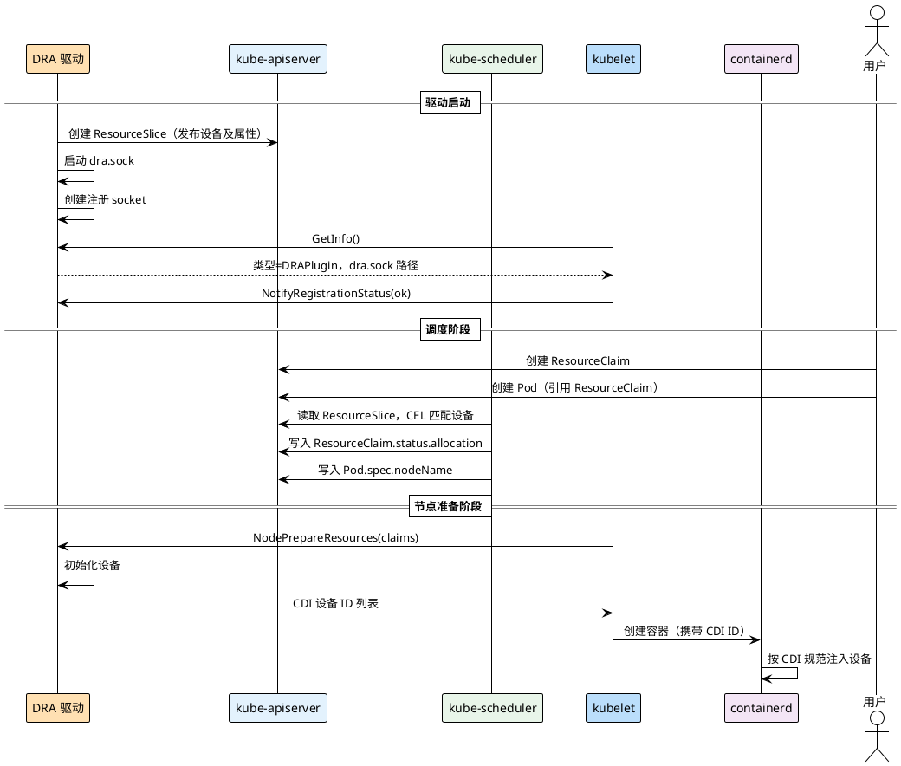

Device Plugin 用一个整数描述节点上的设备数量，调度器只知道"这个节点有 3 块 GPU"，看不到它们的型号、显存大小、所在 NUMA 域。当一个 Pod 需要的是"显存 ≥ 40GB 的 A100"，Device Plugin 无能为力。**DRA（Dynamic Resource Allocation，动态资源分配）** 从根本上解决了这个问题：驱动通过 `ResourceSlice` 将设备的完整属性发布到 API Server，调度器可以用 CEL 表达式对属性做细粒度筛选，并原生支持多个 Pod 共享同一设备。DRA 于 Kubernetes 1.34 正式 GA，使用体验类似 PersistentVolumeClaim。

参考：[dynamic-resource-allocation](https://kubernetes.io/zh-cn/docs/concepts/scheduling-eviction/dynamic-resource-allocation/)

## Device Plugin 的局限

上一篇介绍的 Device Plugin 有三个根本局限：

- **只能按数量申请**：Pod 只能声明 `limits: vendor/gpu: 1`，无法表达"我要一块显存 ≥ 40GB 的 GPU"
- **无法共享设备**：一个设备 ID 在同一时刻只能分配给一个容器，即便设备本身支持多路复用
- **调度器感知不到属性**：`ListAndWatch` 上报的是设备 ID 列表，属性完全不可见，NUMA 亲和性等高级调度无从实现

DRA 针对性地解决了这三个问题：设备属性写进 `ResourceSlice`，调度器直接读取并用 CEL 做匹配；`ResourceClaim` 可以被多个 Pod 共享；整套调度决策在 API Server 层完成，不再绕过调度器在 kubelet 侧进行。

## 核心 API

DRA 围绕四个 API 资源构建。

**ResourceSlice** 是驱动发布到 API Server 的设备目录，集群级资源。每个 ResourceSlice 描述一个驱动在某个资源池（通常等于节点）内的一批设备，每个设备可以携带任意属性（`attributes`）和容量（`capacity`），调度器用 CEL 对这些属性做匹配：

```yaml
spec:
  driver: fake.dra.example.com
  pool:
    name: node01
    resourceSliceCount: 1
  nodeName: node01
  devices:
    - name: fake-0
      attributes:
        model: {string: "fake-v1"}
        index: {int: 0}
      capacity:
        memory: {value: 8Gi}
```

**DeviceClass** 是集群管理员定义的设备类型模板，类似 StorageClass。用户创建 ResourceClaim 时引用 DeviceClass，自动继承其中预设的 CEL 选择器；管理员可以在 DeviceClass 中限定只有特定驱动的设备才能被申请。

**ResourceClaim** 是用户声明资源需求的对象，类似 PersistentVolumeClaim。用户在 `spec.devices.requests` 中写明需要几个设备、引用哪个 DeviceClass，以及额外的 CEL 筛选条件。调度器在找到满足条件的设备后，将分配结果写入 `status.allocation`。

**ResourceClaimTemplate** 用于"每个 Pod 独享一个 ResourceClaim"的场景。在 Pod 的 `resourceClaims` 字段中引用 Template 时，Kubernetes 会为每个 Pod 自动创建一个独立的 ResourceClaim，并在 Pod 删除时回收。

与 Device Plugin 的对比：

| 维度 | Device Plugin | DRA |
|------|--------------|-----|
| 设备发现 | kubelet 调用 ListAndWatch | 驱动主动发布 ResourceSlice 到 API Server |
| 资源申请方式 | `resources.limits` | `resources.claims` + ResourceClaim |
| 设备筛选 | 只能按数量 | CEL 表达式按属性过滤 |
| 共享设备 | 不支持 | 支持（ResourceClaim 可被多 Pod 共享） |
| 调度器感知 | 节点可用数量 | 设备完整属性 |
| K8s 版本 | Stable（很早） | 1.34 GA |

## 整体架构

DRA 的资源生命周期分两个阶段：调度阶段由调度器完成设备匹配，节点准备阶段由 kubelet 驱动实际的设备初始化：



两个阶段的关键点：

- **调度阶段**：调度器直接读取 API Server 中的 ResourceSlice，对每个设备的 `attributes` 跑 CEL 表达式，找到满足条件的节点和设备后，将分配结果写入 ResourceClaim 的 `status.allocation`，整个过程在控制面完成，不需要和节点通信。
- **节点准备阶段**：kubelet 发现 Pod 调度到本节点后，通过 DRA gRPC 接口调用驱动的 `NodePrepareResources`，驱动准备好设备并返回 CDI 设备 ID，kubelet 将这些 ID 传给 containerd。containerd 通过 CDI 规范读取 `/etc/cdi/` 下的描述文件，按其中定义的环境变量、挂载、设备节点完成设备注入。CDI 之于设备注入，类似 CNI 之于网络，是驱动与容器运行时之间的标准化协议。

## 实现 DRA 驱动

DRA 驱动由两部分组成：**Controller** 向 API Server 发布 ResourceSlice，**kubelet Plugin** 处理 kubelet 的 NodePrepareResources 调用。两者通常打包在同一个进程里，以 DaemonSet 部署到每个节点。

下面实现一个最简单的 DRA 驱动，在每个节点上发布 5 个虚拟设备（驱动名 `fake.dra.example.com`）。

### Controller：发布 ResourceSlice

Controller 在驱动启动时向 API Server 创建本节点的 ResourceSlice，将节点上可用的设备及属性告知调度器（`pkg/controller/controller.go`）：

```go
func (c *Controller) PublishResourceSlice(ctx context.Context) error {
    sliceName := fmt.Sprintf("%s-%s", DriverName, c.nodeName)

    // k8s 1.34（resource/v1）中 Device 的 Attributes 和 Capacity 直接在 Device 上，
    // v1beta1 时通过 Basic *BasicDevice 包裹，升级时需注意
    devices := make([]resourcev1.Device, DeviceCount)
    for i := 0; i < DeviceCount; i++ {
        devices[i] = resourcev1.Device{
            Name: fmt.Sprintf("fake-%d", i),
            // Attributes 是可供 ResourceClaim CEL 选择器查询的键值对
            // 调度器会将 ResourceClaim 的 selectors 与这些属性做匹配
            Attributes: map[resourcev1.QualifiedName]resourcev1.DeviceAttribute{
                "model": {StringValue: strPtr("fake-v1")},
                "index": {IntValue: int64Ptr(int64(i))},
            },
            // Capacity 描述设备提供的可量化资源，供调度器计算资源余量
            Capacity: map[resourcev1.QualifiedName]resourcev1.DeviceCapacity{
                "memory": {Value: resource.MustParse("8Gi")},
            },
        }
    }

    slice := &resourcev1.ResourceSlice{
        ObjectMeta: metav1.ObjectMeta{Name: sliceName},
        Spec: resourcev1.ResourceSliceSpec{
            Driver: DriverName,
            // Pool 是资源池，通常以节点名命名；调度器通过 Pool 将设备与节点关联
            Pool: resourcev1.ResourcePool{
                Name:               c.nodeName,
                Generation:         0,
                ResourceSliceCount: 1,
            },
            // NodeName 在 resource/v1 中为 *string
            NodeName: &c.nodeName,
            Devices:  devices,
        },
    }

    existing, err := c.client.ResourceV1().ResourceSlices().Get(ctx, sliceName, metav1.GetOptions{})
    if errors.IsNotFound(err) {
        _, err = c.client.ResourceV1().ResourceSlices().Create(ctx, slice, metav1.CreateOptions{})
        ...
        return nil
    }
    // 设备列表变化时更新已有的 ResourceSlice，同时递增 Generation
    existing.Spec = slice.Spec
    existing.Spec.Pool.Generation++
    _, err = c.client.ResourceV1().ResourceSlices().Update(ctx, existing, metav1.UpdateOptions{})
    ...
}
```

`ResourceSlice` 是集群级资源，驱动的 ServiceAccount 需要 `resource.k8s.io/resourceslices` 的 `create/update/delete` 权限（见 `deploy/driver.yaml` 中的 ClusterRole）。

### kubelet Plugin：注册握手

DRA 的注册协议与 Device Plugin 截然不同。Device Plugin 是驱动主动调用 kubelet 的注册接口；DRA 驱动是被动等待 kubelet 来询问。

做法是在 `/var/lib/kubelet/plugins_registry/` 目录下创建注册 socket，kubelet 的 plugin manager 持续监听该目录，发现新 socket 后主动调用驱动的 `GetInfo` 完成握手（`pkg/plugin/plugin.go`）：

```go
// Start 按顺序完成两件事：
//  1. 在 plugins/<driver>/dra.sock 启动 DRA gRPC 服务
//  2. 在 plugins_registry/<driver>.sock 启动注册 gRPC 服务，触发 kubelet 检测
//
// 顺序不能反：kubelet 检测到注册 socket 后立即调用 GetInfo，
// GetInfo 返回的 Endpoint 是 dra.sock，kubelet 随即连接该 socket，
// 所以 dra.sock 必须在注册 socket 创建之前就绪
func (p *DRAPlugin) Start() error {
    pluginDir := filepath.Join(PluginsDir, DriverName)
    os.MkdirAll(pluginDir, 0750)
    p.draSocketPath = filepath.Join(pluginDir, DRASocketName)

    p.startDRAServer()
    p.startRegistrationServer()
    return nil
}
```

`GetInfo` 向 kubelet 说明这是一个 DRAPlugin 以及 DRA socket 的位置；`NotifyRegistrationStatus` 是握手完成后 kubelet 的回调：

```go
// GetInfo 是 kubelet plugin manager 握手的第一步
// kubelet 通过返回值确认：这是一个 DRAPlugin，DRA socket 在哪里
func (p *DRAPlugin) GetInfo(_ context.Context, _ *registerapi.InfoRequest) (*registerapi.PluginInfo, error) {
    return &registerapi.PluginInfo{
        Type:              registerapi.DRAPlugin,
        Name:              DriverName,
        Endpoint:          p.draSocketPath,
        SupportedVersions: []string{"v1"},
    }, nil
}

// NotifyRegistrationStatus 是 kubelet plugin manager 握手的第二步
// kubelet 通知驱动注册是否成功
func (p *DRAPlugin) NotifyRegistrationStatus(_ context.Context, status *registerapi.RegistrationStatus) (*registerapi.RegistrationStatusResponse, error) {
    if !status.PluginRegistered {
        klog.Errorf("Plugin registration failed: %s", status.Error)
    } else {
        klog.Info("Plugin successfully registered with kubelet")
    }
    return &registerapi.RegistrationStatusResponse{}, nil
}
```

### kubelet Plugin：准备与释放设备

注册完成后，kubelet 会在两个时机调用驱动：Pod 调度到本节点后调用 `NodePrepareResources`，Pod 删除后调用 `NodeUnprepareResources`。

`NodePrepareResources` 接收的每个 `Claim` 只含 `namespace/uid/name`，驱动需要自行从 ResourceClaim 的 `status.allocation` 字段读取调度器记录的具体分配设备（生产实现中通过 informer lister 完成）。准备好设备后，驱动返回 CDI 设备 ID，kubelet 将其传给 containerd。示例中跳过了读取 allocation 的步骤，直接返回一个固定的虚拟设备：

```go
func (p *DRAPlugin) NodePrepareResources(ctx context.Context, req *drapb.NodePrepareResourcesRequest) (*drapb.NodePrepareResourcesResponse, error) {
    resp := &drapb.NodePrepareResourcesResponse{
        Claims: make(map[string]*drapb.NodePrepareResourceResponse),
    }

    for _, claim := range req.Claims {
        klog.Infof("NodePrepareResources: claim=%s/%s uid=%s", claim.Namespace, claim.Name, claim.UID)

        // CDI 设备 ID 格式：<vendor>/<class>=<name>
        // 容器运行时通过此 ID 在 /etc/cdi/ 中查找设备描述文件，完成设备注入
        cdiID := fmt.Sprintf("%s/device=fake-0", DriverName)

        // 真实场景：在这里执行设备初始化操作（如创建软链接、分配显存分区等）
        klog.Infof("  prepared device: cdi=%s", cdiID)

        resp.Claims[claim.UID] = &drapb.NodePrepareResourceResponse{
            Devices: []*drapb.Device{
                {
                    // RequestNames 对应 ResourceClaim.spec.devices.requests[*].name
                    // 此示例固定填写，生产实现中应从 ResourceClaim.status.allocation 读取
                    RequestNames: []string{"my-request"},
                    PoolName:     p.nodeName,
                    DeviceName:   "fake-0",
                    CDIDeviceIDs: []string{cdiID},
                },
            },
        }
    }
    return resp, nil
}

func (p *DRAPlugin) NodeUnprepareResources(ctx context.Context, req *drapb.NodeUnprepareResourcesRequest) (*drapb.NodeUnprepareResourcesResponse, error) {
    for _, claim := range req.Claims {
        klog.Infof("NodeUnprepareResources: claim=%s/%s uid=%s", claim.Namespace, claim.Name, claim.UID)
        // 真实场景：在这里释放设备资源（如删除软链接、归还显存分区等）
    }
    return &drapb.NodeUnprepareResourcesResponse{}, nil
}
```

### main.go

入口按顺序启动 Controller 和 kubelet Plugin，等待退出信号后清理 ResourceSlice。启动顺序有意义：先发布 ResourceSlice，调度器才能感知设备；再启动 kubelet Plugin，处理后续的 NodePrepareResources 调用（`main.go`）：

```go
func main() {
    klog.Info("Starting simple DRA driver")

    // 在集群内通过 ServiceAccount 获取访问 API Server 的凭证
    cfg, _ := rest.InClusterConfig()
    client, _ := kubernetes.NewForConfig(cfg)

    ctx, cancel := context.WithCancel(context.Background())
    defer cancel()

    // 先发布 ResourceSlice，让调度器能感知到本节点的设备
    // ResourceSlice 是调度器看到设备的唯一途径，必须在 kubelet plugin 之前就绪
    ctrl := controller.NewController(client)
    ctrl.PublishResourceSlice(ctx)

    // 再启动 kubelet Plugin，处理 NodePrepareResources / NodeUnprepareResources
    p := plugin.NewDRAPlugin()
    p.Start()

    sigCh := make(chan os.Signal, 1)
    signal.Notify(sigCh, syscall.SIGTERM, syscall.SIGINT)
    <-sigCh

    klog.Info("Shutting down simple DRA driver")
    p.Stop()
    // 删除 ResourceSlice，调度器随即感知本节点设备已下线
    ctrl.DeleteResourceSlice(context.Background())
}
```

完整代码见：[dra/simple](https://github.com/togettoyou/kubernetes-src-notes/tree/main/src/dra/simple)

## 部署与演示

### 部署驱动

驱动以 DaemonSet 部署，需挂载两个宿主机目录，并通过 ClusterRole 授权读写 ResourceSlice（`deploy/driver.yaml`）：

```yaml
containers:
  - name: simple-dra-driver
    image: togettoyou/simple-dra-driver:latest
    env:
      # NODE_NAME 注入当前节点名，Controller 用此值命名 ResourceSlice 和 Pool
      - name: NODE_NAME
        valueFrom:
          fieldRef:
            fieldPath: spec.nodeName
    volumeMounts:
      - name: plugins-dir
        mountPath: /var/lib/kubelet/plugins       # 驱动在此创建 dra.sock
      - name: registry-dir
        mountPath: /var/lib/kubelet/plugins_registry  # 驱动在此创建注册 socket
volumes:
  - name: plugins-dir
    hostPath:
      path: /var/lib/kubelet/plugins
  - name: registry-dir
    hostPath:
      path: /var/lib/kubelet/plugins_registry
```

DaemonSet 启动后，每个节点上的驱动实例各自发布本节点的 ResourceSlice，并向本节点的 kubelet 完成注册握手。查看驱动日志可以看到完整流程：

```bash
$ kubectl -n dra-system logs simple-dra-driver-x7bxr
I0418 14:02:11.123456  1 main.go:18] Starting simple DRA driver
I0418 14:02:11.234567  1 controller.go:65] Created ResourceSlice fake.dra.example.com-node01 with 5 devices
I0418 14:02:11.345678  1 plugin.go:94] DRA plugin gRPC server started at /var/lib/kubelet/plugins/fake.dra.example.com/dra.sock
I0418 14:02:11.456789  1 plugin.go:120] Registration server started at /var/lib/kubelet/plugins_registry/fake.dra.example.com.sock
I0418 14:02:11.567890  1 plugin.go:154] Plugin successfully registered with kubelet
```

### 创建 DeviceClass 和 ResourceClaim

管理员先创建 DeviceClass，限定只有本驱动的设备才能被申请（`deploy/deviceclass.yaml`）：

```yaml
apiVersion: resource.k8s.io/v1
kind: DeviceClass
metadata:
  name: fake-device
spec:
  selectors:
    - cel:
        expression: device.driver == "fake.dra.example.com"
```

用户创建 ResourceClaim 申请一个设备（`deploy/claim.yaml`）：

```yaml
apiVersion: resource.k8s.io/v1
kind: ResourceClaim
metadata:
  name: my-fake-device
  namespace: default
spec:
  devices:
    requests:
      - name: my-request
        deviceClassName: fake-device
```

### Pod 申请设备

Pod 通过 `spec.resourceClaims` 引用 ResourceClaim，容器通过 `resources.claims` 声明自己要使用哪个 claim。这是 DRA 与 Device Plugin 在 Pod 写法上最直观的区别：

```yaml
apiVersion: v1
kind: Pod
metadata:
  name: fake-device-consumer
  namespace: default
spec:
  # resourceClaims 声明此 Pod 要使用的 ResourceClaim
  resourceClaims:
    - name: my-device
      resourceClaimName: my-fake-device
  containers:
    - name: consumer
      image: busybox
      command: ["sh", "-c", "sleep 3600"]
      resources:
        # claims 声明容器使用 Pod 级别 resourceClaims 中的哪一项
        claims:
          - name: my-device
            request: my-request
```

Pod 创建后，调度器读取 ResourceSlice，找到满足 DeviceClass CEL 条件的设备，将分配结果写入 ResourceClaim 的 `status.allocation`，随后选定节点。kubelet 检测到 Pod 调度到本节点，调用驱动的 `NodePrepareResources`，驱动返回 CDI 设备 ID，containerd 完成设备注入，容器启动。

## 总结

DRA 把"设备是什么"和"设备怎么用"分离到两个层面。驱动通过 ResourceSlice 告诉控制面设备有哪些属性，调度器在控制面完成匹配并记录分配结果，kubelet 最后驱动设备初始化并将 CDI ID 交给容器运行时，各层职责清晰，互不感知彼此的细节。

实现一个 DRA 驱动需要做三件事：Controller 发布 ResourceSlice，kubelet Plugin 处理 NodePrepareResources（设备准备）和 NodeUnprepareResources（设备释放），注册 gRPC 服务让 kubelet plugin manager 能发现驱动。与 Device Plugin 的 ListAndWatch 上报模型相比，DRA 换来的是调度器对设备属性的完整可见性、原生的设备共享支持，以及与 PVC 一致的用户体验。

## 微信公众号

更多内容请关注微信公众号：gopher的Infra修行


