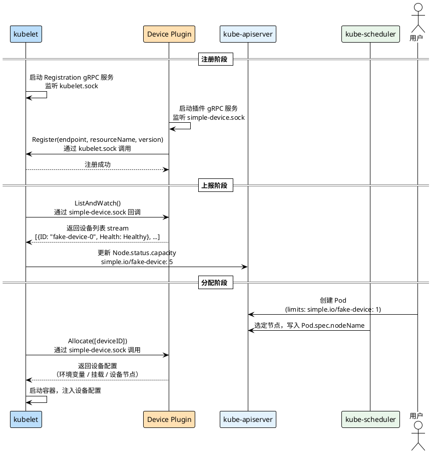

Kubernetes 对 CPU、内存等标准资源的调度是内置的，但对 GPU、NPU、FPGA 这类异构硬件，Kubernetes 本身并不知道它们的存在。**Device Plugin** 是 Kubernetes 为此设计的标准化扩展点：硬件厂商实现一个 gRPC 服务，向 kubelet 注册自定义资源并上报设备状态，kubelet 再将信息同步到 API Server，调度器就能感知节点上有多少这类设备可用，Pod 也可以像申请 CPU 一样申请这些资源。

参考：[device-plugins](https://kubernetes.io/zh-cn/docs/concepts/extend-kubernetes/compute-storage-net/device-plugins/)

## 整体架构

Device Plugin 一般以 DaemonSet 方式部署，在每个节点上各运行一个实例。它与 kubelet 之间通过 Unix Socket 通信，整个生命周期分为注册、上报、分配三个阶段：



三个阶段的职责各不相同：

- **注册阶段**：kubelet 启动时在 `device-plugins/` 目录下创建 `kubelet.sock`，对外提供 Registration gRPC 服务。Device Plugin 启动后先建好自己的 socket，再通过 `kubelet.sock` 调用 `Register()`，告知 kubelet 自己监听的 socket 路径、资源名称和 API 版本。
- **上报阶段**：注册成功后，kubelet 立即通过插件的 socket 回调 `ListAndWatch()`，插件以 stream 形式推送设备列表。kubelet 根据 `Healthy` 状态的设备数量更新 `Node.status.capacity`，资源随即对调度器可见。
- **分配阶段**：用户创建 Pod 并声明资源需求，调度器选定节点后，目标节点的 kubelet 调用插件的 `Allocate()`，插件返回设备访问所需的配置（环境变量、挂载、设备节点），kubelet 将其注入容器后启动。

两个关键的 Unix Socket 都位于 `/var/lib/kubelet/device-plugins/` 目录下：`kubelet.sock` 由 kubelet 创建，供 Device Plugin 调用注册接口；插件自己的 socket（如 `simple-device.sock`）由 Device Plugin 创建，kubelet 注册完成后通过它回调 `ListAndWatch` 和 `Allocate`。这也决定了启动顺序：**插件必须先建好自己的 socket、启动 gRPC 服务，再向 kubelet 发起注册**，否则 kubelet 注册成功后立即回调 `ListAndWatch` 时会找不到 socket。

## gRPC 接口

Device Plugin 需要实现以下 gRPC 服务：

```protobuf
service DevicePlugin {
    // 声明插件支持哪些可选能力，插件注册成功后 kubelet 调用一次
    rpc GetDevicePluginOptions(Empty) returns (DevicePluginOptions) {}

    // 以流的形式持续上报设备列表，设备状态变化时推送新列表
    rpc ListAndWatch(Empty) returns (stream ListAndWatchResponse) {}

    // 容器创建前调用，返回容器访问设备所需的配置
    rpc Allocate(AllocateRequest) returns (AllocateResponse) {}

    // 可选：从候选设备中返回推荐分配方案（如 NUMA 亲和性）
    rpc GetPreferredAllocation(PreferredAllocationRequest)
        returns (PreferredAllocationResponse) {}

    // 可选：容器启动前调用，可用于设备重置等初始化操作
    rpc PreStartContainer(PreStartContainerRequest)
        returns (PreStartContainerResponse) {}
}
```

`GetDevicePluginOptions` 的返回值告诉 kubelet 后两个可选接口是否实现了，kubelet 据此决定是否调用它们。不需要实现可选接口时，把对应字段设为 `false` 即可，kubelet 不会调用。

`ListAndWatch` 的返回值是一个持续开放的 stream，设备状态发生变化时，插件主动向 stream 推送新列表。kubelet 根据 `Health` 字段为 `Healthy` 的设备数量更新 `Node.status.capacity`（以及由此派生的 `allocatable`）；设备变为 `Unhealthy` 时可分配数量减少，但已分配给现有 Pod 的设备不会被强制收回。

`Allocate` 的返回值 `ContainerAllocateResponse` 有三种方式向容器暴露设备：

| 字段 | 类型 | 用途 |
|------|------|------|
| `Envs` | `map[string]string` | 注入环境变量，适合传递设备 ID、配置参数 |
| `Mounts` | `[]*Mount` | 挂载宿主机路径，适合传递驱动库（如 `libvgpu.so`） |
| `Devices` | `[]*DeviceSpec` | 暴露设备节点，适合真实硬件（如 `/dev/nvidia0`） |

## 实现设备插件

下面实现一个最简单的 Device Plugin，向 kubelet 注册 5 个虚拟设备（资源名 `simple.io/fake-device`），在 `Allocate` 时通过环境变量将分配到的设备 ID 注入容器。

### 常量与结构体

先定义几个关键常量和插件结构体（`pkg/plugin/plugin.go`）：

```go
const (
    // 资源名称，决定 Node.status.capacity 中的键名
    // 命名规范：<vendor-domain>/<resource-type>，不能以 kubernetes.io 开头
    ResourceName = "simple.io/fake-device"

    // 向 kubelet 上报的虚拟设备总数
    DeviceCount = 5

    // 插件在 device-plugins 目录下创建的 Unix Socket 文件名
    SocketName = "simple-device.sock"

    // kubelet 与 Device Plugin 通信的 socket 目录
    SocketDir = "/var/lib/kubelet/device-plugins"

    // kubelet Registration gRPC 服务的 socket 文件名
    KubeletSocket = "kubelet.sock"
)

// SimplePlugin 实现了 Device Plugin gRPC 服务
type SimplePlugin struct {
    server *grpc.Server  // 插件自己的 gRPC 服务器
    stop   chan struct{}  // 停止信号，关闭时通知 ListAndWatch 退出
}
```

### 启动与注册

`Start()` 按顺序完成三件事：清理旧 socket、启动 gRPC 服务、向 kubelet 注册：

```go
func (p *SimplePlugin) Start() error {
    socketPath := filepath.Join(SocketDir, SocketName)

    // 清理可能残留的旧 socket 文件（插件崩溃或 kubelet 重启后可能存在）
    if err := os.Remove(socketPath); err != nil && !os.IsNotExist(err) {
        return fmt.Errorf("failed to remove old socket %s: %v", socketPath, err)
    }

    lis, err := net.Listen("unix", socketPath)
    if err != nil {
        return fmt.Errorf("failed to listen on %s: %v", socketPath, err)
    }

    p.server = grpc.NewServer()
    pluginapi.RegisterDevicePluginServer(p.server, p)
    go p.server.Serve(lis)
    klog.Infof("Device plugin gRPC server started at %s", socketPath)

    // gRPC 服务就绪后再注册，否则 kubelet 回调 ListAndWatch 时会连接失败
    if err := p.register(); err != nil {
        return fmt.Errorf("failed to register with kubelet: %v", err)
    }

    go p.watchKubeletRestart()
    return nil
}
```

`register()` 连接到 kubelet 的 `kubelet.sock`，调用 Registration gRPC 完成注册。`Endpoint` 字段只需文件名，不需要完整路径，kubelet 会在 `SocketDir` 下查找：

```go
func (p *SimplePlugin) register() error {
    kubeletSocket := filepath.Join(SocketDir, KubeletSocket)

    ctx, cancel := context.WithTimeout(context.Background(), 5*time.Second)
    defer cancel()

    conn, err := grpc.DialContext(ctx, "unix://"+kubeletSocket,
        grpc.WithTransportCredentials(insecure.NewCredentials()),
        grpc.WithBlock(),
    )
    if err != nil {
        return fmt.Errorf("failed to connect to kubelet at %s: %v", kubeletSocket, err)
    }
    defer conn.Close()

    client := pluginapi.NewRegistrationClient(conn)
    _, err = client.Register(context.Background(), &pluginapi.RegisterRequest{
        Version:      pluginapi.Version,
        Endpoint:     SocketName,      // 只需文件名
        ResourceName: ResourceName,    // "simple.io/fake-device"
        Options:      &pluginapi.DevicePluginOptions{},
    })
    if err != nil {
        return fmt.Errorf("registration call failed: %v", err)
    }
    klog.Infof("Successfully registered with kubelet: resource=%s, devices=%d", ResourceName, DeviceCount)
    return nil
}
```

### ListAndWatch：上报设备

kubelet 注册成功后立即调用 `ListAndWatch`，插件通过 stream 推送设备列表，然后保持 stream 开启。设备状态发生变化时（如硬件故障），在这里向 stream 推送带有 `Unhealthy` 状态的新列表，kubelet 会相应减少节点可分配的资源数量：

```go
func (p *SimplePlugin) ListAndWatch(_ *pluginapi.Empty, stream pluginapi.DevicePlugin_ListAndWatchServer) error {
    // 构造设备列表：5 个虚拟设备，全部标记为 Healthy
    devs := make([]*pluginapi.Device, DeviceCount)
    for i := 0; i < DeviceCount; i++ {
        devs[i] = &pluginapi.Device{
            ID:     fmt.Sprintf("fake-device-%d", i),
            Health: pluginapi.Healthy,
        }
    }

    // 首次推送，kubelet 据此更新 Node.status.capacity
    if err := stream.Send(&pluginapi.ListAndWatchResponse{Devices: devs}); err != nil {
        return err
    }
    klog.Infof("Reported %d devices to kubelet", DeviceCount)

    // 保持 stream 开启，直到插件停止
    // 真实场景中：在此监听硬件状态变化，设备故障时重新 Send 带 Unhealthy 状态的列表
    <-p.stop
    return nil
}
```

### Allocate：分配设备

Pod 调度到节点后，kubelet 在创建容器前调用 `Allocate`，传入本次分配的设备 ID 列表（`ContainerRequests` 包含本次请求中所有容器的分配项，每个元素对应一个容器）。示例通过环境变量将设备 ID 注入容器，真实场景通常还会通过 `Mounts` 挂载驱动库或通过 `Devices` 暴露设备节点：

```go
func (p *SimplePlugin) Allocate(_ context.Context, req *pluginapi.AllocateRequest) (*pluginapi.AllocateResponse, error) {
    var responses pluginapi.AllocateResponse

    for _, r := range req.ContainerRequests {
        klog.Infof("Allocate: container requested devices %v", r.DevicesIDs)

        resp := &pluginapi.ContainerAllocateResponse{
            // 通过环境变量将分配的设备 ID 传入容器
            Envs: map[string]string{
                "FAKE_DEVICE_IDS": fmt.Sprintf("%v", r.DevicesIDs),
            },
        }
        responses.ContainerResponses = append(responses.ContainerResponses, resp)
    }

    return &responses, nil
}
```

### watchKubeletRestart：监听 kubelet 重启

kubelet 重启后会删除并重建 `kubelet.sock`。如果插件不重新注册，节点的 `simple.io/fake-device` 资源会从 capacity 中消失；`watchKubeletRestart` 正是为了检测这一情况，在 kubelet 重建 socket 后主动触发重新注册。

用 fsnotify 监听整个 `device-plugins/` 目录，等待 `kubelet.sock` 的 `Create` 事件：

```go
func (p *SimplePlugin) watchKubeletRestart() {
    kubeletSocket := filepath.Join(SocketDir, KubeletSocket)

    watcher, err := fsnotify.NewWatcher()
    if err != nil {
        klog.Errorf("Failed to create fsnotify watcher: %v", err)
        return
    }
    defer watcher.Close()

    // 监听目录而非文件：kubelet.sock 被删除后直接 Watch 已失效，
    // 监听目录可以捕获文件的重建事件
    if err := watcher.Add(SocketDir); err != nil {
        klog.Errorf("Failed to watch %s: %v", SocketDir, err)
        return
    }

    for {
        select {
        case <-p.stop:
            return
        case event, ok := <-watcher.Events:
            if !ok {
                return
            }
            // kubelet 重启时先 Remove 再 Create kubelet.sock
            // 检测到 Create 事件时触发重新注册
            if event.Name == kubeletSocket && event.Has(fsnotify.Create) {
                klog.Info("kubelet.sock recreated, re-registering...")
                if err := p.register(); err != nil {
                    klog.Errorf("Re-registration failed: %v", err)
                }
            }
        case err, ok := <-watcher.Errors:
            if !ok {
                return
            }
            klog.Errorf("fsnotify error: %v", err)
        }
    }
}
```

### main.go

入口只需初始化插件、启动，然后等待终止信号（`main.go`）：

```go
func main() {
    klog.Info("Starting simple device plugin")

    p := plugin.NewSimplePlugin()

    if err := p.Start(); err != nil {
        klog.Fatalf("Failed to start device plugin: %v", err)
    }

    // SIGTERM 由 DaemonSet 滚动升级时发送，SIGINT 用于本地调试
    sigCh := make(chan os.Signal, 1)
    signal.Notify(sigCh, syscall.SIGTERM, syscall.SIGINT)
    <-sigCh

    klog.Info("Shutting down simple device plugin")
    p.Stop()
}
```

完整代码见：[device-plugin/simple](https://github.com/togettoyou/kubernetes-src-notes/tree/main/src/device-plugin/simple)

## 部署与演示

### 部署 DaemonSet

我们以 DaemonSet 部署，并将宿主机的 `device-plugins` 目录挂载到容器内，用于创建和访问 Unix Socket：

```yaml
apiVersion: apps/v1
kind: DaemonSet
metadata:
  name: simple-device-plugin
  namespace: device-plugin-system
spec:
  selector:
    matchLabels:
      app: simple-device-plugin
  template:
    metadata:
      labels:
        app: simple-device-plugin
    spec:
      containers:
        - name: simple-device-plugin
          image: togettoyou/simple-device-plugin:latest
          volumeMounts:
            # 挂载 device-plugins 目录，用于与 kubelet 交换 Unix Socket
            - name: device-plugins
              mountPath: /var/lib/kubelet/device-plugins
      volumes:
        - name: device-plugins
          hostPath:
            path: /var/lib/kubelet/device-plugins
```

DaemonSet 启动后，每个节点上的插件实例各自向本节点的 kubelet 完成注册。查看插件日志，可以看到完整的启动流程：

```bash
$ kubectl -n device-plugin-system logs simple-device-plugin-x7bxr
I0418 13:36:27.608346  1 main.go:14] Starting simple device plugin
I0418 13:36:27.608863  1 plugin.go:73] Device plugin gRPC server started at /var/lib/kubelet/device-plugins/simple-device.sock
I0418 13:36:27.614377  1 plugin.go:123] Successfully registered with kubelet: resource=simple.io/fake-device, devices=5
I0418 13:36:27.615464  1 plugin.go:187] ListAndWatch called by kubelet
I0418 13:36:27.616076  1 plugin.go:200] Reported 5 devices to kubelet
```

注册完成后，`simple.io/fake-device: 5` 出现在节点的 `capacity` 和 `allocatable` 中。两者含义不同：`capacity` 是节点上该资源的总量，由 Device Plugin 通过 `ListAndWatch` 上报；`allocatable` 是可供 Pod 申请的量，等于 `capacity` 减去系统预留（对设备插件资源通常无预留，所以两者相等）。调度器依据 `allocatable` 做调度决策：

```bash
$ kubectl get node node01 -o jsonpath='{.status.capacity}' | python3 -m json.tool
{
    "cpu": "1",
    "ephemeral-storage": "19221248Ki",
    "hugepages-2Mi": "0",
    "memory": "1948928Ki",
    "pods": "110",
    "simple.io/fake-device": "5"
}

$ kubectl get node node01 -o jsonpath='{.status.allocatable}' | python3 -m json.tool
{
    "cpu": "1",
    "ephemeral-storage": "18698430040",
    "hugepages-2Mi": "0",
    "memory": "1846528Ki",
    "pods": "110",
    "simple.io/fake-device": "5"
}
```

### 申请设备资源

在 Pod 的 `resources.limits` 中声明扩展资源即可，调度器会自动选择有足够剩余量的节点：

```yaml
apiVersion: v1
kind: Pod
metadata:
  name: fake-device-demo
spec:
  containers:
    - name: demo
      image: busybox
      command: ["sh", "-c", "echo 'Allocated device IDs:' $FAKE_DEVICE_IDS && sleep 3600"]
      resources:
        limits:
          simple.io/fake-device: "1"
```

Pod 运行后，从日志可以看到 kubelet 为它分配了 `fake-device-3`，`Allocate` 将设备 ID 通过环境变量注入了容器：

```bash
$ kubectl logs fake-device-demo
Allocated device IDs: [fake-device-3]
```

插件侧也记录了这次分配：

```bash
I0418 13:38:02.678938  1 plugin.go:218] Allocate: container requested devices [fake-device-3]
```

## 总结

Device Plugin 用统一的 gRPC 接口把硬件设备的注册、上报、分配三个环节标准化，让调度器和 kubelet 无需感知底层硬件的具体类型。实现一个插件需要做三件事：在 `device-plugins/` 目录下建 socket 并启动 gRPC 服务、向 kubelet 注册资源名和 socket 路径、在 `ListAndWatch` 持续上报设备状态并在 `Allocate` 返回容器访问设备所需的配置。

Device Plugin 有一个根本局限：`ListAndWatch` 接口只能上报设备数量（整数），调度器完全无法感知设备的具体属性，例如显存大小、型号、NUMA 拓扑。Kubernetes 1.34 GA 的 **DRA（Dynamic Resource Allocation）** 从 API 层面解决了这个问题：设备驱动通过 `ResourceSlice` 上报携带完整属性的设备列表，调度器可以直接读取并用 CEL 表达式做细粒度筛选，原生支持多 Pod 共享同一设备，使用体验类似 PersistentVolumeClaim。

## 微信公众号

更多内容请关注微信公众号：gopher的Infra修行


