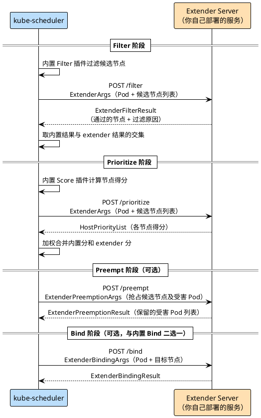
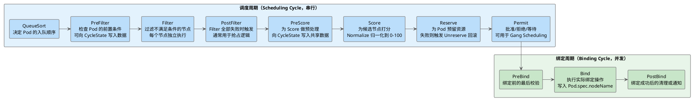

kube-scheduler 负责为每个 Pod 选出最合适的节点，内置了丰富的调度策略，能满足大多数场景。但当需要引入业务特定的调度规则时，比如感知 GPU 显存剩余量、按标签亲和性做自定义打分、或绕过默认绑定逻辑，就需要对调度器进行扩展。

kube-scheduler 提供了两种扩展方式：

| 方式 | 原理 | 可介入的阶段 | 是否需要重新编译 |
|------|------|------------|--------------|
| **scheduler extender** | HTTP Webhook，调度器在特定阶段向外部服务发起 HTTP 调用 | Filter / Prioritize / Preempt / Bind | 不需要 |
| **scheduler framework** | 插件化架构，将自定义插件编译进调度器二进制 | 全部扩展点 | 需要 |

选择哪种方式，取决于你需要介入哪些阶段、能否接受维护一个定制调度器的成本。以 HAMI 为例，它选择了 extender，原因是只需要介入 Filter 和 Bind 阶段，又不想入侵调度器的编译流程，HTTP 方式足够了。

参考：[scheduling-extensions](https://kubernetes.io/zh-cn/docs/concepts/extend-kubernetes/#scheduling-extensions)、[scheduling-framework](https://kubernetes.io/zh-cn/docs/concepts/scheduling-eviction/scheduling-framework/)、[scheduler_extender](https://github.com/kubernetes/design-proposals-archive/blob/main/scheduling/scheduler_extender.md)

## scheduler extender：以 HTTP Webhook 介入调度

scheduler extender 是一种轻量扩展方式：kube-scheduler 在特定调度阶段，会向配置的外部 HTTP 服务发起调用，由外部服务给出过滤或打分结果，再由调度器综合决策。整个过程不需要修改或重新编译 kube-scheduler，改动成本很低。

### 整体架构

kube-scheduler 在自身的调度逻辑执行完成后，再调用已注册的 extender，不同阶段的调用方式不同。Filter 阶段多个 extender 串行执行：kube-scheduler 先用内置插件过滤一遍候选节点，再把剩余节点列表依次发给各个 extender，前一个 extender 过滤后的结果作为下一个 extender 的输入，节点列表在这个过程中只减不增。Prioritize 阶段则是并发的：多个 extender 同时对候选节点打分，最后将各 extender 的得分加权合并到内置 Score 插件的结果中。



Prioritize 阶段，extender 的得分会与内置插件的得分加权合并，权重由配置文件中的 `weight` 字段控制。Bind 阶段是可选的，一旦 extender 声明接管 Bind，调度器就不再执行自己的绑定逻辑，两者是互斥的。

### 可介入的阶段

extender 只能介入以下四个阶段：

| 阶段 | 接口类型 | 说明 |
|------|---------|------|
| **Filter** | `ExtenderArgs` → `ExtenderFilterResult` | 从候选节点中移除不满足条件的节点 |
| **Prioritize** | `ExtenderArgs` → `HostPriorityList` | 对候选节点打分（0~100），与内置分加权合并 |
| **Preempt** | `ExtenderPreemptionArgs` → `ExtenderPreemptionResult` | 在抢占场景中，控制哪些受害 Pod 必须保留（不能被驱逐） |
| **Bind** | `ExtenderBindingArgs` → `ExtenderBindingResult` | 接管绑定操作，调度器不再执行默认 Bind |

调度 framework 中的 QueueSort、PreFilter、PostFilter、PreScore、Score、Reserve、Permit、PreBind、PostBind 等扩展点，extender 均无法介入。这也是 extender 最大的限制。

### 实现 Extender Server

下面实现一个最简单的示例：Filter 阶段过滤掉名字以 `bad` 开头的节点，Prioritize 阶段按节点名字长度打分（名字越短分越高）。

extender 本质上是一个 HTTP 服务，需要实现上述四个端点。先定义一个 `Handler` 接口，将各阶段的业务逻辑与 HTTP 收发解耦（`pkg/extender/server.go`）：

```go
// Handler 封装 Filter、Prioritize、ProcessPreemption 和 Bind 阶段的入参和出参
type Handler interface {
    Filter(ctx context.Context, args extenderapi.ExtenderArgs) (*extenderapi.ExtenderFilterResult, error)
    Prioritize(ctx context.Context, args extenderapi.ExtenderArgs) (*extenderapi.HostPriorityList, error)
    ProcessPreemption(ctx context.Context, args extenderapi.ExtenderPreemptionArgs) (*extenderapi.ExtenderPreemptionResult, error)
    Bind(ctx context.Context, args extenderapi.ExtenderBindingArgs) (*extenderapi.ExtenderBindingResult, error)
}
```

`Server` 将 `Handler` 适配为 `http.HandlerFunc`，每个端点的处理逻辑一致：从 Body 解码入参，调用 Handler，将结果序列化后写回响应：

```go
func (s *Server) Filter() http.HandlerFunc {
    return func(w http.ResponseWriter, r *http.Request) {
        var args extenderapi.ExtenderArgs
        if err := json.NewDecoder(r.Body).Decode(&args); err != nil {
            http.Error(w, err.Error(), http.StatusBadRequest)
            return
        }
        res, err := s.handler.Filter(r.Context(), args)
        if err != nil {
            http.Error(w, err.Error(), http.StatusInternalServerError)
            return
        }
        writeJSON(w, res)
    }
}
```

Prioritize、ProcessPreemption、Bind 的处理框架与 Filter 完全一致，只是入参和出参类型不同。

业务逻辑实现在 `simpleHandler` 中（`pkg/extender/simple.go`）。这个示例实现了两个规则：Filter 阶段过滤掉名字以 `bad` 开头的节点，Prioritize 阶段按节点名字长度打分（名字越短分越高）：

```go
// Filter 过滤节点，名字带 "bad" 前缀的节点直接排除
func (h *simpleHandler) Filter(ctx context.Context, args extenderapi.ExtenderArgs) (*extenderapi.ExtenderFilterResult, error) {
    var filtered []corev1.Node
    failed := make(map[string]string)

    for _, node := range args.Nodes.Items {
        if len(node.Name) >= 3 && node.Name[:3] == "bad" {
            // FailedNodes 记录被过滤的节点名和原因，调度器会在日志中展示
            failed[node.Name] = "节点名包含 'bad' 字符串"
            continue
        }
        filtered = append(filtered, node)
    }

    return &extenderapi.ExtenderFilterResult{
        Nodes:       &corev1.NodeList{Items: filtered},
        FailedNodes: failed,
    }, nil
}

// Prioritize 节点优先级，名字越短分数越高（最高 100，最低 0）
func (h *simpleHandler) Prioritize(ctx context.Context, args extenderapi.ExtenderArgs) (*extenderapi.HostPriorityList, error) {
    var result extenderapi.HostPriorityList

    for _, node := range args.Nodes.Items {
        score := 100 - len(node.Name)*10
        if score < 0 {
            score = 0
        }
        result = append(result, extenderapi.HostPriority{
            Host:  node.Name,
            Score: int64(score),
        })
    }

    return &result, nil
}
```

`main.go` 把路由和 Server 组装起来，监听 8080 端口：

```go
func main() {
    server := extender.NewServer(extender.NewSimpleHandler())

    http.HandleFunc("/filter", server.Filter())
    http.HandleFunc("/prioritize", server.Prioritize())
    http.HandleFunc("/preempt", server.ProcessPreemption())
    http.HandleFunc("/bind", server.Bind())

    log.Fatal(http.ListenAndServe(":8080", nil))
}
```

### 配置注册

extender 不通过 Kubernetes API 资源注册，而是通过 `KubeSchedulerConfiguration` 的 `extenders` 字段告诉 kube-scheduler 去哪里调用、调用哪些阶段：

```yaml
apiVersion: kubescheduler.config.k8s.io/v1
kind: KubeSchedulerConfiguration
leaderElection:
  leaderElect: false
profiles:
  - schedulerName: simple-scheduler  # 自定义调度器名称，Pod 通过 schedulerName 选择
extenders:
  - urlPrefix: "http://localhost:8080"  # extender 服务地址
    filterVerb: filter                  # Filter 端点路径（不填则不调用）
    prioritizeVerb: prioritize          # Prioritize 端点路径
    preemptVerb: preempt                # Preempt 端点路径
    # bindVerb: bind                    # Bind 端点路径（与默认 Bind 二选一）
    enableHTTPS: false
    httpTimeout: 30s
    weight: 1                           # Prioritize 得分的权重，用于与内置得分加权合并
    nodeCacheCapable: false             # 是否启用节点缓存（extender 直接从缓存读节点，减少传输量）
    managedResources: []                # 只有 Pod 申请了这里列出的资源，才会调用此 extender
```

`managedResources` 是一个重要的优化字段：如果填了具体资源名（比如 `nvidia.com/gpu`），kube-scheduler 只会在 Pod 申请了该资源时才调用这个 extender，避免对每个 Pod 都发起 HTTP 调用。

### 部署方式

extender 通常以 sidecar 形式与 kube-scheduler 部署在同一个 Pod 中，通过 localhost 通信，避免网络开销：

```yaml
apiVersion: apps/v1
kind: Deployment
metadata:
  name: simple-scheduler-extender-deployment
  namespace: scheduler-system
spec:
  template:
    spec:
      containers:
        - name: kube-scheduler                       # 官方 kube-scheduler 镜像，不需要改
          image: registry.k8s.io/kube-scheduler:v1.27.2
          command:
            - kube-scheduler
            - --config=/etc/kubernetes/config.yaml   # 指向包含 extenders 配置的文件
          volumeMounts:
            - name: config-volume
              mountPath: /etc/kubernetes
        - name: simple-scheduler-extender            # extender 作为 sidecar
          image: togettoyou/simple-scheduler-extender:latest
      volumes:
        - name: config-volume
          configMap:
            name: simple-scheduler-extender          # ConfigMap 中存放 KubeSchedulerConfiguration
```

kube-scheduler 通过 `urlPrefix: "http://localhost:8080"` 直接访问同 Pod 内的 extender，不需要创建 Service。

### 局限性

extender 的使用成本低，但有几个先天限制：

- **HTTP 开销**：每次调度都会发起同步 HTTP 调用，高调度频率下性能压力明显，JSON 序列化和反序列化也有额外开销
- **阶段受限**：只能介入 Filter、Prioritize、Preempt、Bind 四个阶段，无法介入 QueueSort（影响 Pod 入队顺序）、Reserve（资源预留）、Permit（调度批准）等其他阶段
- **无法访问内部状态**：extender 是独立进程，拿不到调度器内部的 CycleState（每次调度周期的共享状态），也无法直接读取调度器的本地缓存

如果这些限制让业务逻辑写不下去，就该考虑 scheduler framework 了。

完整代码见：[scheduler-extension/webhook/simple](https://github.com/togettoyou/kubernetes-src-notes/tree/main/src/scheduler-extension/webhook/simple)

## scheduler framework：插件化调度框架

scheduler framework 是 Kubernetes v1.19 Stable 的插件化架构，它把调度流程分解为一系列有序的扩展点，开发者以插件形式实现感兴趣的扩展点接口，然后将插件编译进调度器二进制，部署一个定制版的 kube-scheduler。

相比 extender，framework 的扩展能力更强：可以介入调度的每一个阶段，可以在扩展点之间共享状态（通过 `CycleState`），也可以直接访问调度器的本地缓存。代价是必须维护一个定制调度器的编译和部署流程。

### 扩展点全景

kube-scheduler 的一次调度周期（Scheduling Cycle）和绑定周期（Binding Cycle）总共提供以下扩展点：



调度周期是串行的，同一时刻只有一个 Pod 在被调度；绑定周期是并发的，多个 Pod 可以同时执行绑定。`CycleState` 是每次调度周期独立的共享状态，插件可以在 PreFilter 写入数据，在后续的 Filter、Score 中读取，不同调度周期之间的数据互不干扰。

### 实现一个调度插件

一个插件只需要实现它感兴趣的扩展点接口，用不到的接口完全不用管。下面是一个同时实现了 PreFilter、Filter、Bind 和 PostBind 的示例（`pkg/simple/simple.go`）：

```go
const Name = "SimplePlugin"

type plugin struct {
    handle framework.Handle  // 框架提供的句柄，可访问 ClientSet、调度器本地缓存等资源
}

func (pl *plugin) Name() string { return Name }

// 编译期检查：确保 plugin 实现了这四个扩展点接口
var (
    _ framework.PreFilterPlugin = &plugin{}
    _ framework.FilterPlugin    = &plugin{}
    _ framework.PreBindPlugin   = &plugin{}
    _ framework.BindPlugin      = &plugin{}
    _ framework.PostBindPlugin  = &plugin{}
)
```

`framework.Handle` 是框架注入给插件的依赖，通过它可以调用 `ClientSet()` 操作 Kubernetes API，或通过 `SnapshotSharedLister()` 读取调度器的本地节点缓存。这是 extender 做不到的能力。

**PreFilter**：在过滤开始前检查 Pod 是否满足插件的前置条件。如果在这里返回失败，整个调度周期直接终止，不会再逐节点执行 Filter：

```go
// PreFilter 检查 Pod 是否携带了必要的标签
func (pl *plugin) PreFilter(ctx context.Context, state *framework.CycleState, pod *corev1.Pod) (*framework.PreFilterResult, *framework.Status) {
    if _, ok := pod.Labels["simple.io/required"]; !ok {
        // 返回 Unschedulable，调度器会记录失败原因并停止本次调度
        return nil, framework.NewStatus(framework.Unschedulable, "缺少必要的 pod 标签 simple.io/required")
    }
    return &framework.PreFilterResult{}, framework.NewStatus(framework.Success)
}

// PreFilterExtensions 返回 nil 表示不需要增量更新通知
func (pl *plugin) PreFilterExtensions() framework.PreFilterExtensions { return nil }
```

**Filter**：对每个候选节点独立执行，返回 `Success` 表示节点通过，返回 `Unschedulable` 表示节点被过滤掉：

```go
// Filter 评估单个节点是否适合运行这个 Pod
func (pl *plugin) Filter(ctx context.Context, state *framework.CycleState, pod *corev1.Pod, nodeInfo *framework.NodeInfo) *framework.Status {
    // nodeInfo.Node() 直接读调度器本地缓存，不发网络请求
    // 可以根据节点标签、资源剩余、污点等做判断，这里示例直接放行
    return framework.NewStatus(framework.Success)
}
```

**Bind**：接管绑定逻辑。调度器默认的 Bind 插件会调用 Kubernetes API 写入 `Pod.spec.nodeName`，自定义 Bind 插件可以在写入前后执行额外操作，或完全替换绑定方式：

```go
// Bind 执行 Pod 到节点的绑定
func (pl *plugin) Bind(ctx context.Context, state *framework.CycleState, pod *corev1.Pod, nodeName string) *framework.Status {
    binding := &corev1.Binding{
        ObjectMeta: metav1.ObjectMeta{Namespace: pod.Namespace, Name: pod.Name, UID: pod.UID},
        Target:     corev1.ObjectReference{Kind: "Node", Name: nodeName},
    }
    // 通过 Handle 拿到 ClientSet，调用标准 Bind API
    err := pl.handle.ClientSet().CoreV1().Pods(binding.Namespace).Bind(ctx, binding, metav1.CreateOptions{})
    if err != nil {
        return framework.AsStatus(err)
    }
    return framework.NewStatus(framework.Success)
}

// PostBind 绑定成功后执行，适合做清理、通知等后置操作
func (pl *plugin) PostBind(ctx context.Context, state *framework.CycleState, pod *corev1.Pod, nodeName string) {
    fmt.Printf("[PostBind] Pod %s/%s 已成功绑定到节点 %s\n", pod.Namespace, pod.Name, nodeName)
}
```

### 插件注册与编译

framework 要求将插件编译进调度器二进制。`main.go` 的写法固定：通过 `app.WithPlugin` 将自定义插件注册到调度器的插件工厂，其余逻辑由框架处理：

```go
func main() {
    command := app.NewSchedulerCommand(
        // 将 SimplePlugin 注册为 out-of-tree 插件
        // Name 是插件名，New 是工厂函数，框架在需要时调用它实例化插件
        app.WithPlugin(simple.Name, simple.New),
    )
    code := cli.Run(command)
    os.Exit(code)
}
```

`New` 是插件的工厂函数，框架调用时会传入插件配置和 `framework.Handle`：

```go
func New(_ runtime.Object, h framework.Handle) (framework.Plugin, error) {
    return &plugin{handle: h}, nil
}
```

第一个参数 `runtime.Object` 是插件的配置对象，如果插件需要接收配置参数（比如阈值、策略名等），可以在 `KubeSchedulerConfiguration` 的 `pluginConfig` 字段中传入，框架会反序列化后通过这个参数注入。

### 调度器配置

插件编译进二进制后，还需要在 `KubeSchedulerConfiguration` 中显式启用，调度器才会在对应阶段调用它：

```yaml
apiVersion: kubescheduler.config.k8s.io/v1
kind: KubeSchedulerConfiguration
leaderElection:
  leaderElect: false
clientConnection:
  kubeconfig: /root/.kube/config
profiles:
  - schedulerName: simple-scheduler
    plugins:
      preFilter:
        enabled:
          - name: SimplePlugin
      filter:
        enabled:
          - name: SimplePlugin
      preBind:
        enabled:
          - name: SimplePlugin
      bind:
        enabled:
          - name: SimplePlugin
        disabled:
          - name: "*"    # 禁用所有内置 Bind 插件，由 SimplePlugin 独占 Bind 阶段
      postBind:
        enabled:
          - name: SimplePlugin
```

`bind.disabled: ["*"]` 这里有一个细节：Bind 阶段默认只有一个内置插件（`DefaultBinder`）在工作，如果启用了自定义 Bind 插件但没有禁用默认插件，两个插件都会尝试执行绑定，通常会导致冲突。因此实现了自定义 Bind 插件时，要显式禁用所有内置 Bind 插件。

### 部署：并行运行自定义调度器

framework 方案需要将定制调度器作为独立进程部署。常见做法是将其与官方 kube-scheduler 并行运行，两者各自管理不同 `schedulerName` 的 Pod，互不干扰：

```bash
# 编译自定义调度器
go build -o simple-scheduler .

# 以配置文件启动
./simple-scheduler --config=config.yaml
```

Pod 通过 `schedulerName` 字段选择由哪个调度器处理：

```yaml
apiVersion: v1
kind: Pod
metadata:
  name: test-scheduler
  labels:
    simple.io/required: "true"  # SimplePlugin 的 PreFilter 要求必须带这个标签
spec:
  schedulerName: simple-scheduler  # 指定由自定义调度器处理，不填默认走 default-scheduler
  containers:
    - name: nginx
      image: nginx
```

完整代码见：[scheduler-extension/framework/simple](https://github.com/togettoyou/kubernetes-src-notes/tree/main/src/scheduler-extension/framework/simple)

## WebAssembly（WASM）插件

[kube-scheduler-wasm-extension](https://github.com/kubernetes-sigs/kube-scheduler-wasm-extension) 是一个实验性方案，允许以 WebAssembly 模块的形式实现调度插件，最大的优点是无需重新编译 kube-scheduler，把 `.wasm` 文件挂载进去就能生效。

插件逻辑用 Go 编写，编译目标改为 `GOOS=wasip1 GOARCH=wasm`，通过 `sigs.k8s.io/kube-scheduler-wasm-extension/guest` SDK 实现调度扩展点接口：

```go
func main() {
    p, _ := New(klog.Get(), config.Get())
    plugin.Set(p)  // 将插件实例注册给 WASM 宿主
}

func (s *Simple) PreFilter(state api.CycleState, pod proto.Pod) (nodeNames []string, status *api.Status) {
    if _, ok := pod.GetLabels()["simple.io/required"]; !ok {
        return nil, &api.Status{
            Code:   api.StatusCodeUnschedulable,
            Reason: "缺少必要的 pod 标签 simple.io/required",
        }
    }
    return []string{}, &api.Status{Code: api.StatusCodeSuccess}
}
```

目前该项目仍处于实验阶段，生产环境使用需谨慎。完整教程见：[kube-scheduler-wasm-extension tutorial](https://github.com/kubernetes-sigs/kube-scheduler-wasm-extension/blob/main/docs/tutorial.md)

完整代码见：[scheduler-extension/wasm-extension/simple](https://github.com/togettoyou/kubernetes-src-notes/tree/main/src/scheduler-extension/wasm-extension/simple)

## 如何选择

| 需求 | 推荐方案 |
|------|---------|
| 只需介入 Filter / Prioritize / Bind，不想维护定制调度器 | scheduler extender |
| 需要介入 QueueSort、Reserve、Permit 等更多阶段 | scheduler framework |
| 需要在扩展点之间共享状态（CycleState） | scheduler framework |
| 需要在扩展点内直接访问调度器本地缓存 | scheduler framework |
| 调度频率高，HTTP 调用延迟不可接受 | scheduler framework |
| 不想重新编译调度器，且能接受实验性方案 | WASM 插件 |

HAMI 选择 extender 的原因具有代表性：它只需要感知显存，介入 Filter 和 Bind 两个阶段就够了，而 extender 方案让它可以完全复用官方 kube-scheduler 镜像，只需部署一个 HTTP sidecar，运维复杂度更低。

## 总结

scheduler extender 和 scheduler framework 覆盖了调度扩展的两端：extender 以最小的改动代价介入调度，适合阶段需求简单、不想维护定制调度器的场景；framework 提供全阶段的插件化能力，适合需要深度定制调度逻辑的场景。

两种方式的核心区别可以归结为一个问题：能接受 HTTP 调用的开销和阶段限制吗？如果可以，extender 就够了；如果不行，上 framework。

WASM 插件是一个有趣的中间道路，试图在不重新编译调度器的前提下获得接近 framework 的扩展能力，但目前成熟度还不足以在生产中大规模使用。

## 微信公众号

更多内容请关注微信公众号：gopher的Infra修行


