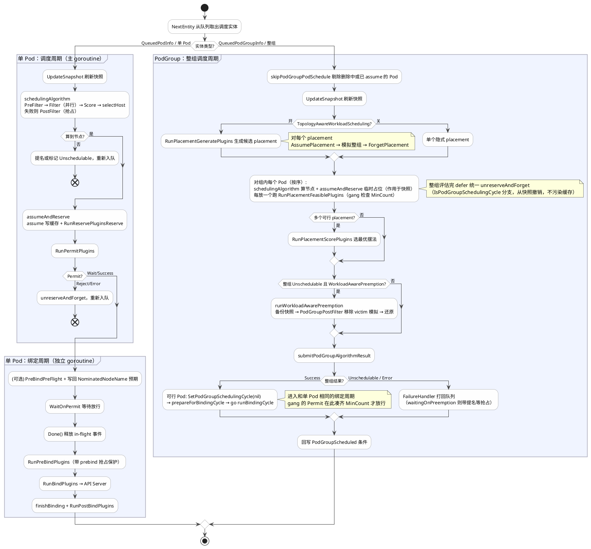

前面几篇我们把单 Pod 的调度流程讲完了，从调度队列、调度缓存，到调度框架，再到 `schedule_one.go` 里一次完整的「调度周期 + 绑定周期」。这些内容都是围绕「一个 Pod」展开的。

而在最新的 1.36 版本里，kube-scheduler 引入了一个新的概念：调度的最小单位不再只是单个 Pod，还可以是一组 Pod，也就是 PodGroup。借助 PodGroup，调度器原生支持了 gang scheduling（全有或全无）和工作负载感知调度（workload-aware scheduling）。

为了支持 PodGroup，`schedule_one.go` 这条主链路也做了一次重构，老的几个大函数被拆成了更小的单元，好让「单 Pod」和「整组 Pod」能复用同一套 assume、reserve、permit、bind 逻辑。本文就以 1.36 的代码为准，把这条新链路重新讲一遍。

需要先说明的是，PodGroup 相关的几个特性门控（GenericWorkload、GangScheduling、TopologyAwareWorkloadScheduling、WorkloadAwarePreemption）在 1.36 都还是 Alpha，默认关闭。

### 新的入口：ScheduleOne 按类型分派

老版本里，主循环每次调用 `sched.NextPod()` 取出一个 Pod。现在换成了 `sched.NextEntity()`，返回的是一个 `QueuedEntityInfo` 接口，它的具体类型可能是 `*QueuedPodInfo`（单 Pod），也可能是 `*QueuedPodGroupInfo`（一整组 Pod）。入口函数据此做类型分发：

```go
// ScheduleOne 完成单个调度实体（Pod 或 PodGroup）的全部调度流程，对节点选择是串行的。
func (sched *Scheduler) ScheduleOne(ctx context.Context) {
	logger := klog.FromContext(ctx)
	entity, err := sched.NextEntity(logger)
	if err != nil {
		utilruntime.HandleErrorWithLogger(logger, err, "Error while retrieving next scheduling entity from scheduling queue")
		return
	}
	// 队列关闭时 entity 为 nil
	if entity == nil {
		return
	}

	switch specificEntity := entity.(type) {
	case *framework.QueuedPodGroupInfo:
		sched.scheduleOnePodGroup(ctx, specificEntity) // 整组调度
	case *framework.QueuedPodInfo:
		if specificEntity.Pod == nil {
			return
		}
		sched.scheduleOnePod(ctx, specificEntity) // 单 Pod 调度，也就是前几篇讲的流程
	default:
		utilruntime.HandleErrorWithLogger(logger, nil, "Unexpected entity", "type", fmt.Sprintf("%T", specificEntity))
	}
}
```

可以看到，「走单 Pod 流程还是整组流程」这件事，在调度器从队列里 `Pop` 出实体的那一刻就已经定了，`ScheduleOne` 只是按类型分派。至于队列是怎么决定的，后面讲到 PodGroup 时再说。

### 单 Pod 流程：骨架没变，函数被拆细了

先看 `scheduleOnePod`，它的结构和前面讲的单 Pod 流程一脉相承，仍然是同步的调度周期加异步的绑定周期：

```go
func (sched *Scheduler) scheduleOnePod(ctx context.Context, podInfo *framework.QueuedPodInfo) {
	pod := podInfo.Pod
	fwk, err := sched.frameworkForPod(pod) // 按 schedulerName 找到对应的 Profile
	if err != nil {
		sched.SchedulingQueue.Done(podInfo.Pod.UID)
		return
	}
	if sched.skipPodSchedule(ctx, fwk, pod) { // 跳过删除中或已 assume 的 Pod
		sched.SchedulingQueue.Done(podInfo.Pod.UID)
		return
	}

	start := time.Now()
	state := framework.NewCycleState()
	state.SetRecordPluginMetrics(rand.Intn(100) < pluginMetricsSamplePercent)
	podsToActivate := framework.NewPodsToActivate()
	state.Write(framework.PodsToActivateKey, podsToActivate)

	schedulingCycleCtx, cancel := context.WithCancel(ctx)
	defer cancel()

	// 同步执行调度周期
	scheduleResult, assumedPodInfo, status := sched.schedulingCycle(schedulingCycleCtx, state, fwk, podInfo, start, podsToActivate)
	if !status.IsSuccess() {
		sched.FailureHandler(schedulingCycleCtx, fwk, assumedPodInfo, status, scheduleResult.nominatingInfo, start)
		return
	}

	// 异步执行绑定周期
	go sched.runBindingCycle(ctx, state, fwk, scheduleResult, assumedPodInfo, start, podsToActivate)
}
```

变化主要在 `schedulingCycle` 内部，它现在被拆成了刷新快照、决策、落地三步：

```go
func (sched *Scheduler) schedulingCycle(...) (ScheduleResult, *framework.QueuedPodInfo, *fwk.Status) {
	// 第一步：刷新节点快照
	if err := sched.Cache.UpdateSnapshot(klog.FromContext(ctx), sched.nodeInfoSnapshot); err != nil {
		return ScheduleResult{nominatingInfo: clearNominatedNode}, podInfo, fwk.AsStatus(err)
	}
	// 第二步：跑算法，做 Filter 和 Score，失败则尝试 PostFilter（抢占）
	scheduleResult, status := sched.schedulingAlgorithm(ctx, state, schedFramework, podInfo, start)
	if !status.IsSuccess() {
		return scheduleResult, podInfo, status
	}
	// 第三步：把算法结果落地，做 assume、reserve、permit，为绑定周期做准备
	assumedPodInfo, status := sched.prepareForBindingCycle(ctx, state, schedFramework, podInfo, podsToActivate, scheduleResult)
	if !status.IsSuccess() {
		return ScheduleResult{nominatingInfo: clearNominatedNode}, assumedPodInfo, status
	}
	return scheduleResult, assumedPodInfo, nil
}
```

把代码和老版本对照一下，就能看出这次重构的意图，它把「决策」和「落地」分开了。第二步的 `schedulingAlgorithm` 只负责决策，跑 Filter 和 Score 算出 `SuggestedHost`，不动任何缓存状态，失败时触发 PostFilter（抢占），就是纯粹地「算一个节点出来」。第三步的 `prepareForBindingCycle` 负责把这个结果落地。

落地这一步本身又分成两小步，展开 `prepareForBindingCycle` 就能看到：

```go
func (sched *Scheduler) prepareForBindingCycle(...) (*framework.QueuedPodInfo, *fwk.Status) {
	// 前半截：assume 加 reserve
	assumedPodInfo, status := sched.assumeAndReserve(ctx, state, schedFramework, podInfo, scheduleResult)
	if !status.IsSuccess() {
		return assumedPodInfo, status
	}
	assumedPod := assumedPodInfo.Pod

	// 后半截：跑 Permit 插件
	pluginsWaitTime, runPermitStatus := schedFramework.RunPermitPlugins(ctx, state, assumedPod, scheduleResult.SuggestedHost)
	if runPermitStatus.IsWait() {
		schedFramework.AddWaitingPod(assumedPod, pluginsWaitTime)
	} else if !runPermitStatus.IsSuccess() {
		// Permit 拒绝，回滚
		sched.unreserveAndForget(ctx, state, schedFramework, assumedPodInfo, scheduleResult.SuggestedHost)
		// ...
		return assumedPodInfo, runPermitStatus
	}
	// ...
	return assumedPodInfo, nil
}
```

可以看到，`prepareForBindingCycle` 自己只做 `RunPermitPlugins`，而把 assume 和 reserve 委托给了 `assumeAndReserve`：

```go
func (sched *Scheduler) assumeAndReserve(...) (*framework.QueuedPodInfo, *fwk.Status) {
	assumedPodInfo := podInfo.DeepCopy()
	assumedPod := assumedPodInfo.Pod
	// assume：把 NodeName 设为 SuggestedHost，并乐观写入调度缓存
	if err := sched.assume(logger, state, assumedPodInfo, scheduleResult.SuggestedHost); err != nil {
		return assumedPodInfo, fwk.AsStatus(err)
	}
	// reserve：运行 Reserve 插件预留资源，失败则 unreserveAndForget 回滚
	if sts := schedFramework.RunReservePluginsReserve(ctx, state, assumedPod, scheduleResult.SuggestedHost); !sts.IsSuccess() {
		sched.unreserveAndForget(ctx, state, schedFramework, assumedPodInfo, scheduleResult.SuggestedHost)
		// ...
		return assumedPodInfo, sts
	}
	return assumedPodInfo, nil
}
```

这样整条链路就清楚了：`schedulingAlgorithm` 决策，`assumeAndReserve` 做 assume 加 reserve，`prepareForBindingCycle` 在它之上再叠加 permit。

为什么要拆成这样，是因为 PodGroup 流程要复用其中的一部分。整组调度时，它需要对组内每个 Pod 调用 `schedulingAlgorithm` 算节点、调用 `assumeAndReserve` 临时占位，但在整组确认可行之前，绝不能调用 `prepareForBindingCycle` 去 permit 和绑定。把大函数拆成小块，正是为了让这两条链路共享代码，又能在不同的点位停下来。

#### 一个新的抽象：unreserveAndForget

老版本里，回滚就是 `Unreserve` 加 `Cache.ForgetPod` 两步。现在收敛成了一个函数 `unreserveAndForget`，并且区分了两种情况：

```go
func (sched *Scheduler) unreserveAndForget(ctx, state, schedFramework, assumedPodInfo, nodeName) error {
	schedFramework.RunReservePluginsUnreserve(ctx, state, assumedPodInfo.Pod, nodeName)

	if state.IsPodGroupSchedulingCycle() {
		// PodGroup 场景：只从「快照」里撤销临时占位，而不是真实缓存
		if err := sched.nodeInfoSnapshot.ForgetPod(logger, assumedPodInfo.Pod); err != nil {
			return err
		}
		// assume 时清掉的提名信息，这里要补回去，因为整组只是模拟，不该产生副作用
		if assumedPodInfo.Pod.Status.NominatedNodeName != "" && sched.SchedulingQueue != nil {
			sched.SchedulingQueue.AddNominatedPod(logger, assumedPodInfo.PodInfo, &fwk.NominatingInfo{
				NominatedNodeName: assumedPodInfo.Pod.Status.NominatedNodeName,
				NominatingMode:    fwk.ModeOverride,
			})
		}
		return nil
	}
	// 普通单 Pod 场景：从真实调度缓存里 Forget
	return sched.Cache.ForgetPod(logger, assumedPodInfo.Pod)
}
```

判断的依据是 `state.IsPodGroupSchedulingCycle()`。这正是后面整组算法「对每个 Pod 临时占位、整组评估完再统一撤销」的底层支撑：整组阶段的 assume 作用在临时快照上，可以干净地回滚，不会污染真实缓存。这个区分是新流程能够「先模拟整组、再决定提交」的前提，后面会反复用到。

#### 绑定周期新增的几道工序

绑定周期 `bindingCycle` 的主干仍然是 `WaitOnPermit → PreBind → Bind → PostBind`，但前后多了几道工序：

```go
func (sched *Scheduler) bindingCycle(...) *fwk.Status {
	assumedPod := assumedPodInfo.Pod

	// 新增：PreBindPreFlight，提前探测是否真的需要 PreBind，并向外部组件暴露「预期落点」
	var preFlightStatus *fwk.Status
	if sched.nominatedNodeNameForExpectationEnabled {
		preFlightStatus = schedFramework.RunPreBindPreFlights(ctx, state, assumedPod, scheduleResult.SuggestedHost)
		if preFlightStatus.Code() == fwk.Error || preFlightStatus.IsRejected() {
			return preFlightStatus
		}
		// 确实会 WaitOnPermit 或 PreBind 时，把 NominatedNodeName 写回 Pod，
		// 好让 cluster-autoscaler 这类组件提前知道这个 Pod 即将落在哪个节点
		if preFlightStatus.IsSuccess() || schedFramework.WillWaitOnPermit(ctx, assumedPod) {
			updatePod(ctx, sched.client, schedFramework.APICacher(), assumedPod, nil, &fwk.NominatingInfo{
				NominatedNodeName: scheduleResult.SuggestedHost,
				NominatingMode:    fwk.ModeOverride,
			})
		}
	}

	// 等待 Permit 放行，gang scheduling 的「全有或全无」就卡在这里，后面会讲
	if status := schedFramework.WaitOnPermit(ctx, assumedPod); !status.IsSuccess() {
		// ... 被拒则构造 FitError 返回
		return status
	}

	// 新增：Permit 是判定 unschedulable 的最后一个扩展点。过了这里，后续失败只会进 BackoffQ 重试，
	// 不再算作 unschedulable，所以可以提前 Done()，尽早释放队列里暂存的 in-flight 事件，省内存
	sched.SchedulingQueue.Done(assumedPod.UID)

	// 新增：prebind 期间的抢占保护，把 Pod 登记进 in-prebind 集合，
	// 若 prebind 过程中它被抢占，下面的 MarkPrebound() 会失败，从而中止绑定
	if preFlightStatus.IsSuccess() {
		ctx, podInPreBindCancel := context.WithCancelCause(ctx)
		defer podInPreBindCancel(nil)
		defer schedFramework.RemovePodInPreBind(assumedPod.UID)
		schedFramework.AddPodInPreBind(assumedPod.UID, podInPreBindCancel)
	}

	if status := schedFramework.RunPreBindPlugins(ctx, state, assumedPod, scheduleResult.SuggestedHost); !status.IsSuccess() {
		return status
	}
	if bindingPod := schedFramework.GetPodInPreBind(assumedPod.UID); bindingPod != nil && !bindingPod.MarkPrebound() {
		return fwk.AsStatus(context.Cause(ctx)) // prebind 期间被抢占，放弃绑定
	}

	if status := sched.bind(ctx, schedFramework, assumedPod, scheduleResult.SuggestedHost, state); !status.IsSuccess() {
		return status
	}
	schedFramework.RunPostBindPlugins(ctx, state, assumedPod, scheduleResult.SuggestedHost)
	return nil
}
```

这几道新工序各有用意。

`SchedulingQueue.Done(uid)` 的位置很讲究。调度队列会为「飞行中（in-flight）」的 Pod 暂存集群事件，用于后续的 QueueingHint 判定。新流程明确了一点：Permit 是判定 unschedulable 的最后一个扩展点，一旦 `WaitOnPermit` 通过，后面 PreBind、Bind 即使失败也只会进 BackoffQ 重试，而不会被标记为 unschedulable。既然如此，就可以在这里立刻 `Done()`，把暂存的事件尽早释放掉，对繁忙集群来说也能省下一些内存。

NominatedNodeName 预期（受 `nominatedNodeNameForExpectationEnabled` 控制）是在真正绑定前，把「即将落到哪个节点」写回 Pod 状态，给 cluster-autoscaler 这类外部组件一个提前量。但只在确实会经历 WaitOnPermit 或 PreBind（也就是绑定不会瞬间完成）时才写，否则没必要。

prebind 抢占保护针对的是 PreBind 可能耗时的情况，比如 `volumebinding` 要等 PV 就绪。这段时间里该 Pod 仍可能被更高优先级的 Pod 抢占。新版通过 in-prebind 登记加上 `MarkPrebound()` 的 CAS 语义，保证「绑定」和「被抢占」不会同时发生。

单 Pod 流程就讲到这里。当上面这些特性门控都关闭时，调度器只会产出 `QueuedPodInfo` 实体，永远走这条路径，也就是前几篇描述的世界。下面进入 PodGroup。

### PodGroup 要解决什么

很多分布式负载有「全有或全无」的语义，比如分布式训练、MPI、Spark。一个任务的 N 个 Pod 要么同时拿到资源一起跑，要么一个都别调度。否则先调度上去的几个 Pod 白白占着 GPU 干等，既浪费，还可能互相死锁。

过去这种需求只能靠外部调度器或第三方插件（如 Volcano、Coscheduling）来补。1.36 把它做进了 kube-scheduler：

- 新增 `scheduling.k8s.io/v1alpha3` 的 `PodGroup` 对象，Pod 通过 `pod.Spec.SchedulingGroup.PodGroupName` 加入某个组。
- `PodGroup.Spec.SchedulingPolicy` 是一个 union，要么是 `Basic{}`（普通调度，没有全有或全无），要么是 `Gang{MinCount}`（至少 `MinCount` 个 Pod 必须同时可调度）。
- 可选的 `SchedulingConstraints.Topology` 用来要求整组落在同一个拓扑域，配合 `TopologyAwareWorkloadScheduling` 使用。
- 这些字段大多是 immutable 的。`PodGroup.Status` 上挂一个 `PodGroupScheduled` 条件，由调度器回写。

### 队列怎么把散 Pod 聚成一个实体

回到前面那个问题，「走单 Pod 还是整组」是谁决定的。答案在调度队列，核心就一个函数：

```go
// 判断一个 Pod 是否被当作 PodGroup 成员来处理
func (p *PriorityQueue) isPodGroupMember(pod *v1.Pod) bool {
	return p.isGenericWorkloadEnabled && pod.Spec.SchedulingGroup != nil
}
```

`isGenericWorkloadEnabled` 就是 `GenericWorkload` 特性门控。只要它开着，且 Pod 声明了 `SchedulingGroup`，这个 Pod 就不再作为独立的 `QueuedPodInfo` 入队，而是要并进它所属的 pod 组。这一步发生在 Pod 入队的 `addPod` 里：

```go
// addPod 把一个 Pod 加入活动队列，但如果它是 pod 组成员，就改为加入它所属的 pod 组
func (p *PriorityQueue) addPod(ctx context.Context, pod *v1.Pod) {
	pInfo := p.newQueuedPodInfo(ctx, pod)
	// ...
	if p.isPodGroupMember(pod) {
		p.addPodGroupMember(logger, pInfo) // 走 pod 组聚合路径
		return
	}
	// 普通 Pod：直接进 activeQ
	if added := p.moveToActiveQ(logger, pInfo, framework.EventUnscheduledPodAdd.Label(), false); added {
		p.activeQ.broadcast()
	}
}
```

聚合的逻辑都在 `addPodGroupMember`。一个成员 Pod 进来时，它所属的 pod 组可能处于三种状态，对应三条分支：

```go
func (p *PriorityQueue) addPodGroupMember(logger klog.Logger, pInfo *framework.QueuedPodInfo) {
	// 情况一：pod 组已经在某个队列里，直接并进去
	if added := p.addToPodGroupIfExists(logger, pInfo); added {
		return
	}
	pgInfoLookup := newQueuedPodGroupInfoForLookup(pInfo.Pod)
	if p.activeQ.isLastPoppedEntity(pgInfoLookup) {
		// 情况二：这个 pod 组刚被 Pop 出去、正在被调度，先把 Pod 暂存起来，
		// 等整组重新入队时再并进去
		p.pendingPodGroupPods.add(pgInfoLookup, pInfo)
	} else {
		// 情况三：队列里还没有这个组，这是它的第一个成员，新建一个 pod 组实体放进 activeQ
		pgInfo := p.newQueuedPodGroupInfo(pInfo)
		if added := p.moveToActiveQ(logger, pgInfo, framework.EventUnscheduledPodAdd.Label(), false); added {
			p.activeQ.broadcast()
		}
	}
}
```

第三种最朴素，组里第一个 Pod 到来时，用它建一个新的 `QueuedPodGroupInfo` 实体扔进 activeQ。`newQueuedPodGroupInfo` 就是拿这个 Pod 的命名空间和组名初始化一个组，成员列表里先放它自己。

第一种最常见，组实体已经在三个子队列（activeQ、backoffQ、unschedulableEntities）的某一个里待着了。这时不能简单往里塞，因为队列是按 key 组织的堆或 map，组的排序键（比如优先级）可能因为新成员而变化，所以要先把整个组实体取出来，`AddPod` 之后再按它原先所在队列的策略重新入队：

```go
func (p *PriorityQueue) addToPodGroupIfExists(logger klog.Logger, pInfo *framework.QueuedPodInfo) bool {
	pgInfoLookup := newQueuedPodGroupInfoForLookup(pInfo.Pod)
	// 从任意一个队列里把组实体连同它所在的队列策略一起取出来
	entity, strategy := p.deleteFromAnyQueue(pgInfoLookup)
	if entity == nil {
		return false // 三个队列里都没有，不走这条路径
	}
	pgInfo := entity.(*framework.QueuedPodGroupInfo)
	pgInfo.AddPod(pInfo) // 把新成员并进去
	// 按原来所在队列的策略（立即 / backoff / 跳过）重新入队
	queue := p.requeueEntityWithQueueingStrategy(logger, pgInfo, strategy, framework.EventUnscheduledPodAdd.Label())
	// ...
	return true
}
```

`AddPod` 不是简单追加，而是用二分查找把成员插到正确的位置，保证组内成员始终有序：

```go
func (pgqi *QueuedPodGroupInfo) AddPod(pInfo *QueuedPodInfo) {
	index, _ := slices.BinarySearchFunc(pgqi.QueuedPodInfos, pInfo, PodGroupMemberPodsOrderingFunc)
	pgqi.QueuedPodInfos = slices.Insert(pgqi.QueuedPodInfos, index, pInfo)
	pgqi.UnscheduledPods = slices.Insert(pgqi.UnscheduledPods, index, pInfo.Pod)
}
```

排序规则 `PodGroupMemberPodsOrderingFunc` 是优先级降序、尝试次数降序、时间戳升序，后面整组调度时就按这个顺序逐个处理成员。

第二种情况比较微妙，是为了处理一种竞争。组实体可能刚好被调度器 `Pop` 出去、正在跑整组调度周期，这时它已经不在任何队列里了（`deleteFromAnyQueue` 找不到），但又不能当成新组去建一个，否则就和正在调度的那个组重复了。`activeQ` 会记住「最后一个被 Pop 出去的实体」，`isLastPoppedEntity` 一比对就知道是这种情况，于是把新成员暂存进 `pendingPodGroupPods`。等这轮整组周期结束、调度器调用 `AddAttemptedPodGroupIfNeeded` 把组重新入队时，会取出暂存的成员放进组里：

```go
func (p *PriorityQueue) AddAttemptedPodGroupIfNeeded(...) error {
	// ...
	p.activeQ.clearPoppedEntity()
	pendingPods := p.pendingPodGroupPods.get(pgInfo) // 取出本轮暂存的成员
	if len(pendingPods) == 0 {
		return nil // 没有暂存的，无需重新入队
	}
	pgInfo.SetPods(pendingPods) // 放进组
	p.pendingPodGroupPods.clear(pgInfo)
	// ... 刷新时间戳、退避计数，再重新入队
}
```

把这几条路径合起来看，`QueuedPodGroupInfo` 这个实体的内涵就清楚了。它内嵌一个 `PodGroupInfo` 和一组有序的成员 `QueuedPodInfos`，并且把尝试次数、backoff、初始时间戳这些队列状态当作一个整体来管理，组里所有成员一起重试、一起退避。于是 `Pop` 出来的就是这样一个整组实体，`ScheduleOne` 据此分发到 `scheduleOnePodGroup`。

### 整组调度的主流程

```go
func (sched *Scheduler) scheduleOnePodGroup(ctx context.Context, podGroupInfo *framework.QueuedPodGroupInfo) {
	schedFwk, err := sched.frameworkForPodGroup(podGroupInfo) // 组内所有 Pod 必须是同一个 schedulerName
	if err != nil {
		// 整组失败，逐个 FailureHandler，并把整组放回队列
		// ...
		return
	}
	// 剔除删除中或已 assume 的 Pod
	sched.skipPodGroupPodSchedule(ctx, schedFwk, podGroupInfo)
	if len(podGroupInfo.QueuedPodInfos) == 0 {
		return
	}
	// 进入整组调度周期
	sched.podGroupCycle(ctx, schedFwk, framework.NewCycleState(), podGroupInfo)
}
```

`podGroupCycle` 是整组版本的 `schedulingCycle`，流程是刷新快照、跑整组算法、补全结果、按需做整组抢占、提交结果：

```go
func (sched *Scheduler) podGroupCycle(ctx, schedFwk, podGroupCycleState, podGroupInfo) {
	start := time.Now()
	logger := klog.FromContext(ctx)
	if err := sched.Cache.UpdateSnapshot(logger, sched.nodeInfoSnapshot); err != nil { /* ... */ }

	// 跑整组算法，得到每个 Pod 的子结果
	result := sched.podGroupSchedulingAlgorithm(ctx, schedFwk, podGroupCycleState, podGroupInfo, runAllPostFilters)
	// 确保结果里每个 Pod 都有一条记录
	result = completePodGroupAlgorithmResult(ctx, podGroupInfo, podGroupCycleState, runAllPostFilters, result)

	// 整组不可调度，且开启了 workload-aware 抢占时，尝试整组抢占
	if sched.workloadAwarePreemptionEnabled && result.status.Code() == fwk.Unschedulable {
		pgPostFilterResult, status := sched.runWorkloadAwarePreemption(ctx, schedFwk, podGroupCycleState, podGroupInfo)
		if status.IsSuccess() {
			result.waitingOnPreemption = true
			// 把抢占给出的提名节点回填到各 Pod 结果
			// ...
		}
	}

	// 提交结果，可行的 Pod 进绑定周期，其余打回队列
	sched.submitPodGroupAlgorithmResult(ctx, schedFwk, podGroupCycleState, podGroupInfo, result, start)
}
```

### 整组算法：在一份快照里模拟整组

`podGroupCycle` 里调用的 `podGroupSchedulingAlgorithm` 本身只是个分派器，按 `TopologyAwareWorkloadScheduling` 门控决定走哪条算法：

```go
func (sched *Scheduler) podGroupSchedulingAlgorithm(...) podGroupAlgorithmResult {
	if utilfeature.DefaultFeatureGate.Enabled(features.TopologyAwareWorkloadScheduling) {
		// 开启拓扑感知：尝试多个 placement，下一节讲
		return sched.podGroupSchedulingPlacementAlgorithm(...)
	}
	// 未开启：只在一个隐式 placement 上跑默认算法
	placementCycleState := framework.NewCycleState()
	placementCycleState.SetPodGroupSchedulingCycle(podGroupCycleState)
	return sched.podGroupSchedulingDefaultAlgorithm(...)
}
```

先看不带拓扑感知的默认算法 `podGroupSchedulingDefaultAlgorithm`。它的做法是，在同一份节点快照里，按顺序为每个成员 Pod 算节点并临时占位，让后面的 Pod 能「看到」前面的 Pod 已经就位。整组评估完之后，再通过 `defer` 把所有占位统一撤销，因为这只是一次可行性模拟，在整组确认之前并不真正绑定。

```go
func (sched *Scheduler) podGroupSchedulingDefaultAlgorithm(ctx, schedFwk, placementCycleState, podGroupInfo, postFilterMode) podGroupAlgorithmResult {
	result := podGroupAlgorithmResult{status: fwk.NewStatus(fwk.Unschedulable)..., /* ... */}

	requiresPreemption, anyScheduled := false, false
	for _, podInfo := range podGroupInfo.QueuedPodInfos {
		// 为单个 Pod 算节点并 assumeAndReserve 临时占位，返回一个撤销函数
		podResult, revertFn := sched.podGroupPodSchedulingAlgorithm(ctx, schedFwk, placementCycleState, podGroupInfo, podInfo, postFilterMode)
		result.podResults = append(result.podResults, podResult)
		if revertFn != nil {
			defer revertFn() // 整组算法结束时统一撤销所有占位，不绑定
		}

		if !podResult.status.IsSuccess() && !podResult.status.IsRejected() {
			result.status = fwk.AsStatus(/* ... */) // 出错就停止
			break
		}

		// 每放一个 Pod，就跑 PlacementFeasible 检查整组约束，比如 gang 的 MinCount
		placementFeasibleStatus := schedFwk.RunPlacementFeasiblePlugins(ctx, placementCycleState, podGroupInfo)
		if placementFeasibleStatus.Code() == fwk.UnschedulableAndUnresolvable {
			// 约束已经不可能满足，提前结束整组循环
			result.status = fwk.NewStatus(fwk.Unschedulable)...
			break
		}
		result.status = placementFeasibleStatus
		requiresPreemption = requiresPreemption || podResult.requiresPreemption
		anyScheduled = anyScheduled || podResult.status.IsSuccess()
	}

	if result.status.IsSuccess() {
		if requiresPreemption {
			// 整组里有 Pod 需要抢占，那整组也得等抢占完成
			result.status = fwk.NewStatus(fwk.Unschedulable, "pod group is waiting for preemption to complete")...
			result.waitingOnPreemption = true
		} else if !anyScheduled {
			result.status = fwk.NewStatus(fwk.Unschedulable)... // 至少要成功一个
		}
	}
	return result
}
```

其中单个 Pod 的子过程 `podGroupPodSchedulingAlgorithm`，复用的正是前面拆出来的那几块积木：`schedulingAlgorithm` 算节点，`assumeAndReserve` 临时占位，并返回一个调用 `unreserveAndForget` 的 `revertFn`。由于此时 `state.IsPodGroupSchedulingCycle()` 为真，`unreserveAndForget` 走的是「从快照撤销、恢复提名」那条分支，干净且无副作用。前面埋下的那个抽象，到这里就用上了。

这里有一个细节：当某个 Pod 需要抢占（`NominatedNodeName` 非空）时，算法会把它当作已经落在提名节点上继续往下走（把 `SuggestedHost` 设为 `NominatedNodeName`），好让后续 Pod 看到「victim 已被移除、该 Pod 已占位」的假想状态。整组的可行性，必须建立在这个假设之上来评估。

`PlacementFeasible` 由 `GangScheduling` 插件实现，是 gang 语义在整组阶段的强制点：

```go
func (pl *GangScheduling) PlacementFeasible(ctx, placementCycleState, podGroupInfo) *fwk.Status {
	gangPolicy := pg.Spec.SchedulingPolicy.Gang
	if gangPolicy == nil {
		return nil // 不是 gang 组就直接放行
	}

	pgState := getPlacementFeasibleState(placementCycleState)
	pgState.evaluated++
	remaining := len(podGroupInfo.GetUnscheduledPods()) - pgState.evaluated // 还没评估到的 Pod 数
	scheduled := podGroupState.ScheduledPodsCount()                          // 已经占位的 Pod 数
	minCount := int(gangPolicy.MinCount)

	if remaining+scheduled < minCount {
		// 剩下的全部成功也凑不齐 MinCount，已经无解，整组循环可以早停
		return fwk.NewStatus(fwk.UnschedulableAndUnresolvable, /* ... */)
	}
	if scheduled < minCount {
		return fwk.NewStatus(fwk.Unschedulable, /* ... */) // 还没凑齐，但继续评估有希望
	}
	return nil // 凑齐了
}
```

`remaining + scheduled < minCount` 这个判断，让那些注定凑不齐 `MinCount` 的组立刻以 `UnschedulableAndUnresolvable` 退出，不必把整组试完，是整组算法里关键的一处早停。

### 拓扑感知：在多个 placement 里挑最优

开启 `TopologyAwareWorkloadScheduling` 之后，整组算法会升级成 `podGroupSchedulingPlacementAlgorithm`。它在默认算法外面套了一层「试多种摆法、选最优」：

```go
func (sched *Scheduler) podGroupSchedulingPlacementAlgorithm(...) podGroupAlgorithmResult {
	// 生成候选 placement，每个 placement 是一组节点或拓扑域
	placements, status := schedFwk.RunPlacementGeneratePlugins(ctx, podGroupCycleState, podGroupInfo.PodGroupInfo, allNodes)

	successfulResults := map[*fwk.Placement]*podGroupAlgorithmResult{}
	for _, placement := range placements {
		sched.nodeInfoSnapshot.AssumePlacement(placement) // 把这个 placement 摆进快照
		result := sched.podGroupSchedulingDefaultAlgorithm(ctx, schedFwk, ..., podGroupInfo, postFilterMode) // 在这种摆法下模拟整组
		sched.nodeInfoSnapshot.ForgetPlacement()          // 撤销，再换下一个摆法
		if result.status.IsSuccess() || result.waitingOnPreemption {
			successfulResults[placement] = &result
		}
	}
	if len(successfulResults) == 0 { /* 全都不可行 */ }
	if len(successfulResults) == 1 { /* 唯一可行的直接用 */ }

	// 多个摆法都可行时，用 PlacementScore 插件打分选最优
	bestPlacement, status := sched.findBestPlacement(ctx, schedFwk, podGroupCycleState, podGroupInfo, successfulResults)
	return *successfulResults[bestPlacement]
}
```

`PlacementGenerate` 和 `PlacementScore` 都是新的插件扩展点。拓扑约束（比如「整组必须在同一机架」）就建立在这套「生成候选摆法 → 逐个模拟 → 打分挑最优」的机制上。不开拓扑感知时，则退化成单个隐式 placement，复用同一套 state 管线。

### 整组抢占

整组 `Unschedulable`，且开启了 `WorkloadAwarePreemption` 时，`runWorkloadAwarePreemption` 会先备份快照，再跑 `PodGroupPostFilter` 插件，试着移除一批 victim 之后看整组是否可行，最后无论成败都还原快照：

```go
func (sched *Scheduler) runWorkloadAwarePreemption(...) (*framework.PodGroupPostFilterResult, *fwk.Status) {
	plugins := schedFwk.PodGroupPostFilterPlugins() // 默认抢占应是唯一的整组 PostFilter 插件
	if len(plugins) == 0 {
		return nil, fwk.NewStatus(fwk.Unschedulable, "...disabled")
	}

	restoreFn, _ := sched.nodeInfoSnapshot.BackupSnapshot()
	defer restoreFn() // 抢占只是「假设移除 victim 后能否放下整组」的模拟，结束必须还原

	// 把「在当前快照下模拟整组（不跑 post filter）」封装成回调，交给抢占插件
	var pgSchedulingFunc framework.PodGroupSchedulingFunc = func(_ context.Context) (*fwk.PodGroupAssignments, *fwk.Status) {
		res := sched.podGroupSchedulingAlgorithm(ctx, schedFwk, podGroupCycleState, podGroupInfo, runWithoutPostFilters)
		return &fwk.PodGroupAssignments{ProposedAssignments: makeProposedAssignments(&res)}, res.status
	}
	return plugins[0].PodGroupPostFilter(ctx, pg, podGroupInfo.UnscheduledPods, pgSchedulingFunc)
}
```

抢占成功时，会把 `waitingOnPreemption` 置为 true，各 Pod 带着提名节点退回队列，等下一轮整组周期验证抢占的结果。

### 提交结果：可行的进绑定，其余打回

`submitPodGroupAlgorithmResult` 是整组流程的收尾，逐个 Pod 决定去向：

- 整组 Success 时，对每个可行的 Pod，先调用 `SetPodGroupSchedulingCycle(nil)` 退出整组模拟状态（这一步很关键，之后的 assume、forget 才会作用于真实缓存而不是快照），再走我们熟悉的 `prepareForBindingCycle` 加 `go runBindingCycle`，进入和单 Pod 完全一样的绑定周期。
- 整组 Unschedulable 时，所有 Pod 用 `FailureHandler` 打回队列。如果是在 `waitingOnPreemption`，则带上提名信息，等抢占完成。
- 整组 Error 时，逐个 Pod 用错误状态拒绝。

最后统一回写 `PodGroup` 的 `PodGroupScheduled` 条件，并通过 `AddAttemptedPodGroupIfNeeded` 把整组的这次尝试记录回队列。

### gang 的三个强制点

gang 的「全有或全无」不是靠某一个机制兜底，而是同一条整组流水线上三个阶段配合完成的，三处都由 `GangScheduling` 插件实现，且在 `policy.Gang == nil` 时全部放行。

第一处是 `PreEnqueue`，在入队之前。组内可见的 Pod 数还不到 `MinCount` 时，直接拒绝入活动队列，避免「半个 gang」占着调度器空转。

第二处是 `PlacementFeasible`，在整组模拟当中。靠 `remaining+scheduled < minCount` 早停判死，没凑齐则整组 Unschedulable。

第三处是 `Permit` 和 `WaitOnPermit`，在各个 Pod 绑定之前。每个 Pod 都在 permit 卡住，直到已 assume 的 Pod 凑齐 `MinCount`，才一起 `Allow` 放行，超时是 5 分钟。

模拟阶段已经有 `PlacementFeasible` 把关了，为什么绑定阶段还要 `Permit` 再拦一道。这是因为整组确认可行之后，各个 Pod 是在各自独立的 goroutine 里异步绑定的。万一某个 Pod 的绑定周期中途失败，`Permit` 这道「凑齐才放行」的闸门能保证不会出现「绑了一半」的局面。`PlacementFeasible` 管的是规划期，`Permit` 管的是执行期，两者缺一不可。

### 两级选择

把整篇串起来，「走哪条路」其实是两级判断，而不是两个并列的引擎。

第一级是路由，发生在队列层。`GenericWorkload` 门控开着，且 Pod 有 `SchedulingGroup`，就聚成 `QueuedPodGroupInfo` 走整组周期，否则就是单 Pod 周期。一个 gang Pod，只要总开关开着，就永远走整组周期，不会再退回单 Pod 路径。

第二级是策略，发生在对象层。进了整组周期之后，到底施不施加全有或全无，取决于 `PodGroup` 对象自身的 `SchedulingPolicy` 是 `Gang{MinCount}` 还是 `Basic`，由 `GangScheduling` 插件在那三个强制点上运行时判定。

至于 `TopologyAwareWorkloadScheduling`（多 placement 的生成和打分）和 `WorkloadAwarePreemption`（整组抢占），是两个正交的增强，分别决定整组算法的「摆法搜索」和「抢占」能力。这几个门控里，`GenericWorkload` 是总开关，其余都建立在它之上。

### 最后总结

相比前面讲的单 Pod 流程，1.36 的 kube-scheduler 在调度主链路上有两条主线变化。

一是函数重构。`schedulingCycle` 被拆成 `schedulingAlgorithm`（纯决策）、`assumeAndReserve`、`prepareForBindingCycle`（落地），回滚收敛成了区分场景的 `unreserveAndForget`。这套「决策与落地分离」的拆分，本质是为了让单 Pod 和整组复用同一套 assume、reserve、permit、bind 机制，又能在不同的点位精确停下来。绑定周期还新增了 PreBindPreFlight、NominatedNodeName 预期、prebind 抢占保护、提前 `Done()` 释放事件这几道工序。

二是 PodGroup 和 gang 的原生支持。调度单位从 Pod 泛化成了实体。整组算法「在一份快照里按序模拟整组，用 `defer` 统一撤销，靠 `PlacementFeasible` 早停判死」，拓扑感知再叠加「多 placement 的生成、模拟、打分」，并支持整组抢占。gang 的全有或全无，由 PreEnqueue、PlacementFeasible、Permit 三个强制点配合保证。

这些特性在 1.36 都还是 Alpha，默认关闭。关掉之后，调度器只产出单 Pod 实体，行为和前几篇讲的完全一样。

### 附：1.36 调度流程（含 PodGroup）



## 微信公众号

更多内容请关注微信公众号：gopher的Infra修行


